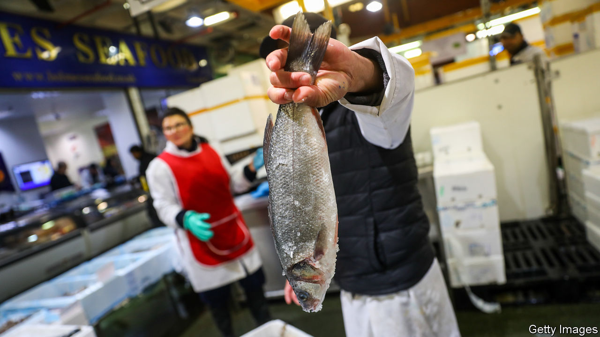

## Britain, the EU and fish

# How fisheries could sink a Brexit trade deal

> A tiny industry is political dynamite

> Jul 23rd 2020

BILLINGSGATE MARKET in east London is busy at 5.30am. Live lobsters and crabs jostle against stalls selling mussels, alongside such exotica as swordfish and tilapia. Social distancing and masks are not in much evidence. Once the world’s biggest fish market, and still the country’s biggest inland one, Billingsgate stands for the history and romance of seafishing in Britain—an industry which, despite accounting for only 0.1% of GDP and barely 12,000 jobs, could yet scupper the chances of a Brexit deal with Brussels.

The desire to take back control of British waters was a powerful force driving Brexit. Brexiteers believe, with justice, that the EU’s common fisheries policy is unfair on British fishermen. For many species, European fishermen have a much larger share of fish quotas in Britain’s coastal waters than do the British themselves. Barrie Deas, chief executive of the National Federation of Fishermen’s Organisations, notes that, for channel cod, Britain has a 9% share against France’s 84%; for Celtic Sea haddock the numbers are 10% and 66%.

The government wants a big increase in British shares based on the location of fish, not historic rights, and annual negotiations like Norway’s. The EU prefers continuing the current system, and says that annual negotiation works with Norway because only seven species are covered and quotas seldom change, whereas with Britain the number is almost 100 and the whole point is to adjust catches. It also insists that, without an agreement on fish, there can be no trade deal. Fishing is now one of the hardest issues in the Brexit talks, which have supposedly intensified—but with big gaps persisting between the two sides.

Because Britain has more coastal water than any EU country, it looks to be in a strong position. Yet some 80% of the fish landed in Britain is exported, mostly to the EU, while 70% of the fish consumed in Britain is imported, largely from the EU. Failure to agree a deal would disrupt two-way trade in a highly perishable product. Iain Spears, who runs a shellfish business in Devon, fears losing access to scallops in the Seine estuary. Britain has neither the capacity to catch all the fish now taken by EU fishermen nor enough patrol boats to police its waters. And the law is messy: many EU firms have bought up British fishing quotas, and they cannot easily or costlessly be deprived of them now.

Furthermore, the most valuable part of the industry is no longer catching but processing, which depends heavily on free trade. Even pro-Brexit Grimsby, where processing is now the main activity, is anxious about lost business if there is no agreement with the EU. James Kane of the Institute of Government, a think-tank, cites a Dutch university study of 2018 which concluded that, without a deal, Britain would lose more from tariffs and non-tariff barriers on fish trade than it would gain from exclusive access to its own waters.

Is there scope for compromise? Britain could agree to multi-year quotas, while the EU could accept that British shares must rise over time. But Brexiteers will cry betrayal the moment Britain agrees to let EU trawlers keep on hoovering up British fish. And feelings on the continent are just as strong. Herring (almost all caught in British waters) are close to the hearts, and stomachs, of the Dutch. The French have fished in British waters for centuries.

Politics makes everything harder. Emmanuel Macron, France’s president, faces a tough re-election battle in early 2022 and will want to placate the country’s fishermen. The British government fears nationalist gains in next year’s election in Scotland, where most fish are caught. But Boris Johnson needs a trade deal, and without agreement on fish, he may find it impossible to land one.■