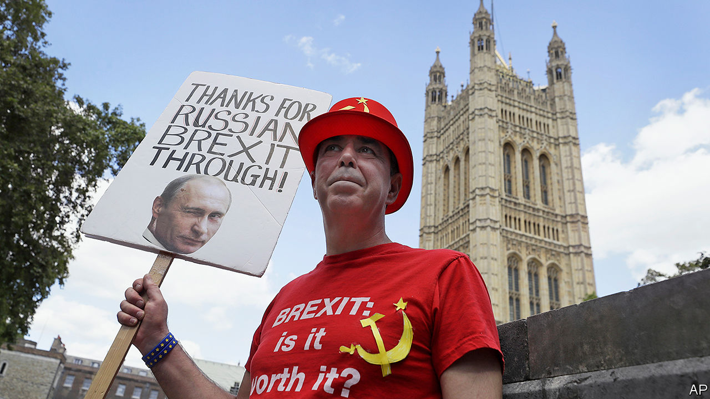

## Putin’s fingerprints

# Russian interference highlights Britain’s political failings

> Complacency, greed and self-interest have left the country’s institutions vulnerable

> Jul 25th 2020

“THE OUTRAGE isn’t that there was interference,” says Kevan Jones. “The outrage is that no one wanted to know if there was interference.” Mr Jones, a member of the House of Commons Intelligence and Security Committee (ISC), whose report into Russian interference in British politics was published on July 21st, encapsulates the government’s alarming attitude to the question of whether Russia meddled in the result of the Brexit referendum.

Russia sows discord and undermines institutions in many Western countries, but Britain is a particular target. The presence of émigrés such as Alexander Litvinenko, who was murdered by the Kremlin, and Sergei Skripal, who nearly suffered the same fate, infuriates Russia’s leadership. It regards Britain as hypocritical and duplicitous for making money from Russians through the “London laundromat” for cleaning money and reputations while offering sanctuary to its opponents. Britain’s special relationship with America also makes it a convenient proxy for Russian attacks on its bigger rival.

The extent of Russian interference in politics has been a subject of much speculation. Many of those who voted to remain in the EU, unwilling to believe that a majority of their countrymen really opted to leave, were inclined to suspect that Russia must have had a hand in it, and indeed funders of a pro-Brexit campaign have admitted meeting Russian diplomats. Russian fingerprints are visible elsewhere. Oligarchs hobnob with ministers at Conservative Party fundraisers. Jeremy Corbyn, a former Labour leader and lifelong critic of America, was endorsed by Russia’s ambassador. Alex Salmond, a former Scottish first minister, hosts a show on Russian state television, which routinely cheers his separatist movement. But hard evidence of interference is thin on the ground.

Many looked to the ISC’s report for a verdict on the matter. Boris Johnson blocked its publication before the December 2019 general election, which heightened expectations. But it is Britain, not Russia, that comes badly out of the report.

MI5, Britain’s domestic intelligence agency, initially provided only a six-line analysis of Russia’s involvement in the Brexit referendum, born, in the committee’s view, of “extreme caution” in dealing with political matters. But a lack of focus on Russia may also have contributed. Two-thirds of MI5’s work is directed towards Islamist terrorism, and a fifth towards Northern Irish terrorism, leaving 13% focused on monitoring hostile state activity. MI6, the foreign intelligence agency, finds Russia a “particularly hard” operating environment. New technology, like biometric controls, makes sending spies into Russia difficult, and grooming sources is a slow business. Though British spies do engage in virtual and physical skulduggery against Russia, fear of escalation and lingering hopes of coaxing Russia into a more emollient stance limit this activity.

Some observers think the report too critical of the security services. “Putin comes out of it really well—a really competent villain—whereas Whitehall comes out looking very Dads’ Armyish, which is a little unfair,” says Mark Galeotti of the Royal United Services Institute, a think-tank. “They are doing things which are much more strung together than most European countries, let alone the US.” Sir David Omand, a former direct of GCHQ, the British signals-intelligence agency, told the BBC that “the intelligence and security agencies follow the priorities of their customers.”

Ultimately, the blame lies with the politicians. Clues that Russia had interfered in Scotland’s independence referendum were ignored, and it was only when Russia hacked America’s Democratic National Committee that the government realised the risk to Britain. Yet the government, held back by fear of a revolt in the Conservative Party, failed to order an inquiry.

Complacency and greed, as well as political self-interest, are to blame. Ministers have “badly underestimated” the Russian threat and adopted a “laissez faire policy approach” says the committee, pointing to an appetite for Russian cash as one explanation. Whatever the reasons, Britain’s political institutions have been left vulnerable. Spies are hobbled by the legal framework in which they operate. Britain’s national-security laws, unlike America’s, do not make it illegal to be a foreign agent. “There are things that compellingly we must investigate…where there isn’t actually an obvious criminal offence,” Sir Andrew Parker, MI5’s chief when the committee was gathering evidence, told the ISC.

Anti-money laundering rules are tougher for businesses than for political parties, which the Electoral Commission says increases the risk of foreign funding. The current fine of £20,000 for breaches risks becoming “a cost of doing business”. Several members of the House of Lords have business dealings with Russian companies, but the current code of conduct does not oblige them to declare income in the way MPs must. Since 2018 the National Crime Agency has had the power to seize money and property from foreign politicians and officials suspected of looting their countries’ coffers, but its head told the committee that its budget for lawyers cannot match the oligarchs’.

Then there is the committee itself. In Britain as in America, lawmakers’ inquisitorial powers are part of the country’s protections against foreign subversion. But the ISC is weak. The security services can refuse to give evidence on live operations, which the committee said had frustrated the inquiry. At their request, the Russia report has been liberally redacted. The report was published after Mr Johnson tried and failed to engineer the appointment as chair of an ally so unpopular that the committee’s members revolted and elected a less pliant candidate. Sometimes Russian efforts to sow distrust in Britain’s political institutions seem unnecessary.

Although the way it has come out is embarrassing to the government, the report provides support for the new, more hawkish line that it is taking on Russia. In its response, the government said that Russia was a top national-security priority; most of the foreign officials on the blacklist that Dominic Raab, the foreign secretary, announced on July 5th were Russians. This new approach will give the Kremlin even more reason to interfere in Britain than it has had in the past. The government had better put some work into bolstering the country’s defences. ■

Correction (24th July 2020): This article has been updated to correct Mark Galeotti’s professional affiliation.