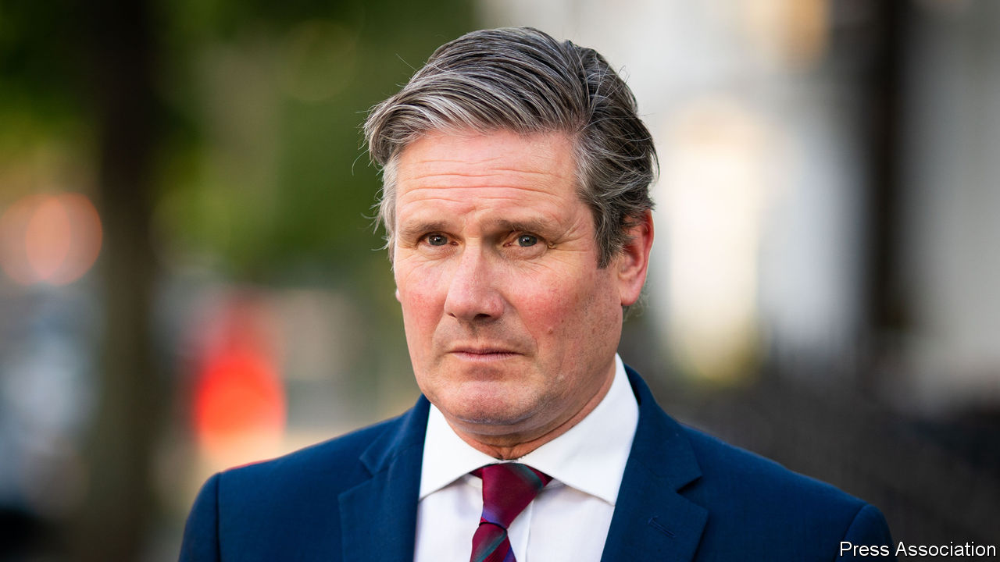

## Labour Party

# Starmer’s tough stance on Russia and anti-semitism

> Tipping Corbyn overboard

> Jul 23rd 2020

“IN CASE THE prime minister has not noticed, the Labour Party is under new management,” Sir Keir Starmer, the party’s leader, declared in the House of Commons. Showing that a party has changed is a tricky but essential task of opposition politics. It requires jettisoning stances that are prominent and unpopular with voters, but without declaring war on the party’s most loyal supporters. That Jeremy Corbyn, the previous leader, became best known for tolerating anti-semitism in the party ranks and for defending Vladimir Putin is to the Labour Party’s discredit, but it has made Sir Keir’s task of differentiating his regime from the previous one unusually easy. In a few hours before lunchtime on July 22nd, he demonstrated the vigour with which he is pursuing this end.

Just after ten o’clock, lawyers conveyed an apology from the Labour Party to John Ware, a BBC journalist, and seven former staff members, who will also receive “substantial” damages. A year ago, Mr Ware had presented a documentary entitled “Is Labour Anti-Semitic?” in which the staffers claimed that Mr Corbyn’s team had meddled in the complaints process. Rather than show contrition, the Corbynites shot back that Mr Ware was a dishonest journalist and claimed the whistleblowers were anti-Corbyn plotters, which the party now accepts was untrue and defamatory. Sir Keir says he will implement in full the findings of the Equality and Human Rights Commission, an anti-racism watchdog, whose report into the Labour Party will be published later this year, and says he is determined to win back the trust of Jewish voters. Mr Corbyn seems less bothered about their views, and said the settlement was “disappointing”. As a result, Mr Ware is now suing him too.

Shortly after the lawyers had done their bit, at Prime Minister’s Questions, Sir Keir charged that the government was slow to respond to the threat of subversion posed by Russia, and condemned its attempted assassination of Sergei Skripal, a turncoat spy. He announced Labour would support new national-security legislation. None of this would be striking for an aspiring prime minister, except for the fact that Mr Corbyn’s office had refused to blame the Kremlin for the attack and said the allegation Russia had used a nerve weapon was reminiscent of the false claims during the war against Iraq that the country was hiding weapons of mass destruction. Mr Corbyn was a regular guest on Russia Today, a state propaganda channel. Sir Keir called for its broadcasting licence to be reviewed.

Sir Keir won members’ support by promising to clean up Labour’s image while retaining Mr Corbyn’s platform of nationalising utilities and ending austerity. He has not broken that compact. But nor has he fleshed out Labour’s economic agenda, beyond saying that the coronavirus crisis demands radicalism. His campaign promise to “put human rights at the heart of foreign policy” sounded like an adoption of Corbynista hostility towards Western militarism, but has translated into kicking Russia and China. The speed and ruthlessness with which he has cleared out Mr Corbyn’s allies and their grubbier beliefs has surprised those who thought he’d put “vanilla unity” above the pursuit of power. Some Labour MPs miss Mr Corbyn. Mr Johnson misses him more. ■

## URL

https://www.economist.com/britain/2020/07/23/starmers-tough-stance-on-russia-and-anti-semitism
