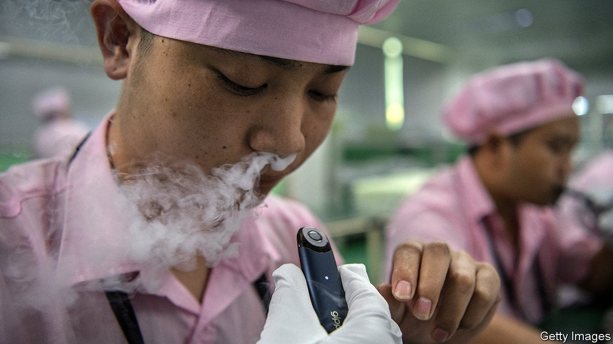

## Puff piece

# A state tobacco monopoly looms over China’s e-cigarette makers

> Smoore, the world’s most valuable vaping company, tries to carve out a niche among Chinese smokers

> Jul 23rd 2020

CHINESE LIKE to quip that the electronic cigarette is China’s fifth great invention, after paper, printing, gunpowder and the compass. A Chinese pharmacist hatched the idea in 2003 to wean smokers off tobacco. But it was in America, home to brands like Juul and Blu, that vaping first took off. Although one in four Chinese adults smoke tobacco, sales of e-cigarettes in China amounted to $2.7bn last year, a tenth of those in America, according to Frost and Sullivan, a consultancy.

Investors spy an opportunity. The market value of Smoore, China’s biggest e-cigarette maker, has nearly tripled since its initial public offering in Hong Kong on July 10th. It is now the world’s most valuable vape firm, worth around $24bn, more than the privately held Juul, most recently valued at $13bn. Smoore made a tidy pre-tax profit of 2.6bn yuan ($371m) in 2019, mainly from exporting components to foreign brands. It also hawks branded devices.

Investor optimism derives in large part from the prospect of rapid growth in China, where just 10m people were regular users of e-cigarettes at the end of last year. But dig a little deeper and the outlook darkens. A powerful state-owned cigarette monopoly, China Tobacco, will not cede ground to a rival product without a fight.

Regulators have already intervened on behalf of China Tobacco, which paid 1.2trn yuan in taxes last year, accounting for 6% of government revenues. In November the authorities banned online sales of e-cigarettes (ostensibly to prevent minors from buying them). Now they can be bought only at physical outlets like convenience stores and karaoke bars. In recent months editorials in state-owned newspapers have claimed (falsely) that vaping is more harmful than conventional cigarettes. A spokesman for the Electronic Cigarette Industry Committee of China, a trade body, blames the online ban for a wave of bankruptcies among smaller firms.

Bigger names like Smoore and RELX, both based in Shenzhen, face another problem. China Tobacco has already opened a lab in Shanghai to research e-cigarettes. If it concludes that vaping is here to stay, it too may get in on the action. It boasts a nationwide network of retail stores, and adding a new product to the mix would not be difficult. Cannibalising sales of ciggies may seem sensible if the alternative is losing millions of customers to rivals. ■