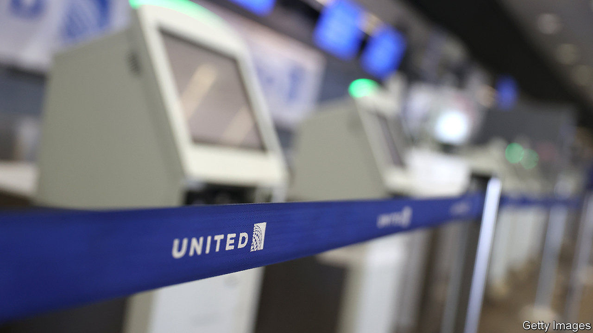
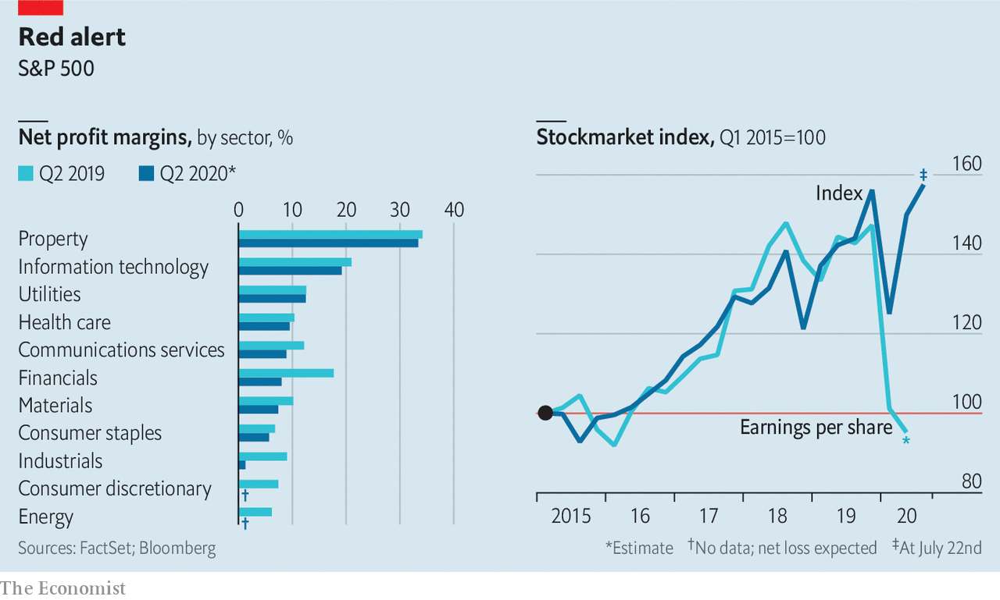

## Seeing is disbelieving

# America Inc braces for an earnings bloodbath

> For investors this earnings season will give the first inkling of just how bad things have got as a result of the pandemic

> Jul 23rd 2020

Editor’s note: Some of our covid-19 coverage is free for readers of The Economist Today, our daily [newsletter](https://www.economist.com/https://my.economist.com/user#newsletter). For more stories and our pandemic tracker, see our [hub](https://www.economist.com//news/2020/03/11/the-economists-coverage-of-the-coronavirus)

UNITED AIRLINES bled cash at a rate of $40m a day from April to June. That is the good news. Delta, a rival, clocked $43m a day. It was, United said, “the most difficult financial quarter in its 94-year history”, as lockdowns and travel restrictions led to an 87% fall in revenues. The travel industry has been eviscerated by covid-19. But it is not alone.

As America Inc begins to report its latest quarterly earnings—the first to capture the full extent of the economic coma induced to combat covid-19—companies across all sectors are disclosing hits to the bottom line. On July 21st Coca-Cola said its operating income fell by 34% year on year, as fewer restaurants bought its soft drinks and snacks. Not even big tech was spared. The day before Microsoft unveiled its own (decent) results on July 22nd, LinkedIn, its professional social network, said it would lay off nearly 1,000 workers because of a drought in corporate recruitment. Overall, profits of big American firms in the S&P 500 index are expected to have fallen by 44% in the three months to June, compared with last year, estimates FactSet, a data firm.

For investors the earnings offer a belated inkling of how bad things are. By May one in two S&P 500 firms declined to issue guidance about their results for the quarter ending in June, citing pandemic uncertainty. Ignorance being bliss, the stockmarket swiftly rebounded from its collapse in March. Now a little knowledge may prove a dangerous thing.

Editor’s note: Some of our covid-19 coverage is free for readers of The Economist Today, our daily [newsletter](https://www.economist.com/https://my.economist.com/user#newsletter). For more stories and our pandemic tracker, see our [hub](https://www.economist.com//news/2020/03/11/the-economists-coverage-of-the-coronavirus)