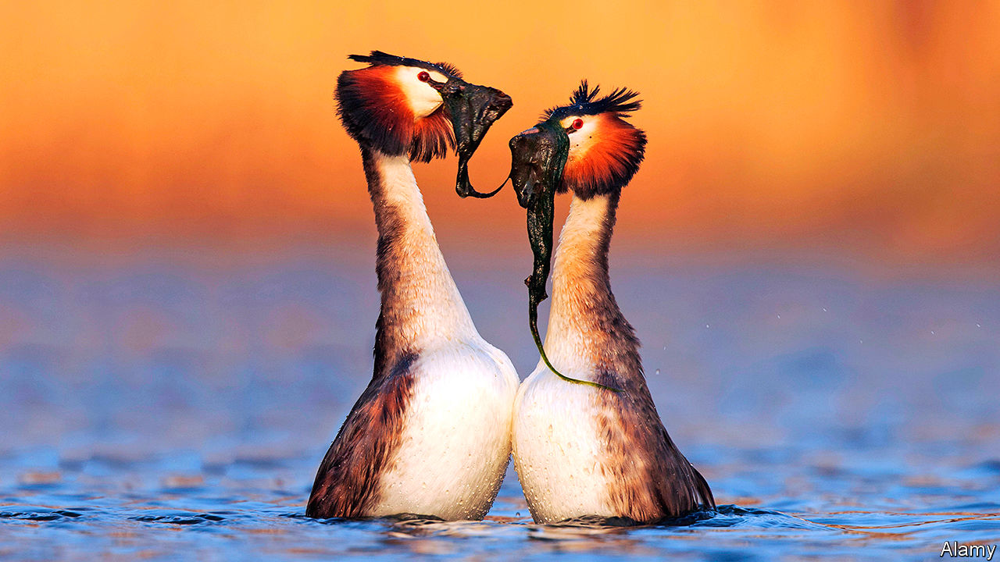
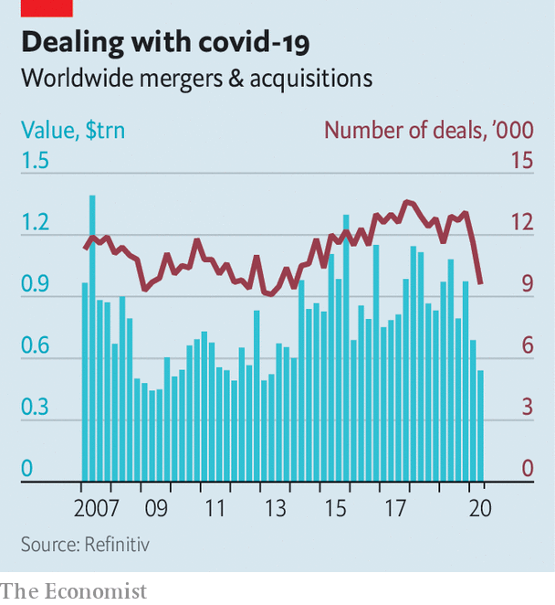

## Wakey, wakey

# Corporate dealmakers emerge from pandemic hibernation

> Does a slew of mega-mergers mark the end of an M&A drought?

> Jul 25th 2020PARIS

Editor’s note: Some of our covid-19 coverage is free for readers of The Economist Today, our daily [newsletter](https://www.economist.com/https://my.economist.com/user#newsletter). For more stories and our pandemic tracker, see our [hub](https://www.economist.com//news/2020/03/11/the-economists-coverage-of-the-coronavirus)

NOTHING EPITOMISES the animal spirits that drive capitalism as neatly as mega-mergers. As covid-19 spread, companies appeared to be practising the corporate version of social distancing: seldom since the aftermath of the global financial crisis of 2007-09 had takeover activity been so subdued. Now dealmakers are slowly emerging from lockdown.

A spate of deals this month suggests that bankers and lawyers specialising in mergers and acquisitions (M&A) may want to hold off booking summer holidays. On July 20th Chevron announced it would be paying $13bn for Noble Energy, a smaller oil-and-gas rival. A day later Adevinta, a Norwegian company, said it would extend its classified-ads empire by snapping up a unit of eBay worth $9.2bn. A week earlier Analog Devices agreed to pay $19.8bn for Maxim Integrated, another chipmaker.

That is quite a change from the first half of the year. A weak start to 2020 at first looked like a blip in an otherwise bullish M&A cycle going back to 2014 (see chart). By the time covid-19 reached Europe and America in March, the blip had turned into a slump. Barely $500bn-worth of deals were announced in the second quarter, compared with over $1trn a year earlier, according to Refinitiv, a data firm. Mega-deals over $5bn fell even more steeply.

At the height of the crisis, companies were reasonably preserving cash rather than looking for new ways to spend it. Uncertainty over the performance of potential targets made dealmaking risky. Complex M&A transactions—big ones can take more than a year to close—are tricky to pull off over Zoom. Regulators who clear them were also hobbled by the pandemic. Many planned deals fell apart. On March 31st Xerox ditched its $35bn hostile pursuit of HP, a bigger office-systems rival. Boeing shelved a putative acquisition of most of Embraer’s commercial-aviation unit in April, after its own prospects darkened as a result of the pandemic hit to air travel.

But the virus did not snuff out animal spirits entirely. T-Mobile and Sprint, two American mobile operators, merged as planned in April, calculating that the benefits of consolidation outweighed the risks. Just Eat and Grubhub announced a food-delivery tie-up in June. Aon’s planned $30bn purchase of Willis Towers Watson, a smaller insurance broker, is on.

It helped that some sellers discreetly agreed to offer buyers better terms. Lawyers have pored over documents to see whether a global pandemic is sufficient grounds to scupper a takeover, a point which judges will no doubt be required to opine on soon. On July 18th EssilorLuxottica, a Franco-Italian eyewear giant, sued GrandVision, a retailer it had agreed to take over a year ago, arguing it is not being given enough information on recent trading. GrandVision denies this is the case, but its shares are now trading below the price at which it had agreed to be bought out.

A second wave of covid-19 may upset the revival. So could rising protectionism, which hampers cross-border deals. But M&A bankers are bullish about the rest of the year. Firms whose profits have held up are likely to be first to return to dealmaking, says Eamon Brabazon of Bank of America. With good options for parking money scarce, lenders are happy to bankroll takeover bids by strong suitors. Private-equity funds can draw on a record $1.5trn of their investors’ money, according to Preqin, a data provider. They are hunting for bargains. Even grim economic conditions worldwide have a silver lining for the acquirers, if these force struggling targets into a sale whether they like it or not. ■

Editor’s note: Some of our covid-19 coverage is free for readers of The Economist Today, our daily [newsletter](https://www.economist.com/https://my.economist.com/user#newsletter). For more stories and our pandemic tracker, see our [hub](https://www.economist.com//news/2020/03/11/the-economists-coverage-of-the-coronavirus)