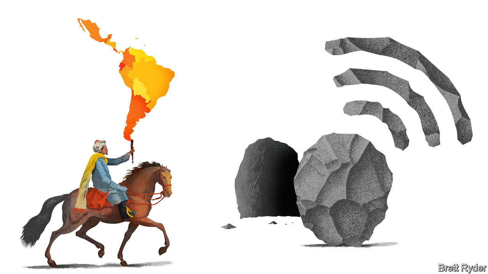

## Schumpeter

# MercadoLibre is a wannabe Alibaba

> It promises a shake-up to both retail and finance in Latin America

> Jul 22nd 2020

SINCE YOUR columnist first moved to a debt-ridden Latin America in the 1980s, he has seen many aspects of business in the region change for the better. Two have not. The first is the plethora of small businesses, from family-run corner shops and ice-cream parlours to hardware stores, that by and large are as scruffy as they were back then, eke out a meagre existence and remain stubbornly cash-only (even if cashiers still struggle to work out how much change you are due). The second is a visit to a bank, where, it sometimes seems, the only people who get what they need are those with a stocking over their head and an Uzi in their hands.

The two traits reinforce each other. Small businesses fail to modernise because they struggle to tap credit. Oligopolistic banks feel vindicated in not caring a hoot about firms stuck in the past. The resulting lack of dynamism among the small and medium-sized firms that account for more than 99% of enterprises in Latin America is a brake on economic activity. With covid-19 still wracking the region, the vulnerability has become worse. Total or partial lockdowns as well as fear of contagion and a deep recession have put many of the region’s smaller businesses in mortal danger.

Not all, though. To see why, look at MercadoLibre. The pan-Latin American e-commerce and fintech firm’s market value has doubled to $50bn during the pandemic as it has provided online sales and payments lifelines to such vulnerable companies. Since it was founded in 1999 by, among others, Marcos Galperin, an MBA graduate from Stanford University, it has become the region’s biggest tech darling, even though in 2020 revenues are projected to be just $3.2bn and it will lose money for a third year running. Profit, though, is for the future. Meanwhile, it is part of a wave of digital disruption that may propel smaller firms—which make up about 80% of those using its platforms—into the modern era.

Typically, MercadoLibre, which means “free market” in Spanish, has been compared to eBay, the American online marketplace that was an early investor. It is now worth more than its erstwhile mentor. It shares some characteristics with Amazon, with which it competes, especially in Mexico. For instance, like Amazon in its early days, it is prepared to forsake short-term profit for rapid growth. It has also been developing a logistics network. But unlike the American titan, it rarely trades on its own behalf; its e-commerce business earns a fee from transactions between buyers and sellers on its platform. In that way it resembles Alibaba, owner of China’s online emporiums. Its fintech arm, Mercado Pago, is loosely modelled on Alipay, Alibaba’s payments system. Plans announced on July 20th by Alipay’s owner, Ant Group, to issue shares that could value it at $200bn have MercadoLibre’s investors salivating over the prospect of a Latin American equivalent.

What attracts those investors most is the promise of a digital revolution in Latin America. It has been slow to get going. Last year less than 5% of retail sales in the region took place online, compared with 12% in America and 20% in China. Half of all Latin Americans lack a bank account. Fear of credit-card fraud has held back e-commerce, as have logistical nightmares in Brazil, where MercadoLibre generates more than half its revenues. Yet in a mixture of luck and good timing, the firm had invested in logistics just as e-commerce penetration surged into double digits amid the pandemic. Pedro Arnt, its finance chief, says Latin America’s move online has been “fast-forwarded” by three to five years in the past few months. That is true everywhere. But if first-time online shoppers in Latin America make it a habit, MercadoLibre has plenty to gain. According to Barclays, a bank, the value of merchandise traded on MercadoLibre averaged $30 per Latin American last year. The equivalent figure for Amazon in its core markets of America, Europe and Japan was $405.

The potential for payments may be even greater, though this business has had a bumpier ride in the pandemic. Beforehand, MercadoLibre was busily trying to bring offline merchants into its orbit by encouraging them to accept mobile payments via QR codes at bricks-and-mortar outlets. With the closure of restaurants and shops this initiative slowed. But QR adoption as a social-distancing measure may flourish as businesses reopen. Marvin Fong of BTIG, a broker, says a push by Latin American central banks to promote QR-style digital payments could galvanise fintech platforms in Latin America, such as Mercado Pago.

Mr Arnt admits it would be foolish to savour these “once-in-a-generation” opportunities and ignore the competitive threats. The biggest is Amazon, against which his firm has waged a costly battle in Mexico. So far Amazon has paid more attention to e-commerce opportunities in India than in Central and South America, but that could change. The second threat is that covid-19 convinces big physical retailers of the urgency to build online networks. He calls this the “empire strikes back” scenario. The third is in payments, whether in the form of competition from regional fintech startups or from WhatsApp (linked, perhaps, with the e-commerce ambitions of Facebook, its owner). MercadoLibre executives must have breathed a sigh of relief last year when they received a $750m investment from PayPal, a potential rival, to help them expand their company’s digital payments.

But MercadoLibre also has some built-in advantages. Its e-commerce success has given it enough brand recognition to support a region-wide payments business. Its small and medium-sized business customers rely on it for e-commerce, payments and, increasingly, credit; that helps entrench their loyalty. And its Latin American heritage means it understands not just the countries’ commonalities, but also their differences. Locals say it is a collegiate company that the brightest people in the region want to work for—more so than Amazon. If it inspires them to create their own businesses to sell via its platform, so much the better.■