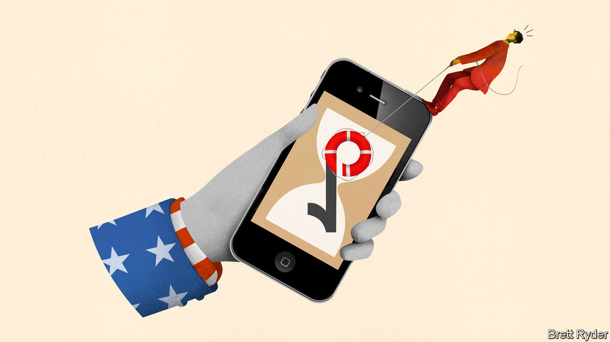
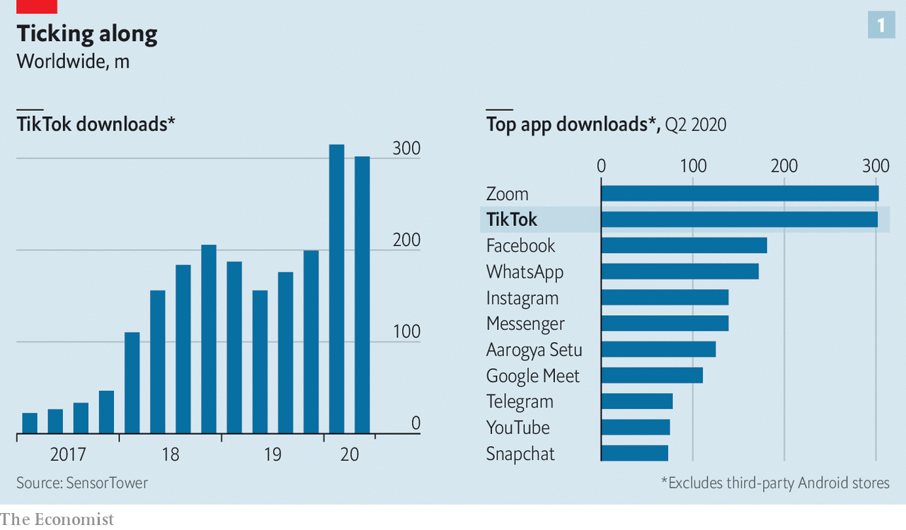
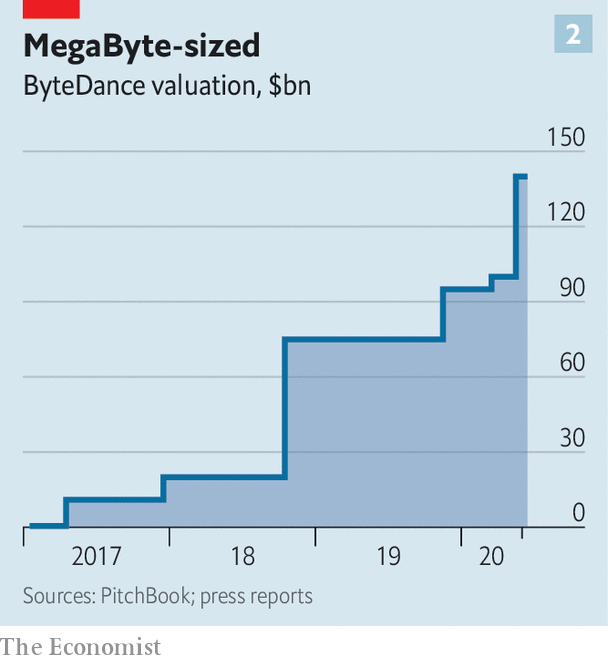

## Sixty seconds of fame

# TikTok’s Chinese parent is scrambling to hang on to its hit app

> America threatens to ban ByteDance’s most valuable digital property—or seize it

> Jul 25th 2020

IN MAY BYTEDANCE, the world’s most valuable startup, leapt further ahead of other technology “unicorns”. It was valued at $140bn on the secondary market, up by nearly half from a funding round in the spring. The reason? TikTok, a short-video app that has been downloaded 2bn times. The “last sunny corner” of the internet, as it is known thanks to jolly user-generated content, is China’s first worldwide internet sensation. For ByteDance’s 37-year-old founder, Zhang Yiming, it is part of an ambition to build a global software giant.

Now that ambition is in jeopardy. On June 29th India banned TikTok and 58 other Chinese apps, after deadly clashes between Indian and Chinese soldiers in the Himalayas. The same month ByteDance’s American lawyers told it that President Donald Trump’s administration has concerns over TikTok’s Chinese ownership. America is now threatening to ban the app altogether.

Official unease about TikTok has risen with its popularity. It has an estimated 70m American users, in the same league as Snapchat. In the first quarter it was downloaded 315m times globally, more than any app ever in three months, according to Sensor Tower, a research firm (see chart 1). In America and Britain it rivals YouTube for user attention—and not just among teenagers, who first took to it. “TikTok is a place for everyone now,” says Vanessa Pappas, the app’s general manager for America.

ByteDance keeps its numbers close to its chest but its investors say it is on track to bring in $30bn of revenue in 2020, up from $15bn-20bn in 2019. Net profit could more than double, to $7bn. Most of that comes from its Chinese businesses, Douyin, a version of TikTok, and Toutiao, a news app. TikTok is not yet making money, but ByteDance reckons it may in time eclipse all its Chinese properties put together, by tapping into America’s vast ad market. It has been rolling out tools to advertisers. ByteDance’s mainly American venture-capital backers believe this, plus growth in China, could lift its valuation to $500bn.

To TikTok’s users the idea of Uncle Sam cracking down on videos of baby hedgehogs is as silly as grandpas learning to shuffle. Officials have two concerns. The first is over censorship and propaganda. TikTok has in the past muted discussion of subjects sensitive in China, like Tibet, Tiananmen Square or repression in Xinjiang province. The second worry is that as a Chinese firm, ByteDance is subject to laws that require it to work with China’s authorities.

TikTok says that it has never received any formal requests for data from China, and would refuse to hand over information on non-Chinese users. But Alex Stamos, former chief security officer at Facebook who now advises Zoom, a videoconferencing service with operations in China, says that even if TikTok could resist government requests, “the question is what extralegal means exist to get data out”. If Beijing-based engineers have access to TikTok’s servers anywhere in the world, he says, their government could force them to hand over data stored there. TikTok says it collects less data than many social networks, but automatically records users’ GPS location, internet address, and browsing and search history on the app. Users can also opt in to share their contacts.

ByteDance has tried to head off these concerns. As TikTok’s user base exploded in the West, it took steps to Americanise its operations and management. After a covid-related delay its “transparency centre” in Los Angeles, where experts can examine its code, should open this summer. TikTok has hired a high-profile new chief executive, Kevin Mayer, from Disney.

In March ByteDance also came up with a more radical plan. It could take all its non-Chinese businesses, including TikTok, and give them a global headquarters in London, plus a back-office in Ireland (where Europe’s strict data-protection rules are in force). Operationally, the firm would bifurcate into “ByteDance China” and “ByteDance Global”. It talked to the British government about the idea in February.

These discussions stopped once the White House raised the prospect of banning TikTok. Some people involved now reckon the likelihood of such a ban is pretty high. ByteDance’s priority is to avoid this outcome, while hanging on to a meaningful chunk of TikTok’s economic value.

The company’s preferred option is the “ByteDance Global” plan. It is ready to change its capital structure and spin off the global arm, keeping a stake of between 35% and 49%. Mr Zhang would appoint a minority of board members. ByteDance Global could in turn spin out TikTok’s American arm to distance it further from China. Another option on the table is reportedly for ByteDance’s existing investors to buy a majority stake in TikTok, maybe letting ByteDance keep a small shareholding. Whether this would placate the Trump administration is unclear.

What ByteDance fears most is a forced sale of 90-100% of global TikTok to American investors or a tech giant. Larry Kudlow, Mr Trump’s economic adviser, has said he thinks TikTok will become an American firm separate from the Chinese parent. Beijing would probably accept a new European global headquarters for ByteDance, the firm reckons. But handing global TikTok over to Americans would smack of expropriation. “America would get another global tech platform,” notes one person in China involved in the matter.

Letting go of some or all of TikTok would be a financial blow to ByteDance. Without TikTok America its potential value would fall from $500bn to perhaps $300bn, reckons a big investor. Losing TikTok globally would be more painful still. A split could also stunt the future development of the app, whose popularity has been fuelled by ByteDance’s algorithms, honed in developing Douyin and Toutiao.

TikTok’s woes offer others an opening. In India, where 200m users lost access to it overnight, a local rival, Roposo, got 22m sign-ups in 48 hours. In America Facebook is about to launch Instagram “Reels”, a TikTok clone, and YouTube will soon roll out “Shorts”. The White House may yet think twice about banning an app so many Americans are hooked on. Its corporate structure may change. But Ms Pappas is resolute: “TikTok is not going away.” ■