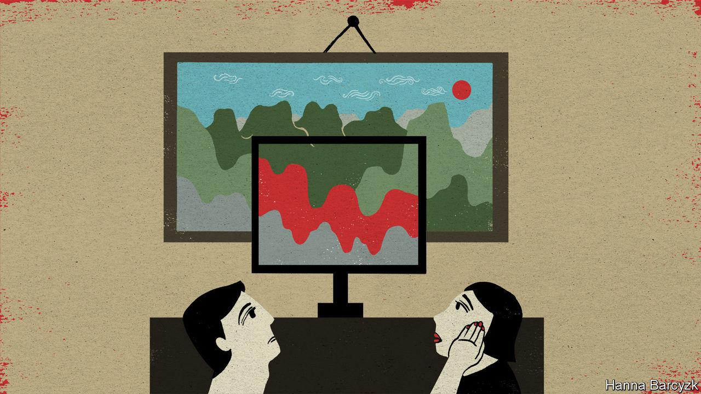

## Chaguan

# A hit TV drama in China asks hard questions about right and wrong

> Its moral code is messy

> Jul 23rd 2020

IN THEORY “The Bad Kids”, this summer’s most talked-about Chinese television drama, is a thriller about a teacher turned mass killer, matching wits with three plucky children in a quiet coastal town. In practice, like all really successful horror stories, the 12-part series is also a window onto things that frighten people in their everyday lives. A case can be made that the drama—despite its impressive body-count and inventive murder locations (a seafood buffet will never look the same again)—is really a meditation about how hard it is to be a good parent, or a good person, in a society that is as competitive, stressful and unequal as modern China.

In an era when entertainers are under ever-stricter orders to promote “positive energy” and the joys of Communist Party rule, that is quite a subversive theme. As a result, “The Bad Kids” offers a case-study about how clever film-makers must operate in the China of 2020. A sensitive, complex examination of the human condition, it is sprinkled with upbeat, censor-friendly details, some of them jarringly at odds with the rest of the plot. The trade-offs have worked. Official news outlets have praised the series. The Chinese public, for their part, have also given it an exceptionally high score of 8.9 out of 10 on Douban, a big online rating site.

Censorship-wise, it helps that the drama unfolds over the course of a sweltering summer about 20 years ago, so that scenes showing violent gangsters and loan sharks do not reflect on today’s leaders. Indeed, it is possible to enjoy the show for its nostalgic recreation of a simpler China where childhood friends might spend a hot night climbing rooftops or sharing lurid soft drinks from glass bottles, rather than sitting in lonely silence as many might now, gazing at smartphone screens. Some compromises are easy to spot. Notably, the show depicts small-town policemen as kindly paragons, bringing justice and comfort to the people of Ningzhou, the fictional port where the killer works as a maths teacher. Historians of corruption remember the era differently.

The drama is adapted from a novel by Zijin Chen, a dark study of evil, both adult and juvenile. The screen version, made by iQiyi, a Netflix-like streaming video company, depicts its three young heroes as mostly well-intentioned rebels, one of whom is tempted by evil. The other two speak with a moral clarity that eludes many adults in the show. Repeatedly, the murderous teacher plays on the power of education to change lives in China. He distracts a suspicious policeman with advice about his daughter’s maths grades, and offers free tutoring to the children who have rumbled him. His youngest tormentor, a sweet-natured girl known as Pupu, sternly replies: “Is school where you learned to kill people?”

In the book, the children are angry victims of adult betrayal, ranging from sexual abuse to being disowned by a divorced father. Two youths in the novel are the children of murderers, executed by the state. The television drama offers a nuanced view of parenthood. Viewers see the flaws of a mother whom society might call a model parent, pushing her clever son to study until his bedroom is filled with academic trophies. He will have time for friends once he has a good job, the mother snaps at a teacher concerned by her son’s loneliness. Yet that mother is scared, not wicked. Divorced from a cheating husband, she sees education as a way to armour her son against a harsh world. “Promise you will be safe,” she tells her child. They are the most loving words she utters.

One question comes up time and again: what does it mean to be good? Scenes of supposed hospitality—banquets at which the young are handed cash in red envelopes, or junior family members are bullied to drink alcohol—are exposed as cold and empty. “A man without ambition isn’t a man,” the maths teacher is told at a dinner, as in-laws dissect his career prospects. The drama challenges the idea that respectability and virtue are earned by fulfilling the family, social and professional obligations that cost ordinary Chinese so much time and agony.

Even the law offers little help in defining virtue. “Whether your dad is a good or a bad person is decided by a judge, not by you or me,” a gruff policeman tells Yan Liang, a prisoner’s child. He is proved wrong when Yan Liang’s father, a gangster sent to a mental hospital with drug-induced brain damage, redeems himself with a fleeting, almost miraculous proof of love for his son.

Several characters gain moral authority through such private yet sincere acts of affection. Viewers mostly respect a police captain because they see his sweet, bantering-yet-supportive relationship with his daughter, not because he has stars on his epaulettes. Yan Liang, a ragged teenage runaway, steals a blanket for Pupu and agonises aloud about following his father into criminality. When put to a life-and-death test, though, he does the right thing. “I didn’t become a bad person,” he gasps with relief to the gruff policeman who has become a mentor. It is a moving moment. The censors’ hand can be felt soon afterwards, when Yan Liang abruptly declares an ambition to join the police as an adult.

Devoted fans, including a Chinese-Canadian blogger about television who uses the name AvenueX, suggest that attentive viewers can see alternative endings hidden among the uplifting patriotism. Notably, AvenueX points to clues that several characters die before the drama ends and should now be understood as ghosts, visible only to those who care for them. Her arguments are plausible, though the film-makers have rejected such theories.

Truth is a slippery concept in “The Bad Kids”. Many lies are told, sometimes for selfish reasons, but also for fear of losing something precious. Truth-telling is at its most admirable when offered as an act of love, for instance by a child who cannot bear the loneliness of deceiving a parent for ever. This is a messy moral code, far from the tidy, flag-waving pieties favoured by party chiefs. The show’s popularity is cheering. In a China that rings with the din of patronising, bossy propaganda, viewers crave a bit of messiness.■

## URL

https://www.economist.com/china/2020/07/23/a-hit-tv-drama-in-china-asks-hard-questions-about-right-and-wrong
