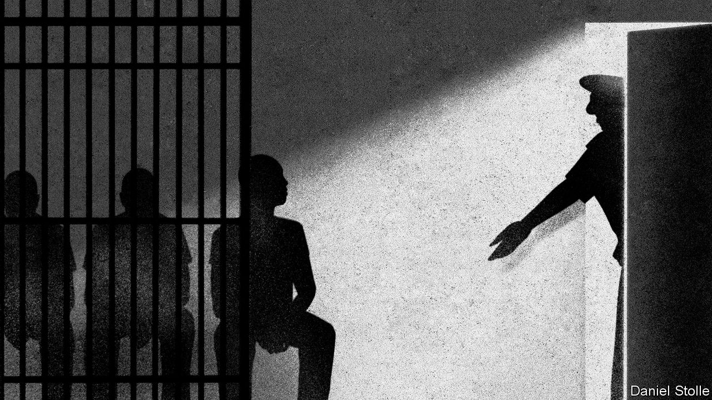

## Righting wrongs

# China is growing more willing to review dodgy convictions

> But not for political dissidents

> Jul 23rd 2020BEIJING

ON A NOVEMBER morning in 2004, Wang Zhansheng’s three- and six-year-old sons fell suddenly and violently ill. The older boy recovered. His little brother died the same day. Police in their home province of Henan, in central China, concluded that the toddler had been murdered. Soon they said they had caught the culprit: Wu Chunhong, a 34-year-old neighbour with three children of his own. Under interrogation, Mr Wu told police that he had quarrelled with the boy’s father over a small debt. He said that he had taken revenge by sneaking into the family’s kitchen and sprinkling rat poison into cooking ingredients.

In April this year Mr Wu was freed from prison, his conviction quashed during a brief hearing that was held online as a result of the covid-19 pandemic. For 16 years Mr Wu had maintained that his confession was false and had been obtained through torture. He said that he had been shackled and beaten, and that his resistance had broken when police threatened to subject his wife to the same treatment. His case is the most recent of more than 60 big miscarriages of justice that have been made public since Xi Jinping took power in 2012, researchers at New York University (NYU) calculate. The overturning of these verdicts is proof, officials say, that China’s criminal justice system is working better.

Many wrongful convictions have come to light after re-examination of cases related to China’s occasional nationwide “strike hard” campaigns against serious offences. Big ones in 1996 and 2000-01 aimed to curb a rise in crime that followed the dismantling of the old state-run economy, and the easing of strict social controls that went with it. Short-staffed police bureaus were given high targets for the number of people to be rounded up. This led to many arbitrary arrests, a problem compounded by the incompetence and bias of judges and prosecutors, who often lacked legal training. Many had simply been assigned to the jobs after military service.

Anti-crime campaigns on such a scale are rarer these days, but much about China’s criminal system remains woeful. Only 30% of criminal defendants are represented by lawyers, guesses Ira Belkin of NYU. Verdicts are almost always agreed before trials begin, during private meetings of judges, police and prosecutors. These officials are easily intimidated by higher-ups seeking the swift closure of cases, or by families of victims who threaten to protest should suspects not be punished. Once defendants reach a courtroom, the conviction rate is above 99.9%.

A common cause of wrongful conviction is the convention in serious cases that suspects must confess. Police often use force to make sure this happens. In 2018 academics in Hong Kong and Macau analysed 141 exonerations that had taken place on the mainland since 1982. They found that false admissions of guilt had been a factor in nearly 90% of them. In America, by contrast, false confessions are thought to contribute to about a quarter of wrongful convictions. A more common cause there is mistaken or deceitful testimony by witnesses (a scourge in China, too).

Questioning all this was once taboo. That changed swiftly during the 2000s, in part because of two cases involving egregious errors by the police. One of them was exposed in 2005 when a woman in Hubei, another central province, turned up alive 11 years after her husband told police that he had killed her (she had left her home to begin a new life). The other came to light in 2010 when a villager returned to his home in Henan, more than a decade after his neighbour had admitted to murdering him during an argument. In both cases police had misidentified decomposed bodies. The publicity given to these wrongful convictions was a hint of officials’ concern about the impact such cases were having on public confidence in the justice system and in the Communist Party’s competence.

After taking power, Xi Jinping put new emphasis on a campaign, begun by his predecessors, to stop such embarrassments. Encouraged by this, some lawyers and law professors launched co-ordinated efforts to get shaky-looking cases reopened, using tactics learned from similar grassroots campaigns in America.

Officials have shown no eagerness to re-examine cases involving dissidents—indeed, under Mr Xi’s rule the party’s critics have been subject to harsher repression. Lawyers who have tried to defend ordinary people against the power of the state have been harassed and jailed. But over the past eight years, there has been a string of directives aimed at curbing other miscarriages of justice. Two revisions to the criminal-procedure law, the most recent in 2018, have sought to make it easier for defendants to challenge evidence obtained under duress. In January the government ordered that people accused of major crimes, as well as their lawyers, be interviewed at the end of investigations to ascertain whether torture was used. It has also been trying to make trials less of a mere ritual: for example, by giving courts more power to compel witnesses to appear in person. In 2017 the government said it wanted all defendants in criminal cases to have access to a lawyer, though it gave no deadline.

There have been other encouraging trends. He Jiahong of Renmin University in Beijing says the increasing availability of electronic evidence, such as from mobile phones, cashless payments and security cameras, is likely to reduce the value of obtaining confessions. And he spots a change in attitudes, whereby people who work in the justice system are increasingly inclined to agree that it is better to let the guilty go free than to punish innocents.

But it is difficult to judge how much this is helping to make justice fairer. Information that might be helpful, such as changes in the proportion of cases being concluded without a confession, is hard to come by. Proving trends in abuses committed by police is “almost impossible”, says NYU’s Mr Belkin. The party’s secrecy may also be directly obstructing change. Tobias Smith of the University of California, Berkeley, says the government has neglected its promise to ensure that defence lawyers take part in reviews of death-penalty cases because it does not want them to work out how many people are executed, which is a state secret.

Criminal justice in China is increasingly splitting along two tracks. People accused of crimes that are unrelated to politics are gradually receiving better protection. Those accused of political crimes or official corruption are being treated more harshly, says Joshua Rosenzweig of Amnesty International. The idea is to have a legal system that looks fairer to many citizens but still just as threatening to people whom the party fears might oppose or undermine it. That could be called progress, but few would call it justice. ■

## URL

https://www.economist.com/china/2020/07/23/china-is-growing-more-willing-to-review-dodgy-convictions
