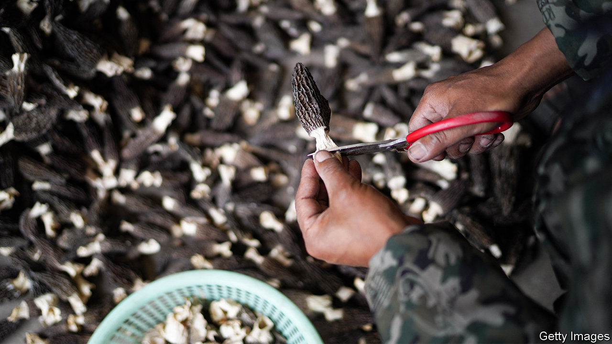

## Champignon champions

# In south-western China’s Yunnan province, mushrooms mean money

> Or death if you pick the wrong ones

> Jul 23rd 2020NANHUA

IN MAY, WHEN the first monsoon rains sweep across the mountainous province of Yunnan, foragers throng to damp forests to hunt for wild mushrooms. Grandmothers strap wicker baskets to their backs, wielding sticks with which to rake the forest floor and hook from it a “black beef liver” (known elsewhere as a bronze bolete) or a crimson “green pinch” (named for the bruises that fingerprints leave on its velvety gills). Joining them at first light are local chefs, village children and their parents, some of them migrant workers who have returned from far-flung coastal factories especially for the hunt.

Thousands of Yunnanese families earn much of their living from the wild-fungi season, which runs until October. The 160,000 tonnes they collect annually in the poor south-western province generate income of about 10bn yuan ($1.4bn). The most valuable end up on posh dinner plates abroad, from porcini—beloved of Europeans—to meaty matsutake, prized by South Koreans and Japanese. Trains are commandeered to get the mushrooms from basket to banquet in under 30 hours. A rail service launched last year has been dubbed the “high-speed matsutake express”. Whatever is not sold fresh is air-dried, frozen or made into a relish.

In the summer, Wu Huahai, a young father from Wujia village, makes 4,000 yuan a month from scouring the hills—roughly what he makes as a driver near the coast. In protected forests, where collecting is limited to local families, and so competition is less fierce, a hunter’s monthly take can reach 10,000 yuan. Among the most coveted types are “goat belly” mushrooms (morels), which can fetch up to 1,000 yuan per kilo when they appear later in the season. But this year demand for Yunnan’s mushrooms has been dented by covid-19. Prices have fallen by as much as half.

At the market where Mr Wu and his wife hawk the morning’s finds, 170 tonnes of wild fungi are sold every day in season. It is located in Nanhua, Yunnan’s best-endowed county mycologically. A vast array of mushrooms grow across the province. Yunnan accounts for just 4% of China’s land area yet is home to more than 800 of the country’s 1,000 known edible varieties, and about one third of the world’s. Dozens more are discovered in Yunnan every year, says Yang Zhuliang of the Kunming Institute of Botany.

Some are lethal. A type identified in 2012 is called “little white” because of its resemblance to an innocuous oyster mushroom. Mr Yang’s institute named it as the culprit behind Yunnan Unknown Cause Sudden Death Syndrome, which for decades had haunted villagers during the monsoon. Little whites now feature on billboards at wet markets in the region that show how to discern the delectable from the deadly (and warn against the mind-bending, which are popular).

Another danger lurks. Mycologists fret that harvesting is damaging the mushrooms’ habitat. Some hunters unearth them too young, says Yang Hongying, an old-timer on the hills. She finds only a tenth of what she recalls gathering as a child. But back then there “wasn’t really a market for mushrooms”, says Ms Yang. Now the villagers’ everyday meals—nutty summer truffle shaved raw over eggs, or yellow jizong stir-fried with salted ham—are considered truly to die for. ■