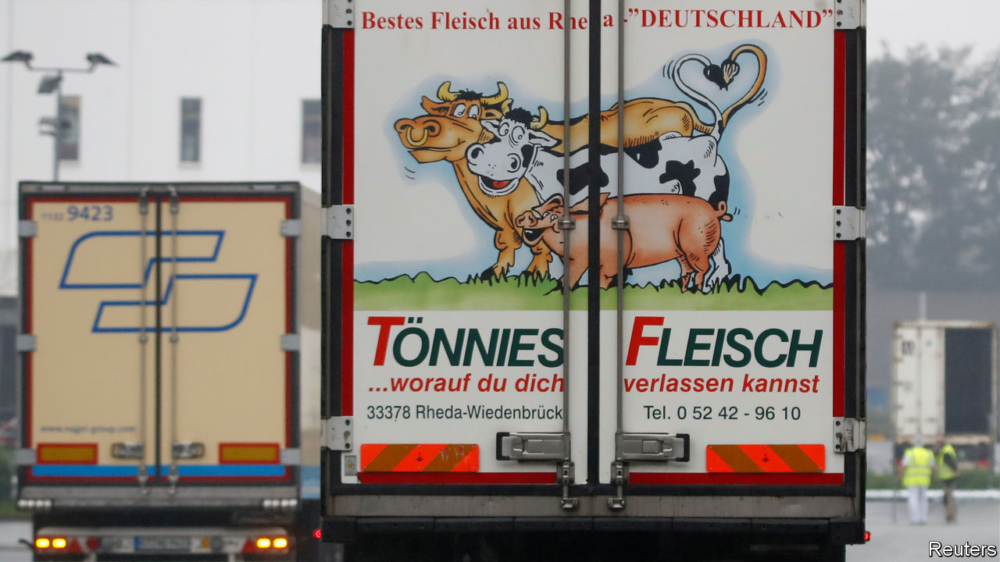

## Germany’s wurst jobs

# After spreading covid-19, a huge European abattoir vows reforms

> An outbreak forces German meat wholesaler Tönnies to promise its workers better conditions

> Jul 23rd 2020BERLIN

Editor’s note: Some of our covid-19 coverage is free for readers of The Economist Today, our daily [newsletter](https://www.economist.com/https://my.economist.com/user#newsletter). For more stories and our pandemic tracker, see our [hub](https://www.economist.com//news/2020/03/11/the-economists-coverage-of-the-coronavirus)

CLEMENS TÖNNIES used to be a local hero in eastern Westphalia. One of six children of a butcher from the town of Rheda-Wiedenbrück, he grew Tönnies, the family meat-wholesaling business which he took over after his brother Bernd’s death in 1994, into one of the biggest meat-processing companies in the world, with annual sales of €7bn ($8bn). For almost two decades the bratwurst billionaire was chairman of Schalke 04, a beloved local football team. He built the Tönnies arena, a 3,600-seat stadium for a women’s football club, next to his company’s headquarters. He donates to the local shooting club, and owns hotels, a gym, a real-estate agency and even a kindergarten in Rheda.

Mr Tönnies’s image suffered last year when he made comments belittling Africans, and was forced to step down as Schalke’s chairman. It took a much bigger hit last month after the plant in Rheda, the largest of his 29 plants in Europe, triggered Germany’s biggest single outbreak of covid-19. More than 1,400 people, mainly contract workers from south-eastern Europe, tested positive. Authorities closed the plant, quarantined some 7,000 workers and their families, and imposed a lockdown for 640,000 people in the area.

As the extent of the outbreak grew clear, Robert Tönnies, Bernd’s 42-year-old son who owns 50% of the company, asked his uncle and the entire top management to resign. Uncle and nephew have been at loggerheads for years over how to manage the firm. (Robert wants his uncle to spend less on football and more on animal and worker welfare.) In a letter leaked to the press, Robert lambasts the company’s use of subcontractors, which he has wanted to ban since 2017. More than 9,000 of Tönnies’s 18,700 workers are supplied by 24 subcontractors who recruit them mainly in Poland, Romania and Bulgaria. They live in cramped, infection-prone quarters.

“Workers are exploited,” says Sonja von Zons, a Green Party candidate for mayor of Rheda-Wiedenbrück. Tönnies does not have a digital time sheet, making it hard to track work: a typical shift is 12 hours of blood-soaked labour at temperatures near freezing, but contractors often pay only for eight. Sixty-hour weeks are the norm. Workers get the minimum wage (€9.35 an hour), but subcontractors charge them for knives, boots and other equipment. They also make them pay for board (in a squalid room shared with half a dozen others) and transport from their home countries. Locals do not mingle with the migrants. “It is a parallel society,” says Ms von Zons.

Mr Tönnies did not resign. Instead, he vowed to right the ship. He promises to scrap subcontractors and employ all workers directly by the start of next year. He also paid for food sent to quarantined workers, and for thousands of coronavirus tests in Rheda and surroundings. In an interview on July 18th with Westfalenblatt, a local paper, he explained that Martin Exner, a hygiene expert at the University of Bonn, found that the outbreak was caused by poor ventilation. In Mr Tönnies’ view, that meant it was not his firm’s problem, but one for the entire industry. On July 17th the Rheda plant restarted slaughtering, albeit at a reduced pace: 8,000 pigs a day, compared with up to 25,000 in normal times.

Hubertus Heil, the German labour minister, will not let Mr Tönnies get off the hook easily. He demands Tönnies pay damages for having forced the region’s quarantining. And he is due to present a draft law on July 29th banning the use of subcontractors in slaughterhouses.

Tönnies reacted by creating 15 subsidiary companies that will employ the formerly subcontracted workers. Critics think this is a ploy to prevent unionisation by dividing workers by job type, and perhaps by nationality: the vast majority of them will still be eastern Europeans. “We cannot find Germans to work for us,” explains André Vielstädte, a spokesman for Tönnies, adding that it is not “pleasant work”. Ending subcontracting will alleviate some hardships for migrant workers, but real change will come only if the industry leader shows the way. So far, Mr Tönnies has improved conditions at his plants mainly when he had no other choice.■

Editor’s note: Some of our covid-19 coverage is free for readers of The Economist Today, our daily [newsletter](https://www.economist.com/https://my.economist.com/user#newsletter). For more stories and our pandemic tracker, see our [hub](https://www.economist.com//news/2020/03/11/the-economists-coverage-of-the-coronavirus)

## URL

https://www.economist.com/europe/2020/07/23/after-spreading-covid-19-a-huge-european-abattoir-vows-reforms
