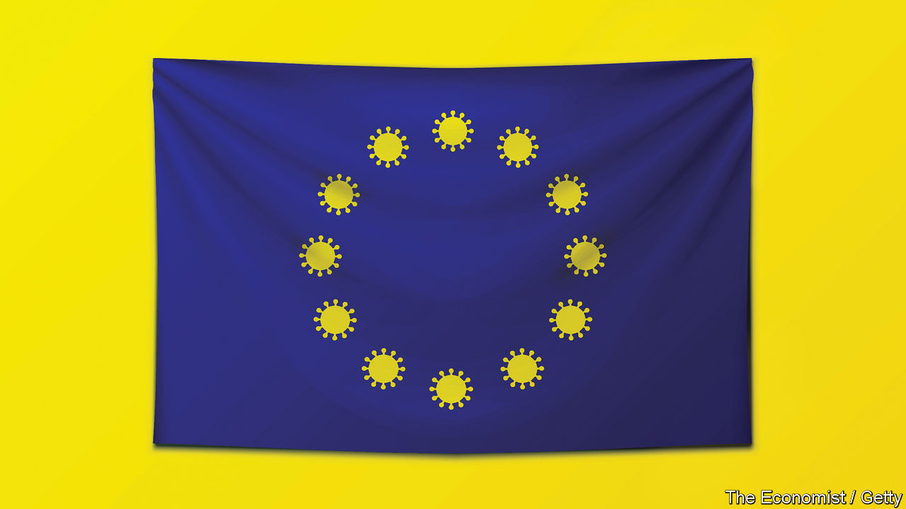
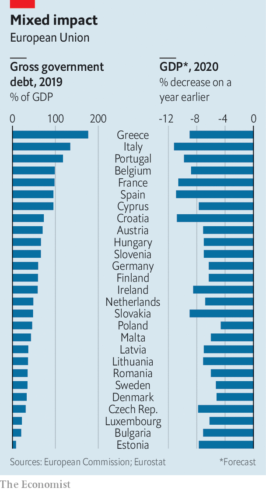

## A big fiscal deal

# The EU’s leaders have agreed on a €750bn covid-19 recovery package

> The union will borrow vast sums collectively for the first time

> Jul 21st 2020BERLIN

LIKE ALMOST everything else at this week’s European Council, which concluded at 5.30am on July 21st after five days of deliberation, the question of whether it was the longest EU summit in history was hotly contested. Some said it beat the record held by a mammoth discussion in Nice in 2000. Others thought it fell 25 minutes short. Either way, it was a landmark event. Most of the EU’s 27 national leaders emerged into the Brussels dawn claiming to have agreed to something historic. To judge by the soaring euro and plunging spreads, investors concurred.

The deal has two elements: the regular EU budget, or multiannual financial framework (MFF), worth nearly €1.1trn ($1.3tn) over seven years; and a one-off “Next Generation EU” (NGEU) fund of €750bn to help countries recover from the covid-19 recession (both figures in 2018 prices). Rows over the second of these explain the summit’s length: at one point leaders spent over an hour arguing over whether to replace the word “decisively” with “exhaustively” in the communiqué. But in the end each returned home broadly satisfied.

The deal broke two historic taboos, says Silvia Merler, head of research at Algebris Policy Forum, the advisory branch of an asset-management firm. First, Europe’s leaders agreed that the European Commission, acting on behalf of the member states, may incur debt at an unprecedented scale. The NGEU will be funded by borrowing over six years, with bonds issued at maturities extending to 2058. Second, €390bn of the €750bn will be distributed as grants, and hence will not add to governments’ debt loads—breaching what had been a red line over substantial intra-EU fiscal transfers. Both developments would have been unimaginable just six months ago.

Europe has marshalled a fiscal response to the covid crisis equal to or better than America’s. The NGEU is worth some 4.7% of the EU’s annual GDP, albeit spread over several years, and comes on top of national governments’ stimulus efforts. The EU has plugged the budgetary hole left by the departure of Britain. It has answered the European Central Bank’s pleas to balance its monetary activism with a comparable fiscal effort, and will provide investors with a steady stream of safe assets. It may have set a precedent for future crises to be met with collective debt, although that will be ferociously resisted, not least by the self-styled “frugal four”—Austria, Denmark, the Netherlands and Sweden—who were the biggest hurdle to striking a deal.

The recovery funds will initially be allocated to countries using criteria like unemployment and income per person. That will benefit the likes of Spain, and Italy, which says it is in line for €209bn in loans and grants. The commission will evaluate governments’ investment plans on the basis of its annual “country-specific recommendations”, usually toothless reform checklists that Ursula von der Leyen, the commission’s president, says will now pack “more punch”. Fully 30% of MFF and NGEU spending should be devoted to climate action, potentially creating a vast green stimulus.

But the commission will not have the only say over spending. Rather like Germany during the euro crisis, the frugals do not trust the commission’s technocrats to police the reforms of southern states. Instead Mark Rutte, the Dutch prime minister, secured an “emergency brake”: any government can object to another’s spending plans, delaying and complicating disbursements. That allows him to tell Dutch voters that they have not signed a blank cheque for feckless southerners. Some southern reformers even hope this rule may help their case (“Thanks Mark Rutte,” wrote a pro-market Spanish politician in El País). But Lucas Guttenberg of the Jacques Delors Centre in Berlin fears the brake could entrench mistrust inside the EU if beneficiary governments believe others are objecting in bad faith.

The deal falls short of the “Hamiltonian moment” some had hoped for, referring to the US national government’s assumption of state debts in 1790. No one has proposed mutualising EU countries’ legacy debts; even the new common debt will not enjoy joint-and-several guarantees. And the question of how to repay it is left for later. Governments have long been unwilling to hand tax-raising powers to Brussels. Yet from 2028 money must be found to repay the new debt: if not from “own resources” (EU revenues, in the jargon) generated by new taxes, then from larger national contributions to the MFF. A levy on plastic will take force in January, and the commission will later propose EU-wide taxes on digital firms and climate-unfriendly imports.

There are two areas of concern. The first is the price demanded by the frugals. To preserve the recovery grants, cuts fell on so-called “future-oriented” areas like research, health care and climate adjustment. These, critics grumble, are precisely the themes the frugals always said should take priority over farming and regional subsidies, which remain intact. And the frugals won big increases to the rebates they get on their EU budget payments (Austria’s more than doubled). Such small-country triumphs do not fatally undercut the deal, but they cost money and will be bitterly contested at the next MFF round.

A second set of worries centred on how to prevent handouts to countries that undermine the rule of law. Wayward governments like Hungary and Poland are big winners from the MFF, and some had hoped that attaching rule-of-law conditions to disbursements might help bring them to heel. In the end the leaders agreed on studiously ambiguous language, shaped by Angela Merkel’s team. It promises “a regime of conditionality to protect the budget” but postpones the decision on how to obtain it. “Lots of people will want this made more precise,” says Katarina Barley, a German social-democratic MEP.

Many of Ms Barley’s colleagues in the European Parliament, which must sign off on the deal, also criticised the deal’s cuts to favoured programmes and their own exclusion from oversight of spending. Yet although the parliament may extract tweaks to the deal, on past form it is unlikely to squash it. A budget must be in place from the start of next year. MEPs will not want to spark a crisis by blocking it. ■