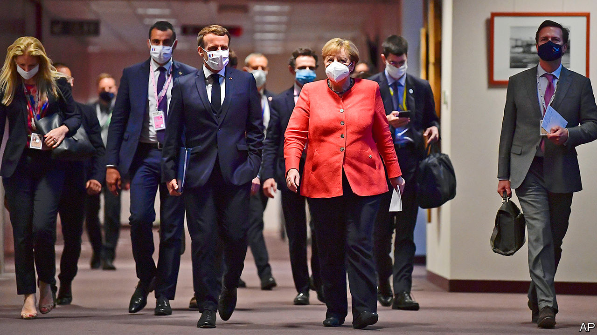

## Keep pedalling the tandem

# The founding partnership behind this week’s EU deal

> Macron and Merkel defy those who had written off the Franco-German relationship

> Jul 23rd 2020PARIS

“I’M NOT FRUSTRATED, I’m impatient,” declared an evidently frustrated Emmanuel Macron in Germany earlier this year. The French president had put European integration at the heart of his election campaign in 2017. Yet even as covid-19 struck, European leaders were still unable to agree on much. France and Germany, two founding members that have guided the European Union for over six decades, were condemned, it seemed, to settle for incremental fixes. One commentator wrote of “the end of the Franco-German love-in”. In The Economist last November, Mr Macron said Europe was “on the edge of a precipice”.

In the early hours of July 21st, however, after four long days and nights, the 27 EU leaders agreed to a deal that, for once, deserved the term Mr Macron gave it: “historic”. The agreement was officially shepherded by Charles Michel, president of the European Council, backed by Ursula von der Leyen, head of the European Commission. But ultimately it happened because the leaders of France and Germany managed—in a crisis—to settle their differences beforehand, then bring others along. “Exceptional events”, said Germany’s chancellor, Angela Merkel, “call for exceptional new measures.”

The Franco-German tandem has driven most of Europe’s advances. The Maastricht treaty in 1992, for instance, which led to the euro’s creation, was masterminded by France’s François Mitterrand and Germany’s Helmut Kohl. Over the decades, even when leaders have not got on, strong cross-Rhine administrative links have endured. The point is not that France and Germany agree readily: they approach almost everything—from defence to debt—differently. But if they can agree, goes the theory, fellow Europeans should be able to as well.

This latest deal tested that principle to the limit. The “frugals”—Austria, Denmark, the Netherlands and Sweden, joined by Finland—dug in, insisting on less money for grants and more for their budget rebates. Tempers flared. At one point Mr Macron “banged his fist on the table”, according to an aide, accusing Austria’s Sebastian Kurz of having “a bad attitude” and the Netherlands of behaving as Britain used to. It was exactly the sort of lecturing from France that, when it acts alone, so irks others.

Yet this time, Mr Macron and Mrs Merkel led a double act. They devised a joint plan in May, steered talks à deux, even stormed out of a summit meeting together. After concessions, the frugals agreed to most of what they had rejected just months ago. “Macron held out his hand to Germany for a long time,” says Tara Varma of the European Council on Foreign Relations. “What made the difference is that in the end Merkel took it.”