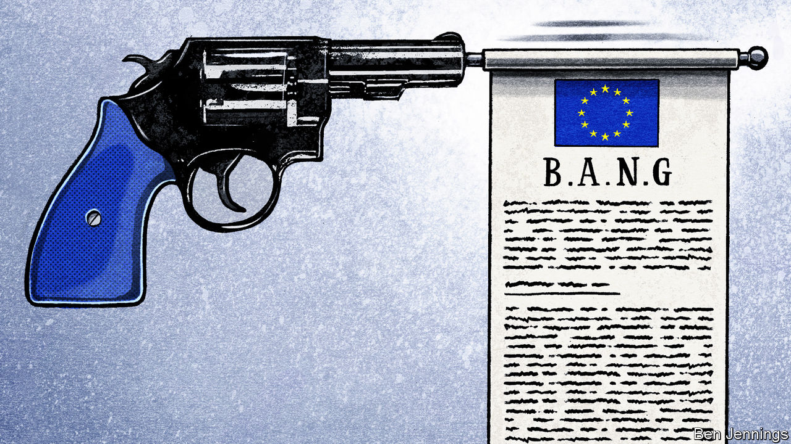

## Charlemagne

# Why the EU is becoming more like a Chekhov play

> Legal guns that once gathered dust may soon be fired

> Jul 23rd 2020

“IF IN THE first act you have hung a pistol on the wall, then in the following one it should be fired.” Anton Chekhov’s rule on writing is a good one. The Russian author would have despaired at the Treaty on the Functioning of the European Union. At 154 pages in its consolidated version, it is a bit long. The prose lacks punch. More importantly, it is littered with unused firearms. Powerful weapons gather dust in the EU’s legal gun-cabinet. Article 222 obliges all EU states to pile in and help if a desperate national capital triggers it, which no one ever has. National capitals can sue each other in the European Court of Justice, although no one has tried it properly. Even the outlines of an EU army are there, if the members want it, which so far they do not.

Now, however, European officials are eyeing up the armoury. Hitherto unused, overlooked or reinterpreted rules provide the legal bedrock for renewed attempts to integrate the bloc in ways unimaginable a few months ago. Such rules were used to allow the EU to issue €750bn of collective debt and then hand it over to member states, with over half of that sum—€390bn—in the form of grants which will not be paid back. At first glance, this plan grinds against the clear principle that the EU is not liable for the debts of its national governments. Instead officials pointed to a vaguer article declaring that the EU has the right to “provide itself with the means necessary to attain its objectives and carry through its policies”. It is a small foothold for the creation of a de facto federal deficit, which is probably the EU’s biggest constitutional leap since the creation of the euro.

Similar ingenuity is afoot when it comes to the powers of EU states to veto legislation they dislike. At the moment, any national government can block an EU tax policy. Now the European Commission is pondering a scheme which would bypass individual objections, if a country’s tax policy distorts the single market—a so far unused part of the treaty. The threat is clear: if a country’s tax scheme is so generous that it bends the single market out of shape, the EU has the right to come and nix it. It is the same story when it comes to foreign and environmental policy, where one or two member states dragging their feet can scupper ambitious plans. In both areas, officials are examining ways of ensuring that a qualified majority of governments can push through proposals, even if a minority objects. “It would be better to adopt a strong and substantial position by a majority rather than unanimously adopting a weak position with little substance,” argued Josep Borrell, the EU’s foreign-policy chief, in a recent interview.

Backdoor integration is in vogue. The thought of the wholesale overhaul of the EU’s treaties makes diplomats nauseous. Changing the union’s legal order would require a wave of referendums across Europe, which have tended not to end well from the EU’s perspective. For a union that rewrote its constitutional rule book every few years during the 1990s and 2000s, this is a problem, particularly as the current one—the Lisbon Treaty—is showing its age. Since it came into force in 2009, a euro crisis has been and gone, a migration crisis flared and a member state has left the union. Rather than rip it up and start again, EU officials are following Chekhov’s advice and using the legal weapons already lying about.

The strategy has been successful elsewhere. America provides the closest analogy. Throughout the 19th and 20th centuries, the federal government’s right to regulate commerce “with foreign Nations, and among the several States, and with the Indian Tribes” was used to suck power up to the national level. It settled law for everything from the humdrum (regulating waterways) to the transformational (civil rights). In the EU the single market plays a similar role to the “commerce clause” of the American constitution, giving EU institutions the right to muscle into almost any area they please under the guise of protecting the union’s trading rules. The single market drags EU members closer together, whether they appreciate it or not.

Yet integration by stealth has its drawbacks. It can disconcert citizens. During the euro-zone crisis, German and Dutch voters—and others across northern Europe—were perplexed and irked when the clauses in the EU’s treaties that supposedly banned bail-outs turned out to do no such thing. The €750bn covid-19 scheme is justified as an extraordinary, temporary measure. Yet temporary schemes can become permanent fixtures, as anyone who has visited the Eiffel Tower can see. Nor are such tactics guaranteed to succeed legally. Whereas the European Court of Justice has been an engine of integration, it has few qualms about slapping down the commission if it shows too much legal ingenuity. Attempts by the commission to use state-aid rules—which ban unfair subsidies to local business—to crack down on the light-touch tax regimes of countries such as Ireland and the Netherlands, have been thrown out. Guns sometimes backfire.

Limiting the right of member states to veto sweeping plans may speed up integration. Efficiency, however, comes at a cost. Unanimity is an ugly process, as those who sat through the EU’s mammoth five-day meeting on its recovery fund can attest, but it builds consent. Although everyone from mighty Germany to tiny Malta must make sacrifices, none is forced to capitulate entirely. Increased use of qualified majorities leads to a more coercive EU, argues Hans Kundnani of Chatham House, a think-tank: countries that vehemently oppose a policy are compelled to follow it. During the migration crisis, the EU pushed through refugee quotas on a qualified majority vote. Though well within the rules, it further soured an already difficult discussion. Using similar means for topics such as foreign policy or taxation could lead to a backlash. Firing the gun may make for a better plot, and perhaps even a more effective EU, but not necessarily a happier one. When wielding a gun, you should be careful where you point it.■

## URL

https://www.economist.com/europe/2020/07/23/why-the-eu-is-becoming-more-like-a-chekhov-play
