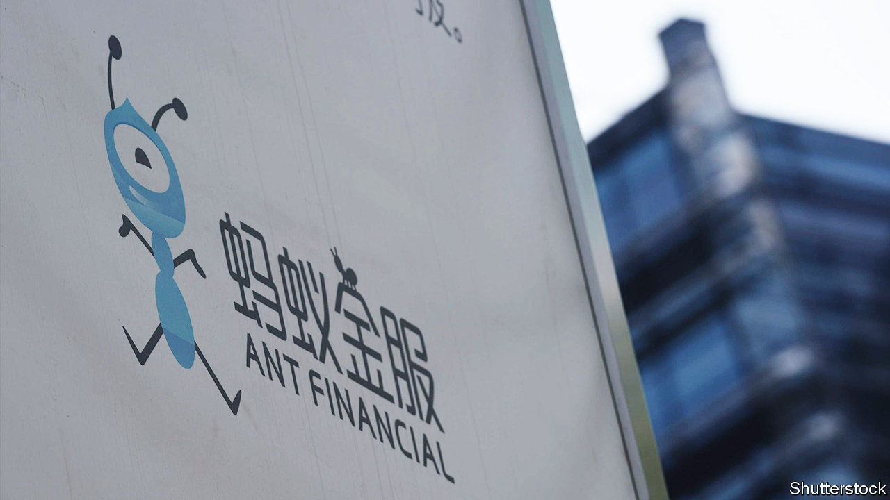
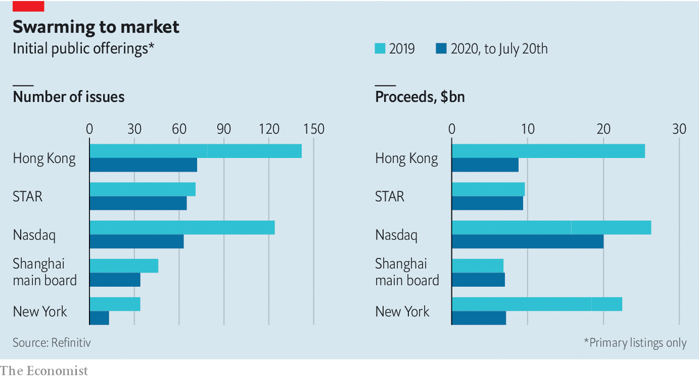

## Swarming to market

# Ant Group announces plans to list in Shanghai and Hong Kong

> It becomes the latest in a trail of listings

> Jul 23rd 2020

ON JULY 20TH Ant Group, the financial-services arm of Alibaba, an e-commerce giant, announced its plans to list on the star market, the Shanghai stockmarket’s technology-focused board, and in Hong Kong. The offering could be huge—the firm was valued at $150bn in 2018. Ant would become the latest in a trail of listings on both venues this year, where the number of ipos has rivalled those on America’s Nasdaq.■

