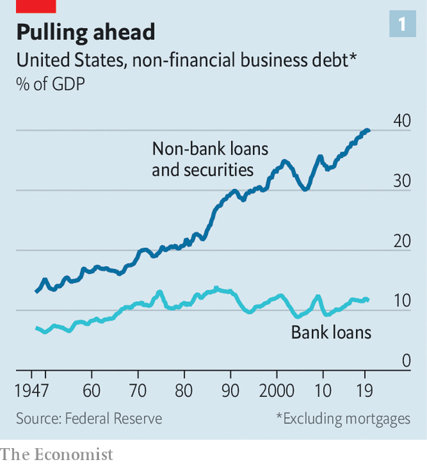
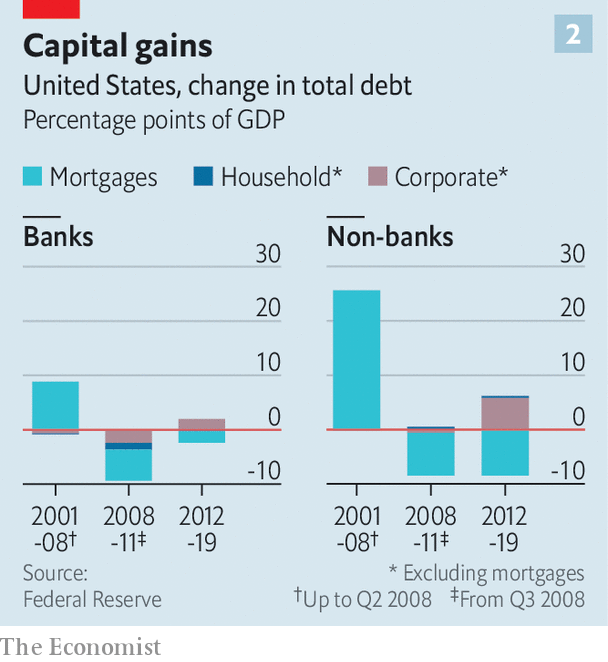
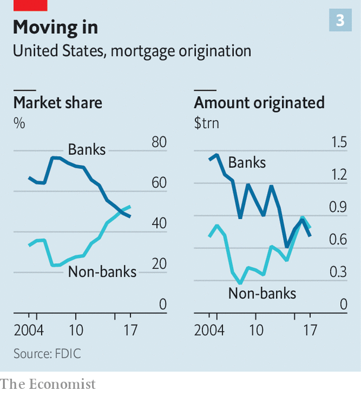
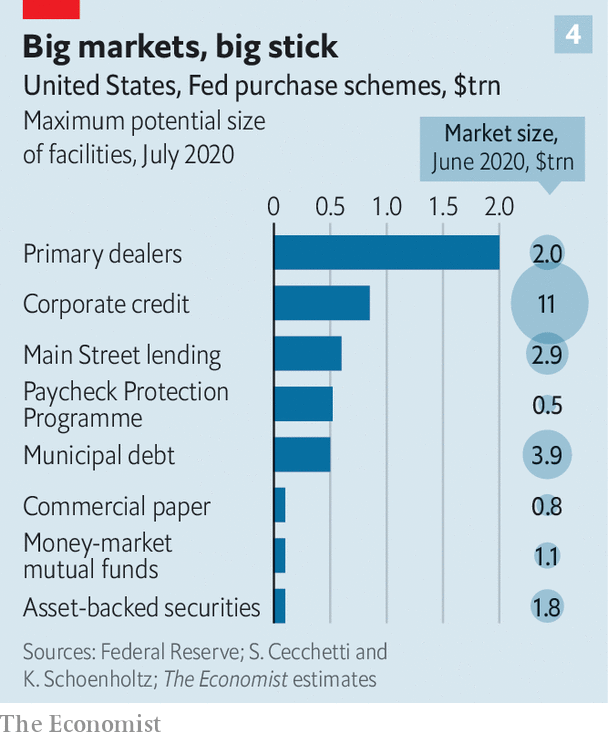

## Putting the capital into capitalism

# Banks lose out to capital markets when it comes to credit provision

> That explains the Fed’s response to the latest economic crisis

> Jul 25th 2020NEW YORK

IN RENAISSANCE ITALY the first modern bankers realised that they could get away with keeping only some of the gold that was deposited with them on hand, and lending out the rest. In most countries banks have dominated lending to households and firms ever since. America has long been different, though. Yes, banks have played a big role in economic development: John Pierpont Morgan was the muscle behind the railways rolled out from coast to coast during the 1880s and a century later Citibank was helping America Inc expand abroad as globalisation took off. But capital markets have played a mighty role, too. Today that is truer than ever, which in turn helps explain the stunning scope of the Federal Reserve’s response to the latest economic crisis.

How banks are defined in America has changed over time. Between 1933 and 1999 commercial banks were legally required to be separated from investment banks, a quintet of which dominated America’s capital markets and were regulated differently. But all these firms had elements in common. They held only a fraction of their assets as reserves and they borrowed short-term to make long-term loans or hold long-term securities. That exposed them to runs. Economic history is littered with the tombstones of banks that were felled when markets for illiquid securities seized up, or depositors rushed to withdraw their funds.

Most of these crises inflicted severe economic pain, not least the subprime fiasco of 2007-09. After it the phrase “too big to fail” entered the modern lexicon—and the popular perception of leviathans pulling the strings of the world’s biggest economy took hold.

This portrait of utterly dominant and dangerous banks exaggerated their importance and today looks out of date. Banks have become safer—including the investment banks, most of which are now part of big banking conglomerates. And they are being upstaged by a new wave of innovation in capital markets that has changed securitisation and debt issuance and led to more direct lending by other financial firms. As a result banks’ corporate lending as a share of GDP, for example, has stagnated at about 12%, even as they have rebuilt their strength and America Inc has indulged in a borrowing boom (see chart 1).

Banks’ stagnation and their risk aversion has had consequences for how central banks respond to crises. In 2007-09 the Federal Reserve had to intervene in capital markets, but went to much greater lengths to prop up commercial and investment banks. Earlier this year, however, banks went relatively unscathed as capital markets seized up. Rather than acting as a lender of last resort to banks, the Fed became marketmaker of last resort, intervening in credit markets with a total size of about $23.5trn. The scale of the Fed’s intervention surpasses any other in its history.

You can trace the gradual rise of America’s capital markets to the 1940s and 1950s, when the pots of money raised by financiers such as mutual-fund managers began to swell. The 1980s brought about a rush of debt issuance, especially of junk bonds, by companies. And there was a boom in household debt winding up in capital markets—and therefore in the hands of investors—via the new financial technology of securitisation, or bundling loans into bonds and selling them. Eventually securitisation helped cause the crash of 2007-09.

The crisis showed that banks remained at the centre of the financial system, acting as dealers and speculators. Subsequent rule changes have nudged them from the limelight. Legislation, including the Dodd-Frank Act in America in 2010, and national and international regulation, such as the Basel framework, have together required banks to fund themselves with more capital, and encouraged them to take less risk. As a result, banks in America have nearly $2trn worth of core capital on their balance-sheets, almost double the amount they did in 2007. That is a meaty 12% of risk-adjusted assets. And crucially, banks’ assets are less troublesome. The risk weight that supervisors attach to them—a measure of how racy the underlying loans and securities are—has dropped from 70% to less than 60% (these figures adjust for changes in the regulators’ definition of risk over that time).

Many of these rules have been aimed at taming the investment-banking activities that sit inside huge firms such as Bank of America and JPMorgan Chase. As all types of banks have faced tighter regulation, the last two big standalone investment banks, Goldman Sachs and Morgan Stanley, have evolved to look like banking conglomerates, too. Both have spread into sedate areas that attract more deposits, such as wealth management and retail banking.

Regulation has blunted banks’ competitive advantage. The fact that they were vertically integrated—they tended to issue loans, monitor and collect those loans, and hold the associated risk on their balance-sheets—once gave them an edge over investors and funds seeking to profit from just one slice of a transaction. It made up for the fact that they were slow to embrace technology. But bankers now talk of their balance-sheets as a “scarce” resource.

As banks have grown risk-averse, non-banks, often tech-savvy, are stepping up. “When you regulate the banks and you leave the rest of the financial system more lightly regulated, there will be regulatory arbitrage,” says Richard Berner of New York University. “But technology has also facilitated a shift because, particularly in the past decade, it has promoted the growth of payments and of bank-like activities outside the banking system.”

You can gauge this by looking at how the stock of lending by banks and non-banks has slowly changed. America has deleveraged since the financial crisis (see chart 2). That was almost wholly driven by the decline in mortgage debt, held by both banks and non-banks. Corporate debt, though, has reached an all-time high, and the bulk of activity has still been facilitated by shadow banks. Of the stock of debt that companies have added since 2012, that lent by banks has increased by just 2 percentage points of GDP. The stock that the non-bank sector holds has risen by 6 percentage points. Even though banks are now flush with capital and liquidity it is the capital markets that have financed the bulk of the increase in corporate debt.

A notable shift has taken place in the rest of the world, where capital markets have historically played a smaller role. Since the crisis these have expanded. In 2007 global non-bank financial assets stood at $100trn, equivalent to 172% of GDP and 46% of total financial assets, according to the Financial Stability Board (FSB), a grouping of regulators. Now these assets, at $183trn, constitute 212% of GDP, or 49% of the world’s financial assets.

What counts as a shadow bank? In America banks are now easy to define: they take retail deposits and are regulated by the Fed. They can park cash in accounts with the central bank, and borrow directly from it in times of stress. The term shadow banking, meanwhile, could apply to a range of financial institutions and activities. It includes long-established institutions like pension, insurance, private-equity and hedge funds, as well as newer ones, like exchange-traded fixed-income funds, which provide a vehicle for savers to deposit cash that is then invested in government and corporate bonds.

Separating the activities of the “real” banks from shadow firms is harder. Some non-banks, such as private-credit lending arms, make loans just as banks do. And just as they did before the financial crisis, banks issue shadow instruments that are allocated in capital markets, such as mortgage-backed securities or bundled corporate loans. Banks also lend to shadow banks. This has been one area where bank lending has grown relative to GDP, and it now makes up 5% of loan books.

Untangling these complex interlinkages is tricky. But to get an idea of how the financial landscape is changing in America, simply look across the range of typical bank activities, from the bread-and-butter work of lending to households and firms, to advisory services and market-making.

Start with mortgages. In 2007 almost 80% of mortgages were created by banks; a decade later, more than half were originated by non-banks. Big hitters include Quicken Loans, a Michigan-based online lender, and LoanDepot, a broker in California. Both were early to online-only mortgage lending and have invested heavily in slick websites and responsive call centres. Quicken, which is preparing to list on the stockmarket, became the largest originator of home loans in America in 2018.

Lending to mid-sized firms is also drawing in new types of institutions. The shift is mirrored by trends in the private-equity (PE) industry over the past decade or so. PE used to fund its takeover bids using bank loans or junk bonds. Most credit funds at PE shops were in their infancy before the 2007-09 crisis. Today at least a fifth of funds under management at five of the largest PE firms—Apollo, Ares, Blackstone, Carlyle and KKR—are invested in credit assets. At Apollo some $221bn of the $260bn the firm has raised since 2010 is for credit investment. The private-credit industry as a whole has amassed $812bn-worth of credit assets that it manages. To give a sense of scale, that is equivalent to 14% of outstanding corporate bonds.

Shadow banks are also muscling into businesses that used to be the sole preserve of the giant investment banks. That includes advisory services on mergers and acquisitions—where newish boutique firms like Evercore and Financial Technology Partners have blossomed alongside established names like Lazard—to even trading stocks and bonds. Banks were once the dominant traders of equities and fixed income. But market structure has evolved, says Paul Hamill of Citadel Securities, a broker-dealer set up by Ken Griffin, founder of Citadel, a hedge fund.

The firm is one of the largest equity traders in America. (When Slack, a corporate-messaging service, went public last year it listed directly via Citadel Securities.) Jane Street Capital, another non-bank trading firm, has also found success intermediating equity markets.

Citadel Securities has expanded into trading fixed income too, in part thanks to regulations that pushed securities like interest-rate swaps onto central clearing platforms, making competition easier. Mr Hamill says there are a few big institutions that conduct full-scale Treasury trading; all are large banks, except for Citadel Securities. The firm may apply to become a primary dealer—ie, an institution that can buy bonds from the government and trade directly with the Fed. This would make it the second non-bank to earn the privilege: Amherst Pierpont, a smaller broker-dealer, was designated a primary dealer in 2019.

That banks have a fight on their hands is clear. They are less profitable in a world where they must hold low-yielding safe assets and carry huge safety buffers. According to Michael Spellacy of Accenture, a consultancy, banks earn half of the roughly $1trn in annual revenues that all global firms make by intermediating capital markets. But of the $100bn in economic profits, which take into account the cost of capital and other expenses, they capture just 10%.

For borrowers and investors, the continuing clout of capital markets and the emergence of innovative new firms has meant more competition in the financial system. Prospective homebuyers can choose the lender that offers the best services. Mid-sized firms struggling to access bank loans can turn to a wealth of newly minted private-credit funds instead.

What does the shift mean for risk in the system? The role that banks play in maturity transformation means that they are always exposed to runs, jeopardising the provision of credit to businesses and households. Whether the evolution of the financial system is risky depends on how bank-like shadow banking is.

TheFSB has tried to identify the financial firms most susceptible to sudden, bank-like liquidity or solvency panics, and which pose a systemic risk to the economy. Pension funds and insurance firms are excluded as they match their long-term liabilities with long-term assets. Worldwide the exercise identified $51trn (or 59% of GDP) in “narrow” shadow investments, almost three-quarters of which are held in instruments “with features that make them susceptible to runs”. This slice has grown rapidly, from $28trn in 2010 (or 42% of GDP). At the end of 2018, America’s share of the risky bucket stood at $15.3trn. Its commercial banks, with assets of $15.6trn, were only just bigger.

The riskiest types of shadow banks, says the FSB, include fixed-income funds and money-market funds, which are large in America; companies that make loans and might be dependent on short-term funding, such as retail-mortgage or consumer-credit providers; broker-dealers, which trade securities; and entities that do securitisation-based credit intermediation, such as creating collateralised-loan obligations that bundle corporate loans which are then sold to investors. Tellingly, it was many of these markets that seized up in March and April.

With a growing number of capital-markets functions and a great deal of credit-provision to firms sitting outside the banking system, policymakers have once again found their customary tools do not work as well as they might like. In the financial crisis, both banks and non-banks were caught up in the panic. This time there has been no concern that banks might fail. Even in the worst case dreamt up by the Fed for this year’s stress tests, core capital ratios fell from an average of 12% across the 33 biggest banks in America to a still-chunky 9.9%.

Rather than acting as a lender of last resort to the banking system, therefore, the Fed has been forced to act as a marketmaker of last resort. The crisis of 2007-09 was an audition for this role, with some experimental interventions. Now the Fed has intruded into a bewildering array of financial markets (see chart 4). It stepped in to calm the Treasury market, and to revive the corporate-bond market, which had ceased functioning, by promising to buy bonds. It has provided funding to the repo market—where Treasuries are swapped overnight for cash—as it did in September 2019, when the market sputtered. It is providing liquidity to money-market mutual funds, which take cash from individuals and park it in very short-term investments like Treasury bills, in the hope that investors can be paid promptly when exiting such funds. And it has bought up mortgage-backed securities—the ultimate output of retail-mortgage providers.

The Fed was able to soothe investors through the power of its announcements; it has so far lent only $100bn through its schemes. But Stephen Cecchetti and Kermit Schoenholtz, two scholars, have calculated the scale of each of the implicit guarantees. Adapting their figures, we estimate that the Fed has promised to lend, or to buy instruments, to the tune of more than $4trn in credit markets with a total outstanding value of $23.5trn. That is backed by a $215bn guarantee from the Treasury, potentially exposing the Fed to losses.

The sheer breadth of the intervention takes the Fed into new territory. As the Bank for International Settlements, a club of central bankers, noted in its recent annual report, the consequences of bailing out capital markets on such a scale could linger. “The broad and forceful provision of liquidity has stemmed market dysfunction, but it has also shored up asset prices across a wide risk spectrum. This could affect the future market pricing of risk.”

Banks’ stagnation may be no bad thing: credit provision has grown more competitive, and is probably becoming less reliant on a handful of large risky institutions. But when banks malfunction, regulators at least know where to look. When so much activity takes place in the shadows, they risk fumbling in the dark. ■