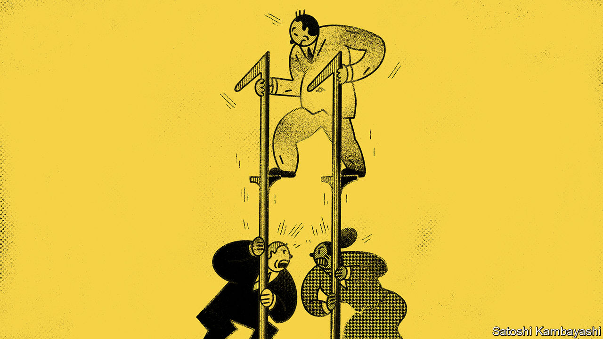

## Buttonwood

# Chapter 11 is no longer a haven for deadbeat debtors

> These days secured creditors are in control

> Jul 23rd 2020

IN THE EARLY 1980s Houston lived through a real-estate frenzy. Then the oil price crashed. Humble Place, a 30-acre tract divided into land parcels, was one of many unfinished projects. The developer filed for Chapter 11 bankruptcy. By the start of the 1990s, his creditors were still unpaid. A court heard that his recovery plan amounted to “mowing the grass and waiting for the market to turn”.

Such cases shaped a particular view of Chapter 11, the bit of America’s bankruptcy code directed at preserving businesses rather than winding them up. It was widely seen as a way to enrich lawyers and a means for debtors to frustrate creditors endlessly. The growing caseload in the wake of the covid-19 recession is likely to give new life to critics of Chapter 11. There are serial users. NorthEast Gas Generation, of Texas, recently joined the “Chapter 33” club. It has filed three times in six years.

A perennial bugbear is that Chapter 11 keeps the debtor in possession of the business. If unpaid debts do not spell the sack for management, say critics, then where is its incentive to be prudent? Yet a system that leans towards keeping a firm alive helps preserve its value. Bankruptcy is no longer creditor versus debtor, if it ever was. It is—as it should be—a wrangle between creditors. And these days it is secured bondholders who appear to be in control of the process.

Why involve the courts at all? In the case of a single debtor and a single creditor, there is not much to adjudicate. A property firm owes $2m to a bank. It defaults. The bank seizes the assets. Case closed. Things become messier when there are lots of competing claims on a troubled company. There is then an incentive for creditors to rush to get their money out while they can, which can undermine the business and destroy value for other creditors. Bankruptcy allows for a stay on legal action while the parties sort out what happens to the business and decide who gets what.

The first goal of a bankruptcy process is to maximise the proceeds. For a business that is bleeding cash, the best option may be liquidation: selling off buildings, equipment, patents and other assets. But a lot of the value of an enterprise is tied up in intangible assets, such as the skills of its workforce or its relationships with suppliers and customers. So getting the most value often means selling the business as a going concern, or finding other ways for it to continue. The second goal is to preserve the priority of claims so that senior creditors are paid first and common-equity holders paid last. This is vital to the working of capital markets. Securities should be priced according to their risks.

A third goal may be ensuring that a firm’s managers pay a penalty for its going bankrupt. But that may clash with the first goal. Managers who know a business are probably best placed to preserve its value.

A big sticking point is working out just how much value is in the business. Take Broke N Hungry, a hypothetical casual-dining chain, which has filed for Chapter 11. It has two creditors, Narcissus Capital, which owns $100m of senior debt and CovLite Capital, which owns $100m of junior debt. The liquidation value of Broke N Hungry’s assets is $100m. But there is uncertainty about its value as a going concern. There is a 50-50 chance that a vaccine for covid-19 is found. If it is found, Broke N Hungry is worth $200m; if not, the business is worth $50m. The expected value of it is thus $125m. The right decision is to keep it going. But Narcissus will not see it that way. In a liquidation it is sure to get its money back. If the business carries on, it gains nothing extra if things go well and loses $50m if things go badly. So it will favour liquidation, denying CovLite the chance to get its money back.

Reality is trickier still. The uncertainty is greater and there are many different classes of debt. But today senior creditors seem to be getting the upper hand. Perhaps that is because more and more of them are savvy distressed-debt specialists, often from the world of private equity. They buy up the secured debt of troubled firms with the aim of becoming owners. They offer a financing package to tide the business over. And they make a bid to buy out other creditors.

Do the unsecured bondholders get a raw deal? “Put it this way”, deadpans a law professor, “everybody wants to be a senior secured creditor.” The power in Chapter 11 ebbs and flows. The shift might even be traced back to the Humble Place case. An appeals-court judge eventually ruled against the debtor. The case notes do not record whether a lawnmower was one of the seized assets.

## URL

https://www.economist.com/finance-and-economics/2020/07/23/chapter-11-is-no-longer-a-haven-for-deadbeat-debtors
