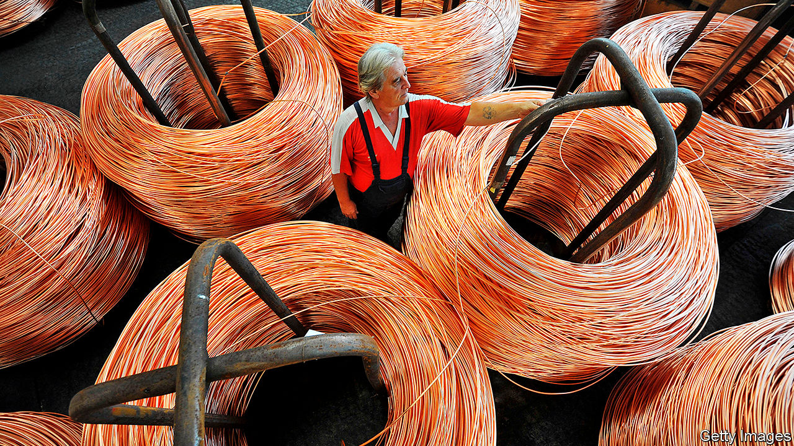

## Shining brightly

# Unusually, copper and gold prices are rising in tandem

> An uncertain and uneven recovery explains their skyward leap

> Jul 23rd 2020NEW YORK

THERE IS, SUPPOSEDLY, a neat choreography to copper and gold prices. When one rises, the other tends to fall. In an economic downturn, for instance, gold climbs as investors seek a haven. Copper prices dip as manufacturing and construction slow. But these are unusual times, and gold and copper are moving in unusual ways. Rather than continue their customary do-si-do, they are leaping upwards together.

The price of copper surpassed $6,000 a tonne in June, up about 30% since the depths of March. Gold this month topped $1,800 an ounce, approaching a record reached in 2011. Many analysts reckon it may exceed $2,000 this year or next. As the world continues to reel from covid-19, the economic outlook is uncertain and the recovery uneven from one country to the next. For those betting on gold and copper, this has proved a winning formula.

Gold started its recent climb from an already lofty perch. The ascent began at the end of 2018, as a trade war between America and China clouded the prospects for economic growth. Sinking interest rates in America lowered the yield on ten-yearinflation-indexed Treasury bonds, making gold shine brighter. From November 2018 to late 2019 the price of the yellow metal jumped by about 25%, to $1,515.

Now covid-19 is propelling gold to even more vertiginous heights. Investors are scrambling for security, fearing a prolonged downturn as the virus continues to ravage giant economies such as America and Brazil. Gold-backed exchange-traded funds attracted $40bn in the first half of the year, a record. The dollar has weakened, making it cheaper for holders of other currencies to buy gold. Rates remain low. Jerome Powell, the chairman of the Federal Reserve, said in June that he was not even “thinking about thinking about” raising them. China, hit first by the virus, is recovering first, too, offering further upside. It is gold’s biggest retail market, and more shopping there would lift prices higher.

Copper’s rise this year may be even more striking. Its price sank by more than a quarter from January to mid-March when covid-19 spread across China, which accounts for about half of the red metal’s consumption. Now, however, efforts to stimulate China’s economy are spurring investment. In June a tracker of sector-level demand for copper in China used by Citigroup, a bank, rose by 5.5% on the year, its biggest jump in over two years.

As China invests to recover from the pandemic, though, the Americas are still grappling with it, explains Jeff Currie of Goldman Sachs, a bank. Because copper production is concentrated in South America, that has constrained supply. Some mines in Peru, shut because of the virus, are only slowly resuming production, points out Susan Bates of Morgan Stanley, another bank. In Chile, where mines have been operating with reduced staff, the deferral of needed maintenance may restrict supply in the months to come. And miners may strike, further threatening output.

It is unclear how long copper prices can be sustained by investment in one place and infection in another. The metal’s traditional engine—strong global economic growth—is sputtering. Continued infections in America or a resurgence of the virus elsewhere could further depress demand for appliances, cars and other copper-dependent goods.

That said, on July 21st European leaders agreed to new stimulus; and demand for copper may rise as countries outside China invest in electric grids and solar farms veined with the metal. Gold’s rally may be even more persistent, argues Mr Currie, supported by factors that linger through the 2020s: high debt levels that weigh on the dollar, and low interest rates. The journey skyward may not be over yet. ■