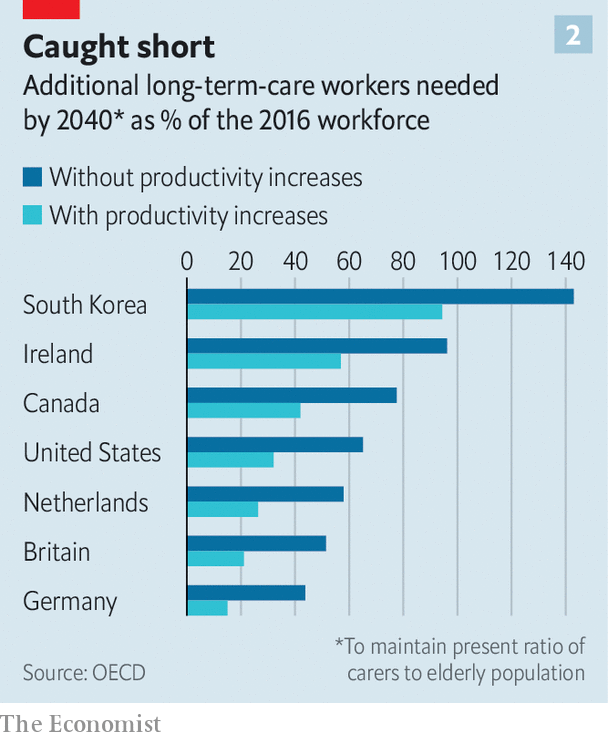
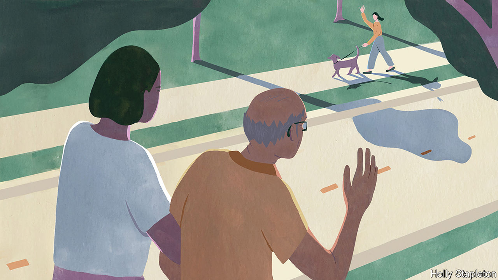
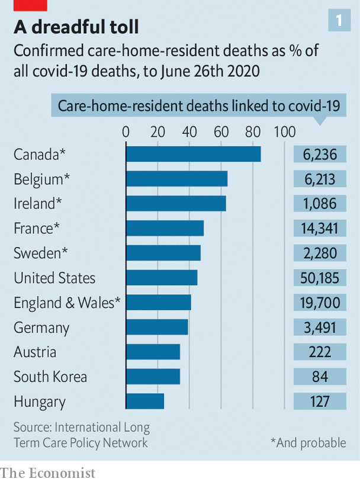

## Who cares?

# The pandemic shows the urgency of reforming care for the elderly

> Most people should be helped at home as they age

> Jul 25th 2020AMSTERDAM, MISSISSAUGA AND TOKYO

Editor’s note: Some of our covid-19 coverage is free for readers of The Economist Today, our daily [newsletter](https://www.economist.com/https://my.economist.com/user#newsletter). For more stories and our pandemic tracker, see our [hub](https://www.economist.com//news/2020/03/11/the-economists-coverage-of-the-coronavirus)

“IT SMELLED LIKE death,” says Stephanie (not her real name) of her first day at Camilla Care Community, a nursing home in Mississauga, a city in Canada. She and other care workers were sent to help out at the 236-bed facility in April as covid-19 ripped through its narrow corridors and crowded wards. Dozens of staff fell ill or refused to work. By mid-July nearly one-third of the residents had died. Outside, on a patch of grass, 69 small white crosses commemorate them.

Across the rich world nearly half of all deaths from covid-19 have happened in care and nursing homes, even though less than 1% of people live in them. In Canada 80% of all the deaths from covid-19 have happened in places such as Camilla (see chart 1). In Britain the pathogen has killed an estimated 5% of all people living in such institutions. The problem is not only that the residents’ age makes them particularly vulnerable, but also that their living arrangements created opportunities for the virus to spread. Countries with fewer care homes have had fewer covid-19 deaths, all else being equal. The number of care-home beds explains 28% of the variation in death rates among European countries and 16% among American states, according to a study by Neil Gandal and colleagues at Tel Aviv University.

Politicians are under pressure to put more cash into care-home safety, inspections and quality standards. In the short term care homes will need more personal protective equipment (PPE) and better access to testing. But the disaster also offers a chance to reimagine care. In the future, many experts argue, the vast majority of old people should be looked after at home for as long as possible. In all but the most severe cases this is cheaper. It is also what most old people want. Putting them in big institutions is the opposite of what they say they value most: autonomy and independence. And for those who still need it, residential care should be transformed.

Most people will need care as they age. In some countries that will bankrupt them. Some 70% of Americans who reach the age of 65 will eventually need help doing at least two basic daily activities, such as washing or dressing; 48% will receive paid care; 16% will get dementia. The risks are higher for women. For one in ten people who reach the age of 65 in Britain, the cost of care in their remaining years will exceed £100,000 ($127,000), according to a review conducted in 2011. Demand is only growing. In rich countries the share of the population that is over 80 will double by 2050, by which time there will be only two people of working age for every over-65-year-old. Although people’s lives are getting longer, the number of years during which they enjoy good health is not rising as swiftly.

In countries such as Norway and Sweden, care for the elderly is pretty good but costs taxpayers so much that it may not be sustainable as their populations age. In others, such as Britain and America, taxpayer-financed care is intended as a last resort for the poorest and sickest. This usually means a bed in a care home. These institutions have typically received most of the funding that governments set aside for looking after the elderly.

“Let’s be honest,” says David Grabowski of Harvard Medical School. Even before the pandemic “nobody ever wanted to go to a nursing home. This was a crisis on top of a long-standing crisis.” The sector is understaffed. In several countries it is unhelpfully detached from the health system. Care homes were “at the back of the queue during covid, when it came to things like testing,” says Jos Schols at the University of Maastricht. In places such as Hong Kong and Taiwan that experienced the SARS outbreak of 2002-03 care homes had stockpiles of PPE. In other places they were very poorly supplied. People working in British care homes say the pandemic has confirmed their “Cinderella status”. They were about twice as likely to die of covid-19 as workers in hospitals. “Everyone is furious about what happened but too knackered to do anything about it,” says one carer.

All around the world staff at care homes turn over quickly. In Germany nearly a third of long-term-care workers leave their jobs after only one year. In France a fifth of home-care positions were vacant in 2018. That is not surprising given that carers are paid on average 35% less than people who do similar jobs in hospitals, according to the OECD, a club of mostly rich countries. Receiving care from a rotating cast of strangers is bad for everyone, but it is a particular problem for people with dementia. They make up the majority of care-home residents but mostly do not live in institutions that specialise in their condition. At the height of the outbreak in London more than one-quarter of staff in care homes for the elderly could not work, or would not. Officials sent in temporary workers to replace them. That probably spread the virus even further.

Many governments spend very little on long-term care. In rich countries it ranges from 0.2% of GDP in Hungary to 3.7% in the Netherlands. Canada spends 1.3%, less than the rich-country average. It has less than half the number of care-home workers per 100 residents as Norway. In America and Britain a frugal monopsony payer (Medicaid and local authorities) typically reimburses less than the cost of residential care. To make up the shortfall, American nursing homes actively recruit patients covered by Medicare, a lavish programme that pays medical costs (but not long-term care costs) for the elderly. They tend to come for short stays to recover after operations such as hip replacements, and bring with them more generous reimbursements. But the pandemic has largely stopped that.

As well as exposing fragile business models, the pandemic has highlighted the tension between keeping old people safe and keeping them happy and well, says Adam Gordon of the University of Nottingham. Regulators encourage nursing homes to focus relentlessly on negative metrics such as falls, bed sores and weight loss. But there is more to quality of life than not falling over. Anne Tumlinson, an expert on ageing, would like to see care homes become less “custodial” and more enthusiastic about “making people happy”.

A better system would make it easier for most people to age at home. Technology could help. The urge to move someone to a care home often starts with concerns for their safety. Care-givers begin to spot unexplained bumps and bruises. Questions about cigarette burns on the duvet are waved away. Pills are not taken. The milk is always off.

Now imagine a home where sensors keep an eye on all of those things. They spot a change in gait, appetite or activity early enough to predict a fall, dehydration or depression. A smart pill dispenser helps with medication. A companion robot provides reassurance, information, brain training and company. Some of the most compelling recent scientific and technological developments aim to help people with dementia. A product produced by Elovee, an American startup, allows them to have simple conversations with a digital avatar styled to look and sound like one of their relatives. The idea is to provide reassurance during moments of anxiety or boredom that occur when their loved ones are not around.

Technology “will never replace the loving attention of a carer,” says Wilco Achterberg of the University of Leiden. But data-crunching could make it easier to work out how to deploy carers more efficiently. Video calling is making it easier for relatives, paid carers and doctors to check in more frequently. Joan Gallimore, a 91-year-old who lives alone in England, says that calling her family using a tablet her home-carers gave her when lockdowns began has been a revelation. She has enjoyed chats with her granddaughters and performances put on by her son-in-law, who is learning to play a ukulele.

Improving conventional ways of providing care at home is essential, too. Buurtzorg, a nursing provider in the Netherlands, champions a model that has been tried out in 25 countries. Its secret is simple, says Jos de Blok, its founder: let nurses do their jobs. Small teams of them are given considerable autonomy to care for a neighbourhood. By stripping away bureaucracy, the model allows nurses to spend more time dispensing help. Because all staff are qualified nurses, their salaries are higher than traditional carers. But because they are better trained they can get as much done despite spending a third less time with each patient.

For some people, particularly the very lonely and those with dementia, home visits are not enough. Day-care centres can help them. Some of those in Switzerland pick people up from their homes, help them get dressed and return them home at the end of the day. In Sweden day care for the elderly is offered by the state, in much the same way as child care is. Chile has only a small formal care sector, but its government has decided to make day care for the elderly a priority.

Day-care services can improve older people’s mental and physical health. They also provide advice and respite for their families. In rich countries more than one in eight people aged over 50 provide care to another person at least once a week. Keeping them from burning out is key to helping people age at home. More support for these carers also helps reduce the risk that their own health will decline, and makes it less likely that they will drop out of the workforce. In America 48% of people who provide help to older adults care for someone with dementia (a quarter of those people have at least one child under the age of 18 to look after as well). Of those who previously had jobs, 18% moved from full- to part-time work when called upon to help. Some 16% took a leave of absence and 9% quit altogether.

Some old people will have to move out of unsuitable homes. But most need not move to an institution, even then. Denmark is a leader in providing alternatives. Its government spends more on non-residential care than the residential sort. Options for ageing Danes include retirement communities and flats built close to but not in care homes. Authorities in some other places are trying to make it easier for families to build annexes that old relatives can move into. Students and some other youngsters in the Netherlands are encouraged to share courtyards or buildings with elderly people who are not part of their family, sometimes in exchange for cheaper rent. The idea is that they will provide them with companionship and occasional help.

Daan Livestro, a consultant at Gupta Strategists, estimates that 25-60% of care given to elderly people in Dutch institutions could be provided at home. In Canada, too, some 40% of residents could go home if given the right support, according to recent research. A study in 2014 in Alabama found that people with similar needs fared about as well in their own houses as those who stayed in care homes. But the group receiving care at home saved $4,500 per year in costs. “Decanting nursing homes” is a growing opportunity, says Zayna Khayat of SE Health, a Canadian care provider.

There will always be people who want or need residential care. In those cases “smaller is often better”, says Dr Grabowski. Research shows that smaller nursing homes use fewer restraints, see fewer infections and have more satisfied residents than larger ones. Small institutions promote closer friendships between residents and closer connections with staff.

In Tupelo, Mississippi, residents of the Green House wake up to the smell of bacon, cinnamon and fresh coffee. The constant smell of baked goods in the open kitchen is deliberate; declining appetite can be a problem in old age. “I’ve seen people come from traditional nursing homes and they start eating again, they start walking again and they start talking again,” says Steve McAlilly, one of the founders. The Green House consists of ten homes, each with 10-12 housemates. There are no vinyl floors, no dinners on trays and no bingo. “Do you have planned activities in your home?” asks Mr McAlilly. “If it isn’t in a home it isn’t in a Green House.” Bill Thomas, an American geriatrician who founded the Green House movement in 2003, calls himself a “nursing home abolitionist” and says he is guided by two principles: “It is better to live in a house than a warehouse,” and “People should be the boss of their own lives.” Care homes that follow the Green House model now exist in more than 30 American states.

The Hogeweyk in the Netherlands is sometimes called a “dementia village”. It hosts 169 residents who live in six-bedroom houses. All have advanced dementia. They move around freely on a campus that includes a high street with a pub, a hairdresser and a supermarket. Residents may bring their own furniture and pets. They help with household chores. Twenty-five social clubs organise activities. “Almost nobody wants to be a passive recipient of care,” says Eloy van Hal, its founder. Twenty years ago, when he tore down the conventional nursing home that used to inhabit the same spot, he was warned that “people will fall over.” Instead residents became healthier and more cheerful. “We take far too few risks in life,” he says.

Technology could help improve residential care, even as it reduces the number of people who need it. Sensors placed in nursing homes in Norway and the Netherlands have reduced hospitalisations. Telemedicine is having the same effect in Estonia and Israel.

In southern Tokyo, in a bland conference room on the tenth floor of a grey office tower, a robot glides towards visitors and announces: “The food you ordered has arrived.” The Future Care Lab was set up by Sompo, one of Japan’s largest insurers. It has experimented with labour-saving devices such as a self-cleaning bath and a wheelchair that turns into a bed. It has also invented a pad that when placed under a mattress monitors breathing, heart rate and quality of sleep. A nursing home that tested it last year said that it reduced the time staff had to spend “patrolling” its 54 rooms from seven hours a day to 20 minutes. Residents slept better because staff no longer routinely woke them up.

Improving care will not be cheap. But settling for bad care only stores up costs for later. Research in America links a 10% cut in Medicaid reimbursement to a nearly 10% decline in older people’s ability to do things such as walk and bathe, as well as a 5% increase in persistent pain. Each month the health system in Britain loses about 83,000 hospital days to “bed-blocking” that results when elderly patients who are no longer sick enough to remain in hospital get stuck there because no good care is available outside of it.

Governments could make more use of personal-care budgets. These are pots of money allocated to someone who needs support. Recipients are entitled to decide for themselves how the cash should be spent. That encourages care providers to dream up ever more personalised services and to keep down costs. Training, recruiting and trying harder to retain carers are also urgent priorities. The number of care workers in rich countries will need to increase by 60% by 2040 just to maintain the present ratio of carers to elderly people, says the OECD (see chart 2). Investments in technology and more efficient use of skilled staff could at best meet half that gap.

Experts are hopeful. “I’ve been preaching this stuff for decades and nobody ever wanted to hear it. Then covid hit and my phone hasn’t stopped ringing,” says Ms Tumlinson. The pandemic is persuading more people that “the mass institutionalisation of older people isn’t such a good idea,” reckons Mr Thomas of the Green House Project. Social care has never enjoyed so much attention, agrees José Luis Fernández of the London School of Economics. But he worries that governments “will struggle to fund new commitments at a time when public finances are under huge pressure.” There have been lots of broken promises in the past.■

Editor’s note: Some of our covid-19 coverage is free for readers of The Economist Today, our daily [newsletter](https://www.economist.com/https://my.economist.com/user#newsletter). For more stories and our pandemic tracker, see our [hub](https://www.economist.com//news/2020/03/11/the-economists-coverage-of-the-coronavirus)

## URL

https://www.economist.com/international/2020/07/25/the-pandemic-shows-the-urgency-of-reforming-care-for-the-elderly
