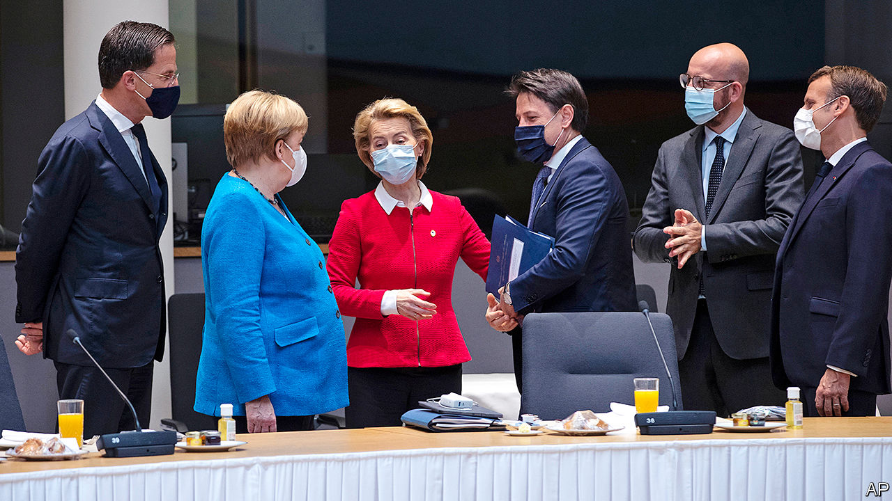

## Pulling together

# Europe’s €750bn rescue package sets a welcome precedent

> Even if the details are fraught

> Jul 25th 2020

WHEN THE leaders of the European Union agreed this week on a €750bn ($869bn) package to help members’ economies recover from covid-19, they answered a looming question: whether Europe was too divided to handle the pandemic. As in earlier crises, the virus’s economic ravages split the EU’s members. Rich countries with low government debt and fewer infections (such as Germany and the Netherlands) can cope on their own. Some of the heavily indebted and infected countries (such as Italy and Spain) cannot. Without fiscal aid, they face recessions deep enough to drag down the whole of the EU.

The programme agreed to in Brussels does not just avert that danger. It does more to strengthen the union than anyone would have imagined a few months ago (see [article](https://www.economist.com//europe/2020/07/21/the-eus-leaders-have-agreed-on-a-eu750bn-covid-19-recovery-package)). The total is equivalent to nearly 5% of the EU’s annual GDP, to be spent over several years, much of it in grants rather than loans. More important is how the money will be raised: through bonds issued by the European Commission. For the first time, the EU will collectively borrow large sums, piggybacking on the creditworthiness of stronger members to help weak ones. By raising total spending by the EU itself (as opposed to member states), from nearly €1.1trn to €1.8trn over seven years, it gives the club a potent fiscal weapon against recession to complement the monetary tools of the European Central Bank. This is especially important when near-zero interest rates are forcing a shift in emphasis from monetary to fiscal policy. To pay the debts back, and avoid direct responsibility, EU countries may be tempted to grant the European Commission more taxing authority.

All these moves to strengthen the EU are welcome. Yet it is an exaggeration to say that the summit was a “Hamiltonian moment”, analogous to the creation of a centralised borrowing capacity for the United States’ new federal government in 1790. The recovery fund does not pool countries’ existing debts, nor does it create new institutions like those set up during the euro crisis. On the one hand it sets a precedent for collective borrowing during an emergency that will probably be repeated. On the other, whereas a sovereign government borrows automatically when revenues do not meet expenditures, the EU will have to endure gruelling negotiations each time it wants to do so.

In part this is no bad thing. The summit showed that Europe is not ready for a Hamiltonian moment. It reflected splits between members over what policies are desirable and what sort of club the EU is. A group of wealthy, net-contributor countries nicknamed the “frugals” (led by the Netherlands, along with Austria, Denmark, Sweden and Finland), which had misgivings about proposals for collective debt, cut the grant portion from €500bn to €390bn. Mark Rutte, the Dutch prime minister, was lambasted as a skinflint by southern Europeans. Meanwhile Viktor Orban, Hungary’s autocratic leader, infuriated people who care about good governance by demanding that rule-of-law conditions for disbursements be diluted—not a great invitation to a fiscal union.

Given such mistrust, the EU’s leaps forward tend to require a lot of grubby horse-trading. The frugals were bought off with bigger rebates on their budget contributions. Enforcement of the rule of law was watered down sufficiently to appease Mr Orban. Yet the deal gives satisfaction at long last to the EU’s hard-pressed south. And the heroes are the EU’s two driving partners, France and Germany, which looked past narrow national interests and strived for a European solution. In April Angela Merkel, Germany’s chancellor, was still on the frugals’ side in opposing collective debt. It was her decision to join Emmanuel Macron, the French president, in backing this sort of debt that shifted the centre of gravity. Such unity among the big members makes smaller ones nervous: what Mr Macron sees as a hard-won precedent looks to Mr Rutte like a slippery slope. But it is Mr Macron and Mrs Merkel who are building the EU’s future.■