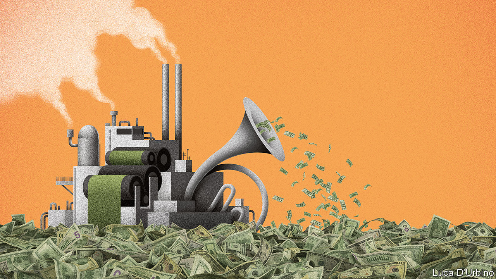

## Macroeconomics

# Governments must beware the lure of free money

> Budget constraints have gone missing. That presents both danger and opportunity

> Jul 23rd 2020

IT IS SOMETIMES said that governments wasted the global financial crisis of 2007-09 by failing to rethink economic policy after the dust settled. Nobody will say the same about the covid-19 pandemic. It has led to a desperate scramble to enact policies that only a few months ago were either unimaginable or heretical. A profound shift is now taking place in economics as a result, of the sort that happens only once in a generation. Much as in the 1970s when clubby Keynesianism gave way to Milton Friedman’s austere monetarism, and in the 1990s when central banks were given their independence, so the pandemic marks the start of a new era. Its overriding preoccupation will be exploiting the opportunities and containing the enormous risks that stem from a supersized level of state intervention in the economy and financial markets.

This new epoch has four defining features. The first is the jaw-dropping scale of today’s government borrowing, and the seemingly limitless potential for yet more. The IMF predicts that rich countries will borrow 17% of their combined GDP this year to fund $4.2trn in spending and tax cuts designed to keep the economy going. They are not done. In America Congress is debating another spending package (see [article](https://www.economist.com//united-states/2020/07/22/americas-backwards-coronavirus-strategy)). The European Union has just agreed on a new stimulus funded by common borrowing, crossing a political Rubicon (see [Leader](https://www.economist.com//leaders/2020/07/25/europes-eu750bn-rescue-package-sets-a-welcome-precedent)).

The second feature is the whirring of the printing presses. In America, Britain, the euro zone and Japan central banks have created new reserves of money worth some $3.7trn in 2020. Much of this has been used to buy government debt, meaning that central banks are tacitly financing the stimulus. The result is that long-term interest rates stay low even while public-debt issuance soars.

The state’s growing role as capital-allocator-in-chief is the third aspect of the new age. To see off a credit crunch, the Federal Reserve, acting with the Treasury, has waded into financial markets, buying up the bonds of AT&T, Apple and even Coca-Cola, and lending directly to everyone from bond dealers to non-profit hospitals. Together the Fed and Treasury are now backstopping 11% of America’s entire stock of business debt. Across the rich world, governments and central banks are following suit.

The final feature is the most important: low inflation. The absence of upward pressure on prices means there is no immediate need to slow the growth of central-bank balance-sheets or to raise short-term interest rates from their floor around zero. Low inflation is therefore the fundamental reason not to worry about public debt, which, thanks to accommodative monetary policy, now costs so little to service that it looks like free money.

Don’t fool yourself that the role of the state will magically return to normal once the pandemic passes and unemployment falls. Yes, governments and central banks may dial down their spending and bail-outs. But the new era of economics reflects the culmination of long-term trends. Even before the pandemic, inflation and interest rates were subdued despite a jobs boom. Today the bond market still shows no sign of worrying about long-term inflation. If it is right, deficits and money-printing may well become the standard tools of policymaking for decades. The central banks’ growing role in financial markets, meanwhile, reflects the stagnation of banks as intermediaries and the prominence of innovative and risk-hungry shadow banks and capital markets (see [article](https://www.economist.com//finance-and-economics/2020/07/25/banks-lose-out-to-capital-markets-when-it-comes-to-credit-provision)). In the old days, when commercial banks ruled the roost, central banks acted as lenders of last resort to them. Now central banks increasingly have to get their hands dirty on Wall Street and elsewhere by acting as mammoth “marketmakers of last resort”.

A state with a permanently broader and deeper reach across the economy creates some opportunities. Low rates make it cheaper for the government to borrow to build new infrastructure, from research labs to electricity grids, that will boost growth and tackle threats such as pandemics and climate change. As societies age, rising spending on health and pensions is inevitable—if the resulting deficits help provide a necessary stimulus to the economy, all the more reason to embrace them.

Yet the new era also presents grave risks. If inflation jumps unexpectedly the entire edifice of debt will shake, as central banks have to raise their policy rates and in turn pay out vast sums of interest on the new reserves that they have created to buy bonds. And even if inflation stays low, the new machinery is vulnerable to capture by lobbyists, unions and cronies.

One of monetarism’s key insights was that sprawling macroeconomic management leads to infinite opportunities for politicians to play favourites. Already they are deciding which firms get tax breaks and which workers should be paid by the state to wait for their old jobs to reappear. Soon some loans to the private sector will turn sour, leaving governments to choose which firms fail. When money is free, why not rescue companies, protect obsolete jobs and save investors?

However, though that would provide a brief stimulus, it is a recipe for distorted markets, moral hazard and low growth. Fear of politicians’ myopia was why many countries delegated power to independent central banks, which wielded a single, simple tool—interest rates—to manage the economic cycle. Yet today interest rates, so close to zero, seem impotent and the monarchs who run the world’s central banks are becoming rather like servants working as the government’s debt-management arm.

Each new era of economics confronts a new challenge. After the 1930s the task was to prevent depressions. In the 1970s and early 1980s the holy grail was to end stagflation. Today the task for policymakers is to create a framework that allows the business cycle to be managed and financial crises to be fought without a politicised takeover of the economy. As our briefing this week explains, this may involve delegating fiscal firepower to technocrats, or reforming the financial system to enable central banks to take interest rates deeply negative, exploiting the revolutionary shift among consumers away from old-style banking to fintech and digital payments. The stakes are high. Failure will mean the age of free money eventually comes at a staggering price.■

## URL

https://www.economist.com/leaders/2020/07/23/governments-must-beware-the-lure-of-free-money
