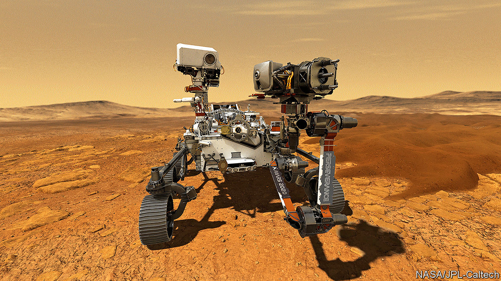

## Protecting other planets

# Mars may be a pristine ecosystem

> Earthlings should be careful not to contaminate it

> Jul 25th 2020

EARTH ASIDE, Mars is the most-studied planet in the solar system. Satellites zip around it. Rovers trundle over its surface. A helicopter may soon clatter through its skies, for a clutch of new missions are either on their way or planned to launch soon.

The motive behind all this is the hope that Mars, like Earth, may support life—or may have done so in the past (see [article](https://www.economist.com//science-and-technology/2020/07/21/is-there-life-on-mars)). And, as technology spreads and rocketry gets cheaper, more people want to join the search for what would, in effect, be Biosphere 2. At first, Mars was the province of America and the Soviet Union. Japan tried and failed to explore it in 1998. Europe sent its first mission in 2003. India launched its in 2013. The United Arab Emirates joined the fray on July 20th. And China, after a failure in 2011, dispatched another attempt on July 23rd. The time is not far off when even private missions might be feasible.

Behind all this enthusiasm, though, is a worry. If Mars is sterile after all, or if any life which once dwelled there is now extinct, what people do to the planet by way of contamination with Earthly bugs probably does not matter. But if Martians do exist, even if they are but lowly bacteria (or something vaguely equivalent), that would mean Mars is a pristine ecosystem. Those wishing to investigate it should therefore tread lightly, for reasons of both moral and scientific prudence.

Astrobiologists identify two kinds of risk in putative encounters with alien life forms that are not actually toting ray guns. The first, “forward contamination”, is that hardy micro-organisms from Earth might hitch a ride with a space probe and set up shop on landing. The second, “back contamination”, concerns the reverse: that samples returned to Earth might bring alien microbes with them.

The first risk is no longer theoretical. Scientists reckon that the rovers and landers already on Mars each play host to tens of thousands of microscopic Earthlings. Shielded from radiation by the probes themselves, these bacteria are probably dormant—but not dead.

Back contamination would require samples to be returned from Mars. That has not happened yet. But America’s newest rover is designed to stash samples of Martian regolith away, to be returned to Earth by a follow-up mission in 2031.

Back contamination is the less worrying of the two. Lurid suggestions that Martian bugs might infect human beings ignore the fact that their biochemistry would almost certainly be too different from that of terrestrial organisms for this to happen. Sealed laboratories could provide reassurance for sticklers.

Forward contamination is more troubling. Some echo terrestrial worries about conservation, arguing that humans have a moral obligation not to damage other ecosystems. Others fret about the scientific implications. Life on Mars, whether extant or extinct, could be one of the most significant discoveries in the history of biology. Contamination risks disrupting understanding of that scientific bounty.

Countries are already required, by the Outer Space Treaty of 1967, to worry about these risks. But this treaty is light on specifics, leaving individual space agencies to come up with their own rules. This is better than nothing. But as more countries head for Mars, the case grows for a formal, global approach.

Plenty of ideas are worth discussing. Some advocate risk-management, in which the greatest care is taken when exploring those parts of Mars most likely to contain life, though lower standards apply in harsher regions. “Reversible exploration” holds that, if life is discovered, humanity should retrieve the probes that already dot the Martian surface, along with their microbial passengers. And should private individuals be required to follow the same rules as nation-states?

International co-operation is not a popular idea just now. Never mind: it should be tried anyway. Nationalism and protectionism can wane as well as wax, and alien-hunting is the work of decades. Counter-measures need not be expensive—experience suggests they add 10% or less to the cost of a probe. And it is hard to think of a more intrinsically global problem than ensuring that one planet’s life forms do not contaminate another’s. ■

## URL

https://www.economist.com/leaders/2020/07/25/mars-may-be-a-pristine-ecosystem
