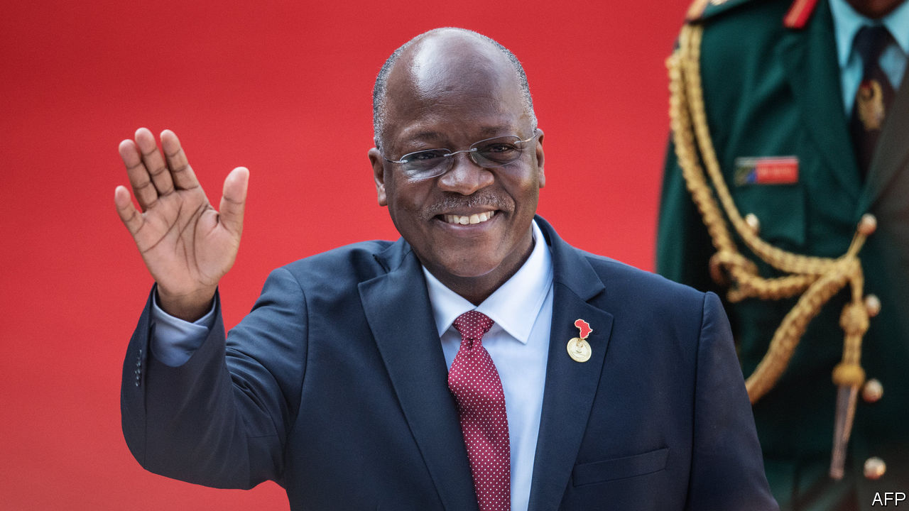

## You say bullish, I say...

# Tanzania’s statistics smell wrong

> And the IMF should say so

> Jul 23rd 2020

BY OFFICIAL MEASURES Tanzania is doing brilliantly. Covid-19 may be devastating its neighbours, but Tanzania is completely free of the virus—and safe for tourists—says President John Magufuli. Sub-Saharan Africa’s economy will shrink by 3.2% this year, predicts the IMF, but Tanzania forecasts GDP growth of 5.5%, making it one of the world’s star economies. This month the World Bank promoted it from “low income” to “lower-middle income”. That implies that income per person has surpassed $1,036, five years ahead of the government’s schedule.

Were these figures true, Tanzania would have much to celebrate. But the closer you look, the less plausible they seem (see [article](https://www.economist.com//middle-east-and-africa/2020/07/23/why-tanzanias-statistics-look-fishy)). For more than a decade from 2000 Tanzania’s economy, east Africa’s second-largest, was indeed among Africa’s best-performing. After ditching one-party rule and “African socialism” in the 1990s, the government opened up the economy and welcomed foreign investors. GDP grew by a cracking 5-8% almost every year. However, when Mr Magufuli came to power in 2015, he turned a hopeful country into a fearful one. Journalists were jailed, opposition MPs have been arrested or shot. The “bulldozer”, as he is known, has scared off investors by ripping up agreements, arresting employees and demanding arbitrary sums from companies. Acacia Mining, the largest foreign investor, was ordered to pay $190bn—more than three years of Tanzania’s GDP—though this absurd figure was later scaled back. Investment has slumped. Tanzania has fallen by ten places in the World Bank’s ease-of-doing-business ranking. Business folk think the economy slipped into recession well before covid-19. But official numbers show it galloping ahead.

IMF staff smelt a fish last year. Official GDP numbers seemed out of step with other gloomier data. The IMF raised concerns about the numbers and noted that the government’s “unpredictable or interventionist policies...could lead to meagre (or even negative) growth.” Its report should have sparked debate. It did not, because Mr Magufuli blocked its release.

If Tanzania’s economy grew by almost 7% in the fiscal year to the end of June 2019, why did tax revenue fall by 1%? And why has bank lending to companies slumped? Private data are bad, too. In 2019 sales at the biggest brewer fell by 5%. Sales of cement by the two biggest producers were almost flat. None of these things is likely if growth is storming ahead. The discrepancies are so large that it is hard to avoid the conclusion that the government is lying. Yet Tanzanians are terrified to suggest anything so scurrilous. Two years ago Mr Magufuli’s government wrote a law (since amended) under which people could be locked up for three years for disputing official statistics. The government has arrested Zitto Kabwe, an opposition MP, for questioning GDP numbers and closed a newspaper for publishing accurate exchange rates.

Lying is bad for democracy: without reliable numbers, it is hard for voters to hold governments to account. Lies are also bad for governance: it is hard to craft good policies without knowing what works. Because accurate numbers matter so much, donors spend almost $700m a year helping poor countries collect them. The World Bank even gave Tanzania a $30m loan to improve its statistics bureau. What was the point, if the IMF buckles to political pressure and professes to believe codswallop?

Some argue that international financial institutions can do more good by staying close to iffy governments and gently nudging them towards reform. If the IMF picks a fight with Mr Magufuli, he may send it packing. But in accepting junk statistics, the fund harms its own credibility, and stores up economic trouble for Tanzania. Mr Magufuli is running for a second term in October, so bad data also undermine the democratic rights of Tanzanians, who should be allowed to vote for politicians based on their actual record, rather than a fictitious one.

Honesty has worked before. In 2013, after it became clear that Argentina was fibbing about inflation, the fund stopped accepting its data. After a change in government, Argentina stopped lying. Tanzanians deserve the truth, too. ■

## URL

https://www.economist.com/leaders/2020/07/23/tanzanias-statistics-smell-wrong
