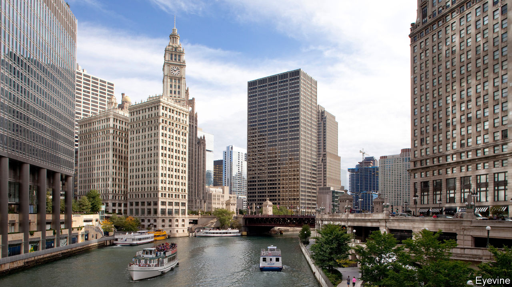
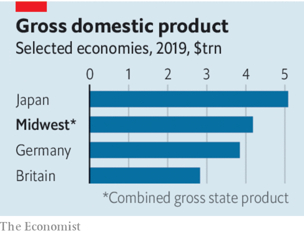

## Regional development

# The best-run cities of America’s Midwest offer lessons in recovery

> How to revive and thrive

> Jul 25th 2020

THE DOZEN states of America’s Midwest have a population of 68m, equal to Britain’s. They share an economy worth some $4trn, equivalent to the GDP of Germany, the world’s fourth-biggest. And the region’s swing voters weigh heavily in politics. Donald Trump won the presidency four years ago thanks to narrow victories in Michigan, Pennsylvania and Wisconsin. This year’s contest may yet be decided there, too. At the same time the Midwest’s troubles, after decades of industrial decline, are also outsized. Detroit, despite its recent improvements, is sadly still emblematic of how hard it is for cities to recover. It has shrunk to just one-third of its peak population of 1.8m in the 1950s. What can the region do to prosper again, and what can the rest of the world learn from its experience?

The Midwest as a whole draws in too few migrants, and too many of its brightest decide to leave. Until that is reversed, renewed prosperity is likely only in some urban parts, not everywhere. A sort of triage is under way. Not everywhere can be saved. Sometimes outsiders—state or federal government perhaps—will have to try to make it easier for people to live, work and study elsewhere, for example by cutting housing costs for those who move or helping pay for better education. But even Flint, Michigan, which has become notorious for economic decline and poisoned municipal water, still has some manufacturing jobs and a decent university.

However many places justify greater optimism. Some cities really can learn to flourish again. Parts of the Midwest, especially in the suburbs around Chicago, Minneapolis and Madison, can point to an admirable record in social mobility. Those born poor there have a much better chance of progressing to a middle-class life than people in less upwardly mobile regions, such as the south. That surely has much to do with investments in education. Cities cope best with closing factories or other shocks, such as a pandemic-induced economic slump, when they are home to people with plenty of schooling.

Our [special report](https://www.economist.com//special-report/2020/07/23/a-region-with-outsized-punch) in this issue highlights some success stories. The population of Columbus, Ohio, is one of the fastest-growing in America. Indianapolis does well getting small businesses to blossom while keeping city finances healthy. And though much of the Midwest is too slow at reducing racial segregation—so evident in Minneapolis, where a policeman killed George Floyd in May—the likes of Cincinnati, which reformed police and promotes African-American businesses, show that progress can come. That is essential, for cutting racial division and boosting the economy go hand in hand.

Each place has its particular story, but the Midwest holds broad lessons for post-industrial areas elsewhere, whether they are in Europe or Asia. One is that recovery tends to grow from the inside out. If a town centre is an attractive place to live, work and play—with renovated bike paths, lots of parks, restaurants and nightlife—that draws young graduates, the newly retired and more. As a whole, Chicago’s population may have stalled but its downtown is an example of how to expand: its population, of around 110,000, is over six times bigger than it was four decades ago. People come both because such places are more fun than they used to be and because they remain less cripplingly expensive than coastal conurbations.

Cities also do well when they tap their own resources, or local social capital, instead of hoping for federal help or for a one-off giant investor who, with enough subsidies, will come in as a saviour. Pittsburgh rebounded after its steel mills shut by shifting spending from police, buying land from bankrupt mills, then letting various new businesses in high technology flourish there. In Grand Rapids, Michigan-based philanthropists, firms and officials persuaded local manufacturers to stay and then attracted others, for example from Germany.

Another lesson is that the most successful places bet on “eds and meds”. Cities with a decent university or an expansive hospital system (often the two go together) reliably outperform others. The Midwest has many of both. Pittsburgh did especially well by co-operating with Carnegie-Mellon University to get new firms in tech, artificial intelligence and robotics to expand. Some now call the city Roboburgh. Chicago plans an ambitious scheme to encourage universities and tech entrepreneurs to work together in a similar way. Minneapolis and others have had success with big health-care companies. The benefits are fewer when universities remain in bubbles, but the most successful ones now strive to engage with local residents.

This matters, last, because cities with the deepest pools of talented workers tend to be long-term winners. Rahm Emanuel, a former mayor of Chicago, boasts that his city produces or lures 140,000 new graduates each year. That’s a big reason why many companies choose to put their headquarters there. Columbus and its flourishing midsized firms also manage to keep hold of bright graduates and are learning to do vocational training that produces high skills for non-academic types. That makes the city appealing to investors of all sorts. Investing in its people is, ultimately, the Midwest’s greatest strength—and it is a recipe for other places, too. ■

Dig deeper:Sign up and listen to Checks and Balance, our [weekly newsletter](https://www.economist.com//checksandbalance/) and [podcast](https://www.economist.com//podcasts/2020/07/17/checks-and-balance-our-weekly-podcast-on-american-politics) on American politics, and explore our [presidential election forecast](https://www.economist.com/https://projects.economist.com/us-2020-forecast/president)

## URL

https://www.economist.com/leaders/2020/07/25/the-best-run-cities-of-americas-midwest-offer-lessons-in-recovery
