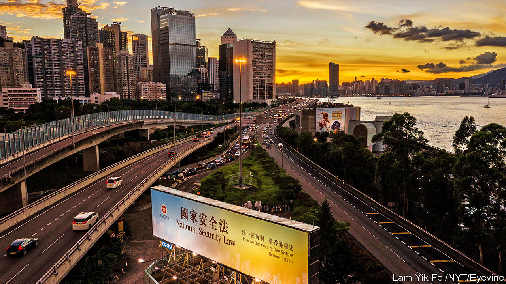
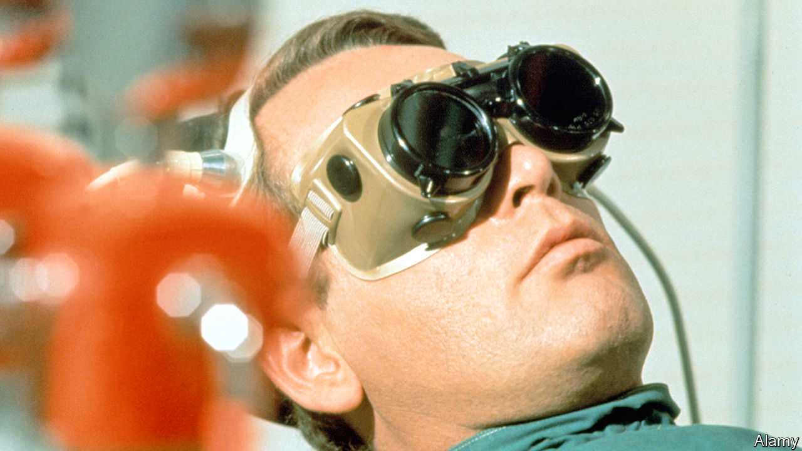
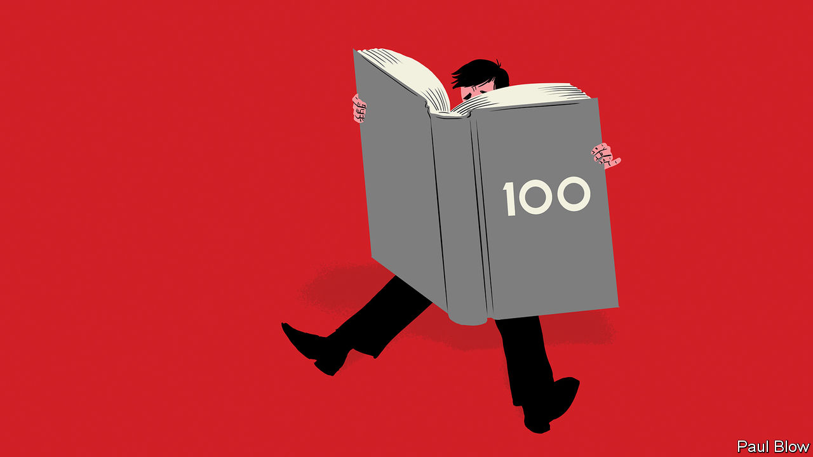
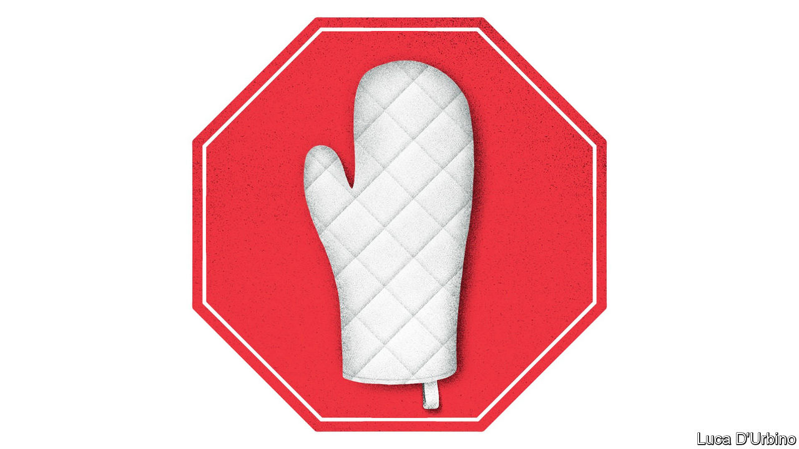

## On Hong Kong, short-sellers, the Supreme Court, horse jumping, “The Prisoner”, medical terms, breadmaking

# Letters to the editor

> A selection of correspondence

> Jul 23rd 2020

Letters are welcome via e-mail to [letters@economist.com](https://www.economist.com/mailto:letters@economist.com%20)

Hong Kong’s new national-security law is hardly “draconian” or “sweeping” (“The evening of its days”, [July 4th](https://www.economist.com//china/2020/07/02/a-new-national-security-bill-to-intimidate-hong-kong), “The party’s grip”, [July 11th](https://www.economist.com//china/2020/07/11/under-a-new-national-security-law-hong-kong-is-already-a-changed-city)). It is relatively mild as far as national-security laws go, focusing on just four well-defined and well-confined activities: secession, subversion of state power, terrorist activities and collusion with foreign or external forces. Nor is it spreading fear among the vast majority of Hong Kongers. After a year of violent protests and traumatising social and business disruption, we are returning to a stable, secure life.

The new law stipulates that the chief executive shall compile a list of judges to hear national-security cases. She may consult Hong Kong’s Committee for Safeguarding National Security and the chief justice of the Court of Final Appeal before doing so. This does not affect judicial independence at all. Hong Kong’s unique “one country, two systems” framework has been successfully implemented since 1997 and will continue to drive its progress.

Moreover, your charge that “censorship is spreading” following the removal of several books from public libraries does not reflect the facts. The books you mentioned are being reviewed to establish whether they violate the national-security legislation’s stipulations (they will be unavailable until that process is complete).

Let me stress that Hong Kong’s fundamental freedoms remain intact under the Basic Law and the applicable provisions of international covenants on human rights. Hong Kong will continue to thrive as a highly autonomous and vibrant international financial and business centre underpinned by the rule of law and an independent judiciary. Between June 30th, when the law was passed, and its opening on July 9th the Hang Seng index rose by 7%. Cash equity market turnover on July 6th, 7th and 9th surpassed HK$200bn ($26bn), the highest daily trading levels in more than two years. In short, Hong Kong looks forward to a peaceful and prosperous future.

MATTHEW CHEUNG KIN-CHUNGChief secretary for administrationHong Kong Special Administrative Region Government

You lauded short-sellers because they occasionally correct the price of falsely or overvalued shares (“In praise of short-sellers”, [June 27th](https://www.economist.com//leaders/2020/06/24/wirecards-scandal-shows-the-benefits-of-short-sellers)). Yet on a routine basis small- and mid-cap companies that are known to require additional funds find that their market capitalisation declines alarmingly. Short-traders benefit from highly discounted dilutive rights issues, or defaults. The short interests have deep pockets and routinely work like a pack without actual collaboration through comments on social media and bulletin boards. This is destructive and makes markets such as AIM a dangerous place for a company known to need investment, and for the unwary to invest.

ALISTAIR HINDLEEdinburgh

“The world this week” in the [July 11th](https://www.economist.com//the-world-this-week/2020/07/11/politics-this-week) issue referred to a 9-0 decision at America’s Supreme Court as a “rare instance of unanimity”. In fact, unanimous rulings (9-0 votes and 8-0 when a justice was recused) accounted for almost a third of the court’s judgments in its latest session. The sharply divided 5-4 and 5-3 votes may have got all the press, but made up just a fifth of its decisions.

MARK NELSONDenver

The list of odd and now defunct Olympic events you proffered in “Citius, Altius, Fortnite” ([June 27th](https://www.economist.com//leaders/2020/06/27/why-the-next-olympics-should-include-fortnite)) overlooked the equestrian long jump at the games in 1900. Constant van Langhendonck, a Belgian horse-rider, won gold with an unimpressive leap of 6.1 metres, one metre below the winning long jump in the athletics competition. Admittedly the athlete in that event did not have to carry a jockey.

RAF MOONSMortsel, Belgium

To a devoted fan of “The Prisoner” ([June 20th](https://www.economist.com//books-and-arts/2020/06/20/the-prisoner-a-classic-tv-series-is-apt-lockdown-viewing)), your essay was particularly welcome reading. It remains arguably the most original and thought-provoking series ever aired on network television. The themes it explored—man versus the state, the use and abuse of technology, individuality struggling against conformity—are even more real and pressing today than when the series was first broadcast in what seems a lifetime ago.

At its heart is Patrick McGoohan’s performance as Number 6, a former spy who refuses, despite all manner of deception, to reveal why he resigned. Was he, as some speculate, John Drake from McGoohan’s earlier series “Danger Man”? Or was he the symbol of an everyman? What was the meaning of the final episode? Who is Number 1? A quote from the series says it best: “Questions are a burden to others; answers a prison for oneself”.

MICHAEL KACZOROWSKIOttawa, Canada

Bartleby’s musings on pointless esoteric acronyms really resonated with me ([June 13th](https://www.economist.com//business/2020/06/11/lessons-from-100-columns)). Although technical abbreviations are still regularly used in hospitals, CBT (Chronic Burger Toxicity), UDI (Unidentified Drinking Injury) and OFIG (One Foot In the Grave), have for some reason fallen out of favour.

Adam Fox, who has researched the use of medical slang, once recalled the story of a doctor who had scribbled TTFO (polite translation: patient told to leave) on a patient’s notes. When asked in court what this meant, the doctor replied shrewdly that he had advised the patient “to take fluids orally” before sending him on his way.

DR JOSHUA RABINOWITZLondon

The global flour-milling industry has been surprised by the surge of interest in home baking during lockdown (“The need to knead”, [July 11th](https://www.economist.com//leaders/2020/07/11/sourdough-economics-no-need-to-knead)). As you observe, people have more of that most valuable baking ingredient, their time. As well as an interest in food, home baking is a leisure activity that people do for many reasons, including educating their children. Baking is for sharing. How do you value that time? Surely it is priceless.

GEORGE MARRIAGEDirectorMarriage’s MillersChelmsford, Essex

I’m as big a fan of Ricardian economic theory as the next Economist reader, but your article on sourdough economics failed to persuade this attorney (and newly minted amateur breadbaker) to hang up his apron. Should those less musically adept than Jimi Hendrix or Jimmy Page also hang up their guitars? Those less deft at painting than Vincent van Gogh discard their brushes? Creative endeavours have value above that captured by economic measures. May the trend in dabbling, like our loaves, continue to rise.

COLIN MCDONELLTampa

Thanks for sensibly dissuading amateur breadmaking. I also encourage my friends to leave gambling, football and lovemaking to the professionals. Much more efficient.

SEB FARQUAROxford