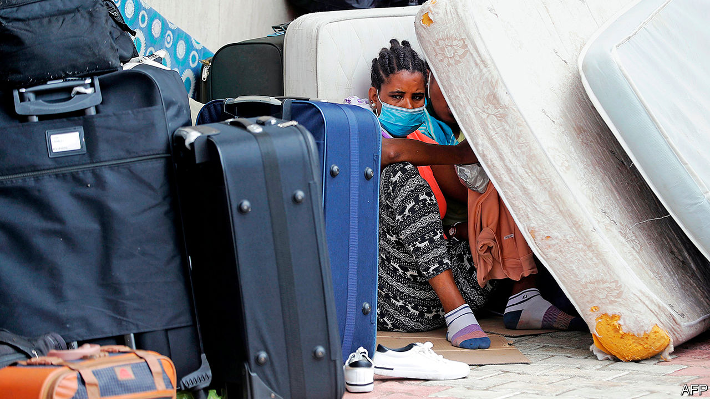

## Maids for sale

# Bigotry against black people poisons the Arab world, too

> Protests in America have shone a new light on an old problem

> Jul 23rd 2020BEIRUT

DAY AFTER day, week after week, the cars pulled up outside the Ethiopian embassy in Beirut and ejected their passengers: tired-looking black women, their modest possessions stuffed into cheap suitcases (pictured). With the economy in free fall, many Lebanese families could no longer afford to pay their domestic workers. Nor could they easily send them home. The price of repatriation flights had surged because of covid-19. So their solution was to dump the women outside their embassy. Dozens were left to fend for themselves.

The protests in America over racism and police brutality have drawn much interest in the Middle East. Some people reacted with shock, some with Schadenfreude. For others, though, America’s unrest was an opportunity to discuss the problems with race in their own countries.

Most Arab states have a black minority. Black communities in north Africa trace their roots to antiquity: the Nubians, for example, called Egypt home long before their country acquired its Arab identity. In the Levant and the Gulf many people are the descendants of slaves taken by Islamic empires, or of African Muslims who made pilgrimages east and decided to stay.

All face discrimination. Dark-skinned people are referred to with terms like abd (“slave”). Egypt’s dark-skinned former president, Anwar Sadat, was called his predecessor’s “black poodle”. Blackface is a common sight on Arabic television. In a widely shared video a black Palestinian actress, Maryam Abu Khaled, recounted the casual bigotry she encounters, such as a mother telling her daughter to get out of the sun lest she, too, turn black.

Skin colour can make marriages fraught when families see it as a marker of socioeconomic status or pedigree. Discrimination exists in the workplace, too. Black Iraqis, a community with more than a thousand years of recorded history, struggle to get government jobs and are typically relegated to menial work.

The worst treatment, though, is reserved not for citizens but for migrants. In wealthy Gulf states it manifests in a tacit racial hierarchy. Fancy hotels might employ black migrants as security guards or porters. They are less common in jobs that require interaction with customers, like waiters or hairdressers. Those better-paid roles often go to lighter-skinned workers from Asian or Arab countries.

Egypt is thought to host around 5m African migrants, many of whom fled war and oppression in places like South Sudan and Eritrea. They have faced years of abuse. About two dozen Sudanese were killed in 2005 when police raided a protest camp. In years past some tried to reach Israel, a long journey across Sinai’s desert that left them prey for human traffickers. Those who crossed the border met discrimination and frequent attempts to deport them—regardless of conditions in their home countries.

Some Lebanese advertise their housekeepers on Facebook as if they were property. A post in April offered a Nigerian maid, “very active and clean”, for 1.5m Lebanese pounds ($1,000 at the official exchange rate). Bigotry can trump class: a black diplomat recalled being pursued in malls by security guards who thought her a housekeeper and wanted to know why she was shopping without her madame.

Faustina Tay, a Ghanaian maid in Lebanon, was found dead in March in the car park underneath the home where she worked. Doctors ruled her death the result of a fall. Her case was not unusual. Even before the economic crisis, human-rights groups estimated that around two domestic workers died each week in Lebanon, mostly by suicide. (Not all are African.)

For years activists have urged the government to scrap the kafala system, which prevents foreign workers from leaving an abusive employer without also leaving the country. Economic crisis may make the issue less pressing: fewer Lebanese can afford to employ foreign maids. In June a Ghanaian television channel covered the return of 211 citizens from Lebanon, most of them female domestics. They described long hours, beatings and having to steal food to survive. “No one should make that mistake and go back to Lebanon,” one woman said. “They don’t respect us.” ■