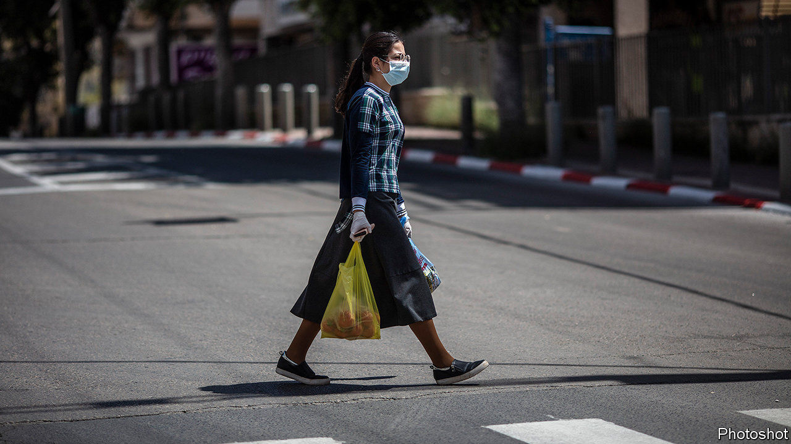
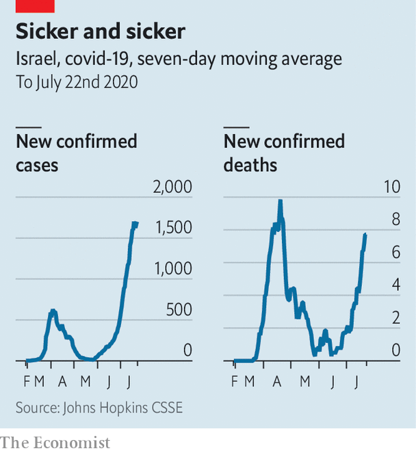

## Mission unaccomplished

# Binyamin Netanyahu boasted too soon of defeating the coronavirus

> With its case count rising, Israel is locking down again

> Jul 23rd 2020JERUSALEM

Editor’s note: Some of our covid-19 coverage is free for readers of The Economist Today, our daily [newsletter](https://www.economist.com/https://my.economist.com/user#newsletter). For more stories and our pandemic tracker, see our [hub](https://www.economist.com//news/2020/03/11/the-economists-coverage-of-the-coronavirus)

GO OUT, GET a coffee, have a beer, said Binyamin Netanyahu. “First of all, have fun.” That was two months ago, after nearly eight weeks of lockdown, when Israel’s prime minister thought he had all but beaten covid-19. Mr Netanyahu led the fight, refusing to delegate authority and holding daily briefings full of alarmism and braggadocio. “So far we’ve done it better than nearly any other country in the world and I assess that by the end of this we will be the best in the world,” he said in March. “Other countries are adopting the steps we took.”

They may want to stop. Although Israel pushed new cases of covid-19 down to a handful a day in late May and early June, they are now close to 2,000, higher than the previous peak (see chart). The disease is spreading faster in Israel than in most other developed countries (though not America). So the government is locking down again. On July 17th it shut schools and gyms. Malls and shops were told to close on weekends. All indoor gatherings of ten or more people are banned.

But the new closures look haphazard. For example, restaurants, beaches and pools were closed—then opened again, with some restrictions. Even Mr Netanyahu admits that the actions are “not scientific”. His critics are harsher. “An entire country is trying to understand why decisions are made in the middle of the night without any data,” wrote Yair Lapid, the head of the opposition, on Twitter. Fewer than a third of Israelis are satisfied with the way Mr Netanyahu is handling the crisis, according to recent polls. Thousands of people have taken to the streets in Jerusalem and Tel Aviv to call for his resignation and to demand more aid for people and businesses hurt by the outbreak.

Mr Netanyahu has hinted that another full lockdown could be in the offing if things do not improve. That would clobber the economy, which is already set to contract by 6% this year. Unemployment sits at 21%, compared with 3.4% before the outbreak. The prime minister has tried to help, but Israelis think he is missing the mark. A 6bn shekel ($1.8bn) plan to give $220 to individuals and up to $870 to families was panned for failing to target those in need. “There are more effective ways to help increase demand,” said Amir Yaron, head of the central bank. The cabinet appears to be sidestepping Mr Netanyahu by setting up a committee to decide who gets the cash.

Public-health experts say the government opened things up too fast, while neglecting to take steps to keep the virus under control. Israel is a world leader in testing per person, but its contact-tracing system has been overwhelmed. The health ministry has too few nurses to track people who may have been infected. Some politicians have called on Mr Netanyahu to transfer responsibility to the defence ministry, which has more manpower. But he is loth to let anyone else take credit for fighting the pandemic—and the defence ministry is run by his political rival, Benny Gantz. (Mr Gantz joined the government only after Mr Netanyahu promised to hand him the premiership next year.)

Mr Netanyahu is instead banking on a controversial mobile-phone surveillance program created by Shin Bet, the security service. The program, designed to track terrorists, was used early in the outbreak, then halted. In June the prime minister brought it back over objections from the head of Shin Bet. The program is meant to identify those who have recently been in contact with an infected person. The health ministry then sends them a text message telling them to quarantine. But there has been a high number of false positives, say experts, and the public’s trust in the government is so low that many Israelis leave their mobile phones at home to avoid being tracked and ordered to quarantine.

One silver lining of Israel’s covid-19 crisis is that relatively few people have died. With a population of 9m, Israel has reported over 56,000 cases but just 430 deaths. That is probably because of a young population and good health care. But criticism of Mr Netanyahu is growing for other reasons, too. On July 19th a court said the next stage of his trial on corruption charges, postponed because of the lockdown, would begin in January. The court will convene three times a week, with the prime minister in attendance. Mr Netanyahu is reportedly trying to wriggle out of both his legal troubles and his agreement with Mr Gantz by calling an early election. ■

Editor’s note: Some of our covid-19 coverage is free for readers of The Economist Today, our daily [newsletter](https://www.economist.com/https://my.economist.com/user#newsletter). For more stories and our pandemic tracker, see our [hub](https://www.economist.com//news/2020/03/11/the-economists-coverage-of-the-coronavirus)