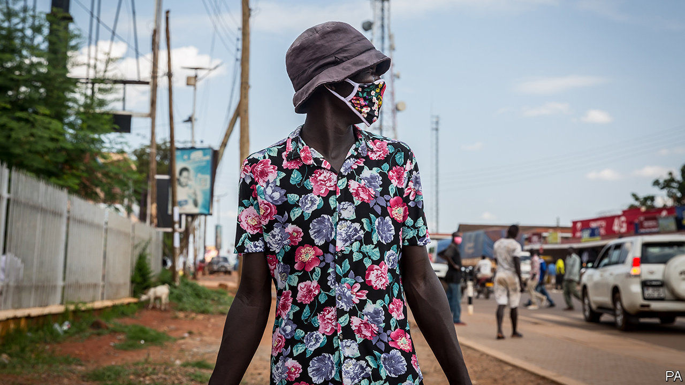

## Power unmasked

# Can Uganda have a fair election amid covid-19?

> Government guidelines make it hard for the opposition to campaign

> Jul 23rd 2020KAMPALA

Editor’s note: Some of our covid-19 coverage is free for readers of The Economist Today, our daily [newsletter](https://www.economist.com/https://my.economist.com/user#newsletter). For more stories and our pandemic tracker, see our [hub](https://www.economist.com//news/2020/03/11/the-economists-coverage-of-the-coronavirus)

THE UGANDAN health minister, Jane Ruth Aceng, has won praise for her handling of covid-19, which has yet to cause a single reported death in her country. But recently she was photographed in a crowd, without a mask, in the district where she is seeking election in six months, when Uganda faces presidential, parliamentary and local elections. Ms Aceng’s critics said she was flouting the rules to chase votes, which she denies.

The coming campaigns will take place without the usual mass rallies, according to covid-19 guidelines issued by the electoral commission. That favours Yoweri Museveni, the incumbent president, who has won five contests, by fair means and foul, since fighting his way to power in 1986. Kizza Besigye, the main challenger in the past four elections, has yet to say if he will run again. But there is a new contender: Robert Kyagulanyi, a singer known as Bobi Wine, who is popular with young urbanites and has recently taken over a hitherto obscure party.

The pandemic complicates a longstanding struggle over freedom of speech and assembly. In January Mr Wine and his supporters were arrested in a cloud of teargas as they tried to hold meetings with voters. The police said the singer had fallen foul of the draconian Public Order Management Act, which has been used since 2013 to block gatherings the government does not like. In March the constitutional court struck down a key section of the act, giving civil society a rare victory.

But the country was already entering a covid-19 lockdown, which offered a compelling new reason to clear the streets. With churches, schools and football pitches still closed, it would be a “total disaster” to stage rallies, argues Mike Mukula, a bigwig in the ruling National Resistance Movement (NRM). That has not stopped him holding indoor meetings with scores of NRM activists. Opposition leaders say the state is keener to control people than to protect them. “If you continue provoking Ugandans, Ugandans will rise up against you,” warns Mr Wine.

Without public rallies, candidates will rely on the media to promote their causes. The press in Kampala, the capital, is lively. But most Ugandans get their news from local radio, which has learned to tread carefully. Maria Ledochowska Nnatabi, a 24-year-old parliamentary candidate who backs Mr Wine, says that talk-show moderators steer her away from sensitive topics. “If I go to the communities, I’m going to say what I want to say openly,” she says. On radio “you’re already compromised.”

Many private broadcasters are owned by politicians or business people with links to the NRM, which state-owned stations also support. “Our majority shareholder is the government so we find our hands are somehow tied,” says Dickson Nandinda of Radio West, a regional outlet. “There are things we will not say.” Candidates will have to pay 3m shillings ($813) to appear on an hour-long talk-show, he adds. That is as much as the average Ugandan makes in a year.

Some opposition leaders want Mr Museveni to declare a state of emergency and postpone elections. The old soldier is disinclined to do so. His regime has built a civilian architecture over the hard foundations of military power. Regular elections, however flawed, reinforce his position as “the elected general” who “stands between the army and the population”, argues Angelo Izama, a Ugandan analyst.

The most radical opposition figures, such as Mr Besigye, say that Mr Museveni has such a tight grip that an election alone will never unseat him. Instead, they see the polls as the catalyst for a political crisis, or even a popular uprising. The deployment of armed militia to enforce the covid-19 curfew looks to some like a dress rehearsal for suppressing post-election protests. ■

Editor’s note: Some of our covid-19 coverage is free for readers of The Economist Today, our daily [newsletter](https://www.economist.com/https://my.economist.com/user#newsletter). For more stories and our pandemic tracker, see our [hub](https://www.economist.com//news/2020/03/11/the-economists-coverage-of-the-coronavirus)

## URL

https://www.economist.com/middle-east-and-africa/2020/07/23/can-uganda-have-a-fair-election-amid-covid-19
