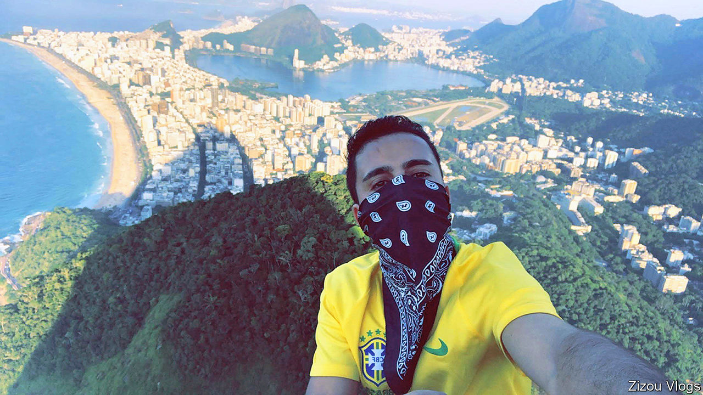

## No passport required

# Vloggers show how to migrate illegally on a jet ski

> North African migrants share their adventures on YouTube

> Jul 23rd 2020

COMPARED WITH the dross of north Africa’s state broadcasters, it makes riveting viewing. The video-blogger cuts his way through rainforests, travels by wooden canoe, flirts with various women and finally reaches Panama, one of ten countries he has entered illegally on his way to the United States. Each instalment, filmed on a mobile phone and posted regularly on YouTube, packs suspense, adventure and tips for would-be illegal migrants. The vlogger, Zouhir Bounou, who calls himself Zizou (pictured), has become a household name back home in Morocco.

North African migrants have long shared advice about how to enter Europe and America illicitly. On social media they offer a romanticised view of life on the other side of the journey. These posts have encouraged hundreds of thousands of north Africans to embark on haraga, or illegal migration. Now vloggers like Zizou are turning their travels into entertainment. And they may be enticing a new generation to pack up and go. “The vlogs have a tremendous pull,” says Amine Ghoulidi, a Moroccan academic.

“I help north Africans break the fear barrier and fulfil their dream of reaching the West,” says Murad Mzouri, who used to peddle cheap clothes in Morocco. Now he is one of its most popular vloggers, with up to a million views a month. Zizou won his audience with tales of raves on beaches and run-ins with the police. Citing the danger, he now tells others not to follow his path.

But the vlogs are full of useful information for would-be migrants, such as the co-ordinates for a route across the Turkish-Greek frontier and the going rates for bribes. Some name lawyers who can help with paperwork or tell of charities that provide the best shelter. Want to know where to conduct a sham marriage or get a fake employment contract? Check the vlogs. How do you avoid deportation? “Claim to be underage, claim to be Libyan and claim to be looking for your father,” suggests a vlogger.

There is often more information in the comments section, such as phone numbers of smugglers. But that’s the old way of doing things. The vloggers caution against paying shady human traffickers. Instead, they suggest buying a ticket to Turkey and hiking into Greece. Jet skis are a popular option for Moroccans heading to Spain. Many of the vloggers are university graduates and have similar viewers. Long considered the desperate pursuit of no-hopers, illegal migration is attracting a growing number of the educated and employed. The vlogs are “making haraga mainstream and middle-class”, says Mr Ghoulidi.

They also make money. Mr Mzouri says he earns $2,000 a month from advertising and product placements. When Zizou landed in jail, his followers crowdfunded his bail. North African vlogs have an advantage over the competition. The authorities in the West know enough standard Arabic—or can use Google translate—to track the information shared on social media by migrants from places like Syria. But the dialects of north Africa are more of a challenge. “The vlogs are beyond the radar of Western officials,” says Matt Herbert, an expert on migration based in Malta. And the vloggers themselves are adept at avoiding the authorities.

## URL

https://www.economist.com/middle-east-and-africa/2020/07/23/vloggers-show-how-to-migrate-illegally-on-a-jet-ski
