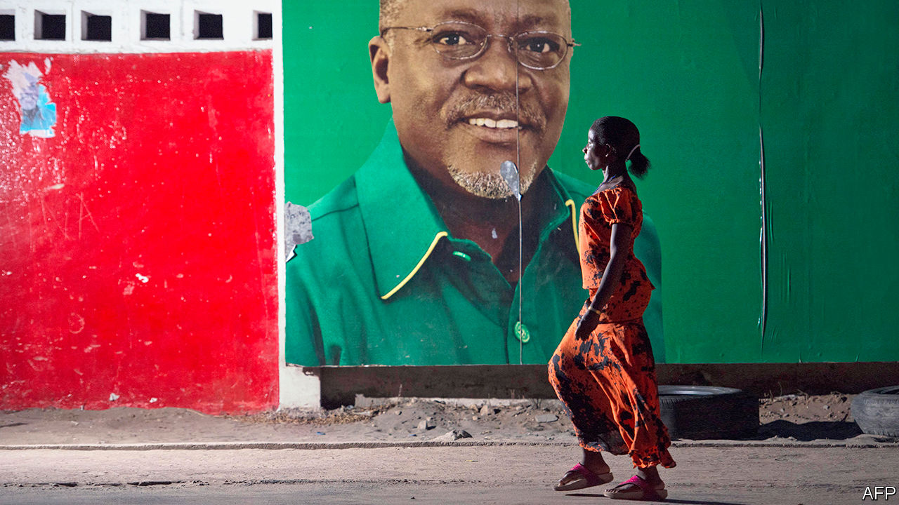
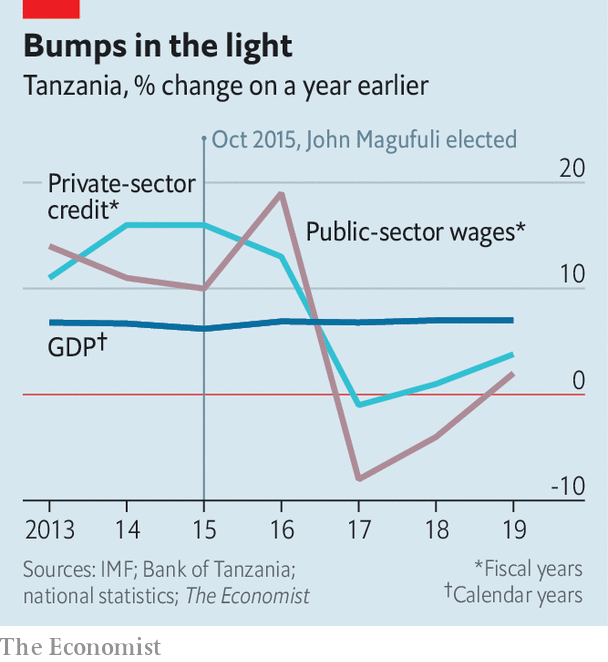

## A Potemkin economy?

# Why Tanzania’s statistics look fishy

> A country lauded for its economic growth may not be doing as well as it says

> Jul 23rd 2020

AFTER THE cold war ended, much of Africa democratised and opened up. Few countries better embodied the feverish hope of the 1990s than Tanzania. It had suffered grievously in the 1960s and 1970s under its founding leader, Julius Nyerere. A nascent democracy was throttled by one-party rule. An economy with great potential was wrecked by “African socialism”. Some 11m peasants were forced into collective villages, where they went hungry.

Democracy and economic freedom revived Tanzania. In 1995 the country held its first free elections in 30 years. As state controls were relaxed, investment flowed in. Steady growth more than doubled income per person between 1994 and 2010.

But John Magufuli, who was elected president in 2015, has turned back the clock on democracy by locking up opposition MPs and journalists. He has also meddled capriciously in the economy. His government has shaken down firms for cash, arresting their executives and holding them without bail if they do not pay up. It is “almost ransom”, says Peter Leon of Herbert Smith Freehills, an international law firm. In 2018, when cashew farmers were unhappy with the market price for nuts, Mr Magufuli sent in the army with orders to buy up the crop for 65% more than private traders offered. In the finest socialist traditions he did not pay the farmers for over 18 months. Since then the harvest has slumped by 30%. Farmers are reluctant to plant if they don’t expect to be paid.

Supporters of Mr Magufuli, who is running for re-election in October, argue that he gets things done—hence his nickname, the “bulldozer”. They also point to Tanzania’s startling record of economic growth. This has been running at close to 7% a year for the past decade. Tanzania has just crossed the World Bank’s threshold to become a middle-income country (ie, with an average income of more than $1,036 a year). Mr Magufuli boasts of achieving this goal five years earlier than planned.

Yet the growth numbers do not stack up. From about 2017 several other indicators, from tax revenue to lending to the private sector, have slowed sharply. The IMF raised doubts last year when it said there were “serious weaknesses” in the growth data. It pointed out that public-sector wages, lending to the private sector and imports were all falling while tax revenue was growing only weakly. The authors made it clear that the official 6.8% growth figure for 2017 was not credible. Publication of the report was blocked by the Tanzanian authorities. (The Economist has seen a copy.)

The fund has since backed down. It now reports, without caveat, Tanzania’s growth as 6.8% in 2017, 7% in 2018 and 6.3% in 2019. Jens Reinke, the IMF’s new representative in Tanzania, says that although the fund makes its own forecasts, it relies on official data for historical figures. “We’re not forensic accountants,” he says. Its latest health check in February has also not been published. The press release that usually accompanies these reports is positive.

Nonetheless, the concerns raised by the IMF did not disappear like their report. Analysis by The Economist using the Tanzanian central bank’s own numbers for the most recent full fiscal year available (2018-19) shows that tax revenue has shrunk in real terms. Discrepancies such as these, says Thorsten Beck of Cass Business School, are “red signals” that GDP may have been overestimated.

Public-sector wages and lending to the private sector, which had both been growing at well over 10% earlier in the decade, crept up by just 2% and 4% respectively (see chart). The amount of money circulating, normally higher when the economy is booming and people need cash, had grown at 10% for several years earlier in the decade but has edged up by only 2% in 2019.

The World Bank produces its own growth numbers for Tanzania, a reflection of its unease. These are lower than the government’s but still close to 6% in recent years. The Bank says that the gaps between GDP and other indicators such as tax revenue have narrowed of late, which would suggest that actual economic growth may have been recovering.

Yet if one looks beyond the indicators flagged by the IMF last year, the picture is still alarming. Foreign direct investment has almost halved since 2013. Exports and imports both fell between 2012 and 2018. Imports of machinery and construction equipment fell between 2015 and 2018, despite claims of booming construction. “The growth numbers are out of line with almost everything else we are seeing out of Tanzania,” says Justin Sandefur of the Centre for Global Development, a think-tank.

Tanzania’s recent growth ought to be evident in ordinary lives. When incomes rise, people buy more beer; yet revenue for Tanzania’s biggest brewer fell in 2018 and 2019. According to door-to-door surveys done in 2012 and 2018, the share of Tanzanians who are extremely poor, 49%, did not change at all over the period. That is almost unheard of. And because Tanzania’s population is growing, the number of extremely poor people has increased by about 4.5m.

Digging by independent wonks in Tanzania might clear all this up. But challenging the numbers is risky. In 2017 Zitto Kabwe, a prominent opposition MP, was arrested for questioning GDP. In 2018 the government made it a crime to dispute official statistics. After an outcry the law was toned down, but its chilling effect persists.

Mr Magufuli avoids sunlight in other areas, too. Tanzania stopped reporting on covid-19 on May 7th, when it had 509 cases and 21 deaths. In May alone Kenya turned 100 Tanzanians away at the border after finding they were infected with covid-19. Nonetheless, on June 8th Mr Magufuli declared Tanzania “coronavirus free”.

The government says the economy will grow by 5.5% in 2020. That would probably make Tanzania the best-performing economy in the world. The IMF predicts a more modest 1.9%

With an election looming, the government’s economic record is facing fresh scrutiny. Bernard Membe, a former foreign minister who has defected to the opposition, says growth is “exaggerated” and “in fact is less than 3%”. What about Tanzania’s middle-income status? “A very big joke,” says Mr Membe. ■

## URL

https://www.economist.com/middle-east-and-africa/2020/07/23/why-tanzanias-statistics-look-fishy
