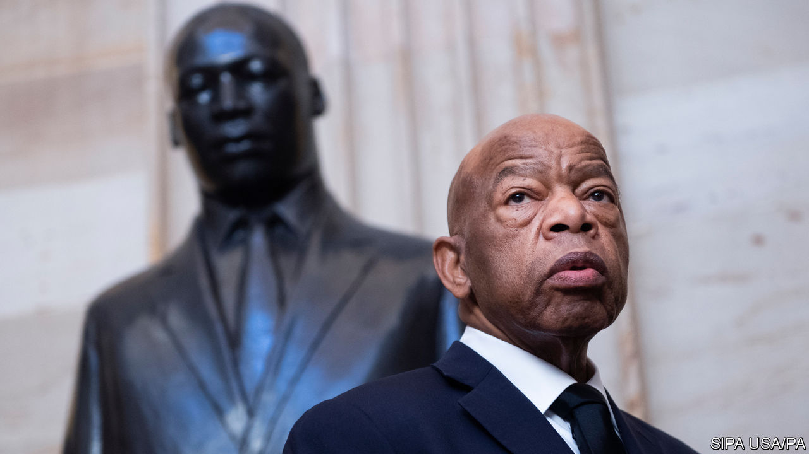

## A country’s conscience

# John Lewis died on July 17th

> The congressman and civil-rights activist was 80

> Jul 20th 2020

JOHN LEWIS had a ritual that saw him through the early 1960s. After being released from jail, he would head back to wherever he was staying—usually a local family’s house—take a long shower, put on jeans and a fresh shirt, find a little restaurant where he could order a burger and a cold soda, drop a quarter in the jukebox and play Curtis Mayfield or Aretha. He would sit down and, as he wrote in his memoir, “let that music wash over me, just wash right through me. I don’t know if I’ve ever felt anything so sweet.”

If it seems like the ritual of a man at the end of a hard day’s work, that is because it often was. Civil-rights activists across the south faced arrest, usually on flimsy charges such as disorderly conduct and disturbing the peace. It was all a part of what he called getting into “good trouble” for acting and speaking out against injustice. He never lost that habit. He was arrested for the 45th time in 2013, his 26th year in Congress, at a rally for immigration reform.

Raised in a small house in Pike County, Alabama, without running water or electricity, he had put himself on an activist’s path early. He applied for a library card at 16. He was denied, of course—libraries, like everything else in Alabama then, were segregated—but he drafted a petition arguing that the library should open its doors to black Alabamans whose taxes helped pay for it.

He had recently heard a sermon on the radio by a young Baptist minister from Atlanta named Martin Luther King junior, who urged listeners to concern themselves not just with God’s Kingdom, but with racial injustice here on Earth. He also wanted to be a preacher—when he was a boy, he had preached to his family’s chickens—and King was the first one he heard use the Gospel to ask how American Christians could believe in both brotherhood and segregation. King could not accept it, and neither could he. What he and King fought for was both radical, given America’s racial history, but also nothing more than an insistence that America live up to its stated ideals of liberty and justice for all.

His activism did not sit well with his parents, who were ashamed when he was jailed. They urged him to “get out of this movement, just get out of that mess.” He was not a gifted orator like King, nor was he urbane like Julian Bond—a co-founder of the Student Nonviolent Co-ordinating Committee (SNCC) and the upper-crust son of a college president whom in 1986 he defeated in the race for the Atlanta congressional seat that he would hold until he died. Small, broadly built and somewhat shy, he was a participant, a doer, an organiser. In person, he was serious and warm, committed to his views but a first-rate listener.

Some of the better-educated members of the movement quietly teased him for his country accent. But as Kelly Miller Smith, who taught him the art of preaching at American Baptist College noted, every word from him might as well be carved in granite, and carried its own truth. His sense of purpose did not waver, even as others retreated from activism, shell-shocked by what they had seen and endured, or lost patience with the slow pace of change and the requirement that they receive blows without giving any back.

But his non-violence was not soft or conciliatory; it was adamantine, confrontational. His first Freedom Ride was in 1961, a bus trip south in which black and white riders sat next to each other and used the “wrong” restrooms and water fountains, provoking beatings, sympathy and attention in order to get the federal government to enforce its ban on segregated facilities at bus and railway stations. Before they left, some of his fellow Riders wrote wills. A poor student of 21, he had nothing to leave anyone.

He defied Bobby Kennedy, then the attorney-general, and Roy Wilkins, the head of the National Association for the Advancement of Coloured People, who urged the Riders not to continue into Mississippi. Two years later, Kennedy conceded that “the young people of SNCC have educated me.” At the March on Washington in 1963—where, at just 23, he was by far the youngest speaker, and the most strident—he vowed to “splinter the segregated South into a thousand pieces and put them back together in the image of God and democracy.”

The night he was nearly beaten to death leading marchers across the Edmund Pettus Bridge in Selma, Alabama—March 7th 1965—he chastised Lyndon Johnson for sending federal troops to Vietnam and Congo but not Alabama. He had been drawn to Selma in part because of the repeated assaults on C.T. Vivian—a minister and veteran activist who was to die on the same day he did—while trying to register black voters. Johnson announced the next day that he was sending troops and signed the Voting Rights Act into law five months later. But after Selma, as he wrote, “the road of non-violence had essentially run out,” and the civil-rights movement began to fracture.

He settled in Atlanta, where he was elected to the city council, and then to Congress. He sought votes from every constituency, blue- and white-collar, Jewish and gay. He never stopped believing in King’s Beloved Community, centred on radical love and justice, never stopped making good trouble. In 1996, almost 20 years before the Supreme Court ruled that gay-marriage bans violate the constitution, he gave a stirring speech on the House floor calling marriage “a basic human right” that should not be denied people just because they happen to be gay.

Alone among March on Washington speakers, he lived long enough to see America elect a black president. At lunch after the inauguration in 2009, he approached the new president with a commemorative photograph and asked for an autograph. Barack Obama wrote, “Because of you, John”, and signed his name.

He spoke forcefully in favour of Donald Trump’s impeachment. His last appearance was with Muriel Bowser, the seventh African-American mayor of Washington, DC, standing on the newly painted Black Lives Matter plaza in front of the White House—a reminder of how far America had come, and how far it still has left to go.■