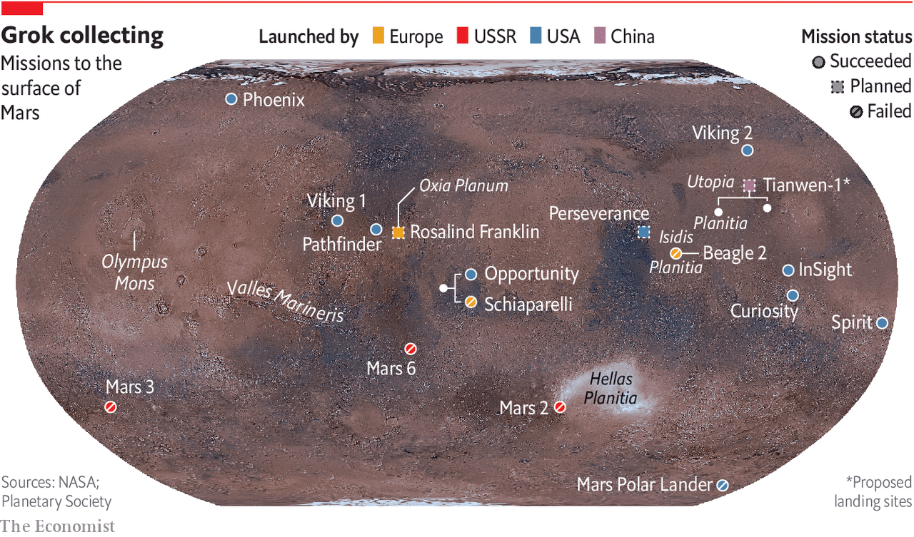
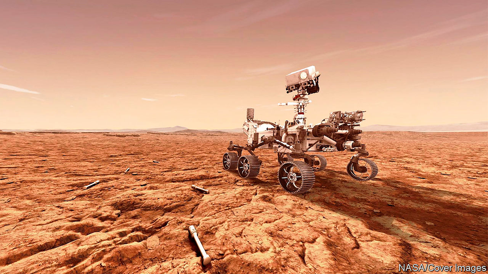

## Astrobiology

# Is there life on Mars?

> A new generation of spacecraft may soon find out

> Jul 21st 2020

AROUND 3.5BN years ago conditions on Earth and Mars were similar. Both had thick atmospheres and liquid water on their surfaces. Both, in other words, had the conditions required to sustain life. And on one of those planets life was, indeed, sustained. Precisely when biology began on Earth remains obscure. But by 3.5bn years ago, a billion years after the solar system formed, it was well established there and has since evolved into the lush abundance of complex forms seen today. Mars, meanwhile, became a freezing desert.

The question nevertheless remains: given that the conditions needed for life to emerge on Earth also seem to have pertained for a time on Mars, might life have evolved there, too? And, if it did, might it still survive in some form, even if only in vanishingly rare amounts?

To answer that question means visiting the place—if not with people then at least with robots. And now is a good time to do so, for Earth and Mars are aligned in a way that means the journey takes less than seven months. On July 20th, therefore, the first of a caravan of craft planning to take advantage of this alignment set off. That was when Al Amal, meaning “hope”, rose from Japan’s spaceport on Tanegashima, off the southern tip of Kyushu. Al Amal is an orbiter intended to study Mars’s weather, and also look at how the Martian atmosphere is leaking into space. Its lift-off adds the United Arab Emirates (UAE) to the list of countries that have dispatched probes towards extraterrestrial bodies.

Al Amal was followed, on July 23rd, by Tianwen-1 (“heavenly questions”), a Chinese mission consisting of an orbiter, a lander and a rover that took off from Wenchang Space Launch Centre, on Hainan. The lander’s provisional target is Utopia Planitia, a large impact basin where an American craft, Viking 2, touched down in 1976. Chinese officials have so far declined to release much detail about Tianwen-1’s scientific aims, but what is known of them suggests that it will study the distribution of ice on Mars and examine how the planet’s habitability has changed over time.

Lack of publicity has not been an issue for the third member of the flotilla. On July 30th NASA, America’s space agency, hopes to launch Perseverance, a one-tonne, six-wheeled rover, from the country’s principal spaceport at Cape Canaveral, in Florida. It will have cost $2.4bn to build and dispatch, and will absorb another $300m in operating costs during its mission. It will be the most sophisticated vehicle yet sent by America to the Martian surface.

Perseverance is aimed at a 45km-wide crater called Jezero that was, 3.5bn years ago, home to a lake. The rover’s main goal is to look for signs of ancient life. But it is also the opening gambit in a decade-long plan to bring Martian rocks to Earth. Jezero itself sits on the inner rim of Isidis Planitia, another large impact basin, which was excavated 3.9bn years ago. One source of the water which formed the lake that once lay within it seems to have been a river leading to a well-preserved delta. The layers of sediment in this feature (colour-coded in the picture on the previous page according to their mineral composition) are prime targets in the search for Martian biology.

On Earth, some of the oldest evidence for life comes in the form of stromatolites. These stratified structures form in shallow water when colonies of microbes grow layer upon layer, trapping sediment as they do so. The most ancient examples are thought to be those found in Greenland in 2016, which have been dated to 3.7bn years before the present day. If there was sufficient time for stromatolite-forming organisms to evolve on Earth by this date then there is no obvious reason why they might not also have evolved on Mars.

Spotting stromatolite-like layers in rocks will not, though, be enough on its own. Researchers will also need to consider the textures of the rocks concerned and the distribution within them of potentially telltale minerals and organic molecules. Confusingly, in chemistry-speak, an organic molecule is not necessarily of biological origin. The term just means that it is built around carbon atoms, so organic molecules can also originate inorganically, as it were. The biological nature of an organic molecule has thus to be justified by other evidence. As Kathryn Stack Morgan, a geologist who is the Perseverance mission’s deputy project scientist, observes, “This is exactly the type of thing that we do here on Earth to make a case for biosignatures in our own rock record, and for the very first time using our instruments we can do that on the surface of Mars.”

Perseverance carries two instruments in particular that are intended to examine the surfaces of rocks which the rover encounters. Both will look for pertinent minerals and organic molecules. SHERLOC, situated at the end of the rover’s robotic arm, will shine a laser onto tiny grains in rocks it comes across. By analysing the spectrum of the light that is scattered back, this instrument will be able to identify molecules in the grains under scrutiny. WATSON, a camera, will then take close-ups of rocks that SHERLOC deems worthy of further study.

Mapping SHERLOC’s chemical analyses onto WATSON’s high-resolution images will show how different mineral layers are arranged and textured. That will be a big improvement over the instruments on board NASA’s current operational Mars rover, Curiosity, which arrived in 2012. These are capable only of grinding up rocks to work out whether or not organic molecules are present in the bulk material. If there are stromatolites (or even fossils of more complex creatures) Perseverance will be able to see them, both chemically and optically.

As did Curiosity, Perseverance will rely on an autopilot to guide it through the atmosphere to the planet’s surface, after arriving at a velocity, relative to its target, of 19,500km per hour. “We refer to it as the seven minutes of terror,” says Matt Wallace, an engineer who is the mission’s deputy project manager. The rover’s autonomy will then carry over to its everyday operations. Because of the time it takes radio waves to travel from Earth to Mars, Perseverance will receive instructions only once a day. On the ground on Mars it will need to find and avoid awkwardly placed rocks, and also more serious hazards, such as cliffs, by processing, in real time, pictures coming from its 23 cameras. This autonomy, NASA is confident, will permit the new rover to cross the Martian surface routinely and safely at a speed of around 150 metres per hour, double that at which Curiosity is usually allowed to travel.

As well as eyes, Perseverance has ears. A pair of microphones on board will permit people to hear the winds of Mars for the first time. They will also be able listen to the whirr of the rover’s gears, the crunch of its wheels as it moves across the regolith (the crushed rock that passes for soil on Mars) and the percussive sounds of the drill at the end of its arm as it chips out samples of rocks to study.

Not all of those samples will be discarded after investigation. Some will be packed for eventual dispatch to Earth by a project called the Mars Sample Return mission. This is a collaboration between NASA and the European Space Agency, ESA, that involves launching five separate spacecraft over the course of a decade. Perseverance is the first, and its collaboration-related job is to seal samples of Martian rock that its operators think worthy of further investigation into one of around 30 titanium tubes which it carries. As the illustration overleaf presages, it will leave these on the surface to be picked up by an ESA-designed “fetch rover” that could arrive as early as 2028. Once collected, the tubes will be brought back to Earth by a system of relay craft, and their contents analysed.

Perhaps most intriguingly of all, Perseverance will also carry a 1.8kg helicopter, called Ingenuity. If this manages to fly in Mars’s thin atmosphere (which has about 1% of the density of Earth’s at the surface), it will represent the first controlled flight, beyond the landing and lift-off of a spacecraft, to take place on another heavenly body. And if that happens, it will pave the way for more sophisticated drones on future missions to act as scouts.

The life-seeking instruments on Perseverance are more advanced than anything that has come before them, but this was not the original plan for the next phase, after Curiosity, of NASA’s attempt to find life on Mars. In February 2012, while Curiosity was still making its way there, Barack Obama’s administration slashed NASA’s planet-exploration budget by a fifth. At the time, American scientists had been developing a programme called ExoMars, in collaboration with ESA. This was to involve an orbiter and several rovers being launched from 2016 onwards, with a combination of tools intended to look for signs of life.

Mr Obama’s cuts killed American involvement in ExoMars and, by the time Curiosity reached Mars in August 2012, NASA had no plans to send any future rovers. The overwhelmingly positive public reaction to Curiosity’s nail-biting landing, however, helped persuade the agency’s chiefs to reconsider their priorities and put together a scaled-back version of previous plans that required no increase in the budget. The result, the mission now known as Perseverance, was announced a few months later.

Meanwhile, ESA had kept its part of the ExoMars programme alive, turning to Russia for help with launching and hardware. In 2016 the agency delivered the first part of the programme, the Trace Gas Orbiter. Its goal is to measure the precise concentrations in Mars’s atmosphere of substances, including methane, water vapour, nitrogen oxides and acetylene, that each form less than 1% of the atmosphere’s total volume but which might be signs of biology.

Methane is of particular interest since its presence varies with both time and location on the planet’s surface. Methane does not live long in the Martian atmosphere, suggesting there is an active source of the gas. On Earth, living things emit methane as they digest nutrients. But purely geological processes can also liberate the stuff.

The next step in ESA’s ExoMars programme is a rover, called Rosalind Franklin. This was also scheduled for launch in the current window. However, a combination of technical delays and the effect of covid-19, which has meant the team of engineers involved could not easily travel to complete the manufacture and testing of the rover, has pushed the lift-off date back to the next favourable alignment, in 2022.

When Rosalind Franklin eventually does arrive on Mars (2023, if this timetable is adhered to), the craft will crawl over an area called Oxia Planum. This has clays that date back around 4bn years, which will make it the oldest site yet explored on Mars. Since clay minerals require water to form, there are high hopes that Oxia Planum may once have been a life-friendly region.

Rosalind Franklin’s scientific payload will be capable of much more sophisticated analyses than Perseverance’s. In particular, the Mars Organic Molecule Analyser (MOMA) will be able to extract organic molecules from rocks and regolith more effectively than before.

Previous attempts to study organic molecules on Mars have been plagued by the presence of chemicals called perchlorates. These were first seen in 2008, by NASA’s Phoenix lander, and were confirmed by Curiosity half a decade later. Those missions baked their Martian samples in ovens, to release the organics. That also released chlorine and oxygen from the perchlorates, and these oxidised most of the organic molecules present. MOMA will circumvent this problem by using an ultraviolet laser that will knock organic molecules off rock samples so fast that any perchlorates present will not have time to decompose.

Rosalind Franklin’s most important tool, however, will be a drill that can collect samples from two metres below the surface. This is crucial for recovering material in which organic molecules can be found in a good state of preservation. The thin Martian atmosphere is easily penetrated by ionising radiation from space. This slams into the surface and even travels a little way beneath it. As Jorge Vago, ExoMars’s lead scientist, observes, “Over many millions of years, this ionising radiation acts like gazillion little knives slowly cutting away the functional groups of the organic molecules you would like to hopefully discover.” Use a drill to go deep enough, though, and material it collects will have been protected from radiation by several metres of rock. ESA’s modelling suggests that samples from 1.5 metres down would be scientifically interesting. The deepest any mission has so far sampled under the surface of Mars is a few centimetres.

The jackpot of this treasure hunt would be to find things like sugars, phospholipids (constituents of the membranes of cells), nucleotides (the “letters” of genetic material) or amino acids (the building blocks of proteins) that are characteristic of life on Earth. But consolation prizes might be available in the form of less direct signals of biology within the chemistry—traces of the actions of enzymes, for example. As Dr Vago observes, the way fatty acids are synthesised biologically on Earth means that they usually have an even number of carbon atoms, although there is nothing in their underlying chemistry which favours that in abiotic syntheses. Finding a pattern like this, or something equally chemically striking, in Martian organic molecules would be encouraging to those who hope that Mars has or once had life.

The UAE’s launch of Al Amal shows how even a small country can join the space race if it is determined enough. No one, however, expects it to become a serious space power. China, though, with half a dozen visits to the Moon under its belt, already is one. Nor is Tianwen-1 the first Chinese attempt to join the Mars club. In 2011 a craft called Yinghuo-1 (“firefly”) attempted to hitch a ride with Phobos-Grunt, a Russian probe. Unfortunately, the rocket intended to propel the combined mission on its way malfunctioned, and it never left Earth orbit. This time, China is going it alone.

One thing which is known is that the mission will host around a dozen scientific instruments, including cameras, chemistry sets, magnetometers and radars. Officials from the China National Space Administration say the plan is to make detailed surveys of the surface. A ground-penetrating radar, for example, will measure the thickness and composition of layers within the regolith and identify any ice within 100 metres of the surface.

It will be a sophisticated spacecraft, if details revealed about the landing system are accurate. Zhang Rongqiao, the chief designer, told Chinese television-viewers in 2019 that the lander would separate from the craft’s main body at an altitude of 70 metres and hover until it found a safe landing spot. Cameras and laser scanners will help this lander avoid obstacles as it makes its way to the surface.

Tianwen-1’s lander does not look capable, from its instrument list, of quite the sorts of sophisticated biology-detecting activity planned for Perseverance and, after it, Rosalind Franklin. But even if that is the case, those other two vehicles, combined with the forthcoming ESA and NASA Mars sample-return mission, do now offer a realistic possibility of answering the question of whether there is, or was, life anywhere other than on Earth. A failure to find it would be a disappointment, although the search would no doubt go on, both on Mars and elsewhere. But an answer in the affirmative, even were that life only bacterial and extinct, would surely transform humanity’s view of itself as profoundly as did the discoveries of Nicolaus Copernicus and Charles Darwin.■

## URL

https://www.economist.com/science-and-technology/2020/07/21/is-there-life-on-mars
