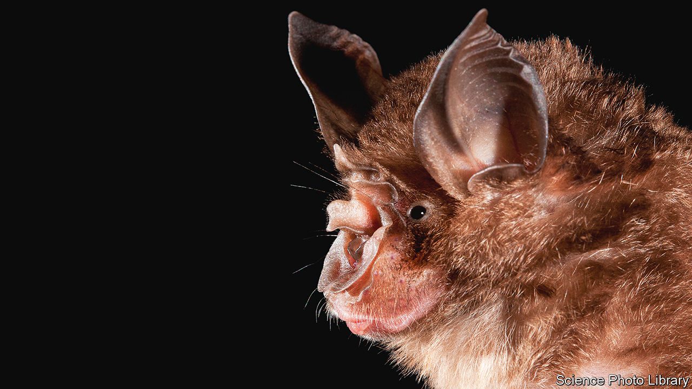
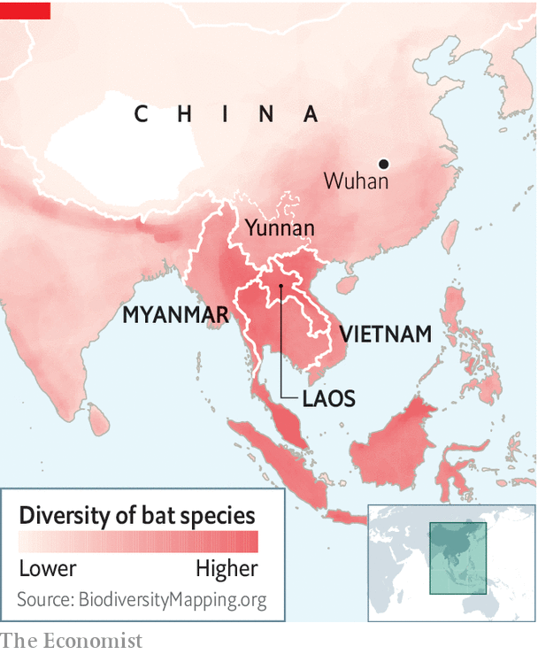

## Bat signal

# The hunt for the origins of SARS-CoV-2 will look beyond China

> The virus may have been born in South-East Asia

> Jul 22nd 2020

Editor’s note: Some of our covid-19 coverage is free for readers of The Economist Today, our daily [newsletter](https://www.economist.com/https://my.economist.com/user#newsletter). For more stories and our pandemic tracker, see our [hub](https://www.economist.com//news/2020/03/11/the-economists-coverage-of-the-coronavirus)

ONE OF THE great questions of the past six months is where SARS-CoV-2, the virus that causes covid-19, came from. It is thought the answer involves bats, because they harbour a variety of SARS-like viruses. Yunnan, one of China’s southernmost provinces, has drawn the attention of virus hunters, as the closest-known relatives of SARS-CoV-2 are found there. But some think the origins of the virus are not to be found in China at all, but rather just across the border in Myanmar, Laos or Vietnam.

This is the hunch of Peter Daszak, head of EcoHealth Alliance, an organisation which researches animals that harbour diseases that move into people. Since the outbreak, in 2003, of the original SARS (now known as SARS-CoV), scientists have paid close attention to coronaviruses. Dr Daszak says that around 16,000 bats have been sampled and around 100 new SARS-like viruses discovered. In particular, some bats found in China are now known to harbour coronaviruses that seem pre-adapted to infect people. The chiropteran hosts of these viruses have versions of a protein called ACE2 that closely resemble the equivalent in people. This molecule is used by SARS-like viruses as a point of entry into a cell.

That such virological diversity has so far been found only in China is because few people have looked at bats in countries on the other side of the border. Yet these places are likely to be an evolutionary hotspot for coronaviruses—one that mirrors bat diversity (see map). The horseshoe bats in Yunnan which harbour close relatives of SARS-CoV-2 are found across the region. Other countries are thus likely to have bats with similar viral building blocks. Dr Daszak believes it is “quite likely that bats in Myanmar, Laos and Vietnam carry similar SARS-related coronaviruses, maybe a huge diversity of them, and that some of them could be close to SARS-CoV-2”.

None of this, though, explains how a virus whose ancestor may be found in South-East Asian bats went on to start a pandemic from central China. China’s government has agreed that a mission led by the World Health Organisation (WHO) can visit later this year to help answer this question. There is particular interest in how much sampling has been conducted to look for the missing link in places like the wildlife market in Wuhan (the first known centre of the outbreak) and more generally in farmers, traders and possible intermediate or host species.

Jeremy Farrar, the head of the Wellcome Trust, a large medical-research charity, and a former professor of tropical medicine, says his guess is that either SARS-CoV-2 or something similar to it has been circulating in people in parts of South-East Asia and southern China, probably for many years, and that intermediate hosts have not yet been identified. Dr Farrar spent 18 years working in Vietnam as the head of an Oxford University research unit. He says people go searching for bats for food and sell them in markets in what is a sophisticated trade that can end up in big cities like Wuhan. Bats are able to carry a huge diversity of viruses without getting sick, and are also more mobile than people realise. As he puts it, bats “congregate in huge colonies, and poo everywhere. And then other mammals live off that poo and then act as a mixing vessel for these sorts of viruses.”

Support for the idea that something resembling SARS-CoV-2 might have been circulating in the region before the pandemic began also comes from another intriguing observation: the low incidence of covid-19 in South-East Asia, particularly in Vietnam. John Bell, a professor of medicine at the University of Oxford, says everyone thought there would be a flood of cases in Vietnam because the country is right across the border from China. Yet Vietnam has reported only 300 in a population of 100m, and no deaths. The country did not have a great lockdown either, he adds. Nobody could work out what was going on.

One explanation, he suggests, is that Vietnam’s population is not as immunologically “naive” as has been assumed. The circulation of other SARS-like viruses could have conferred a generalised immunity to such pathogens. So, if a new one emerged in the region, it was able to take hold in the human population only when it travelled all the way to central China—where people did not have this natural resistance.

This would tie in with the idea that infection with one coronavirus can provide protection against others, and that even in countries away from the evolutionary cauldron of South-East Asia part of the population may have some protection against the current pandemic. In particular, there are suggestions that protection might be conferred mainly via part of the immune system called T-cells (which work by killing virus-infected cells) rather than via antibodies (which work by gumming up pathogens). If that is the case, then serological studies which look at antibodies may be underestimating natural immunity.

Sunetra Gupta, an epidemiologist at Oxford, argues that natural immunity to covid-19 is conferred by infections with seasonal coronaviruses. If correct, this has implications for the level of vaccination needed to reach herd immunity. It is widely assumed that over 50% of people need to be vaccinated to prevent a resurgence of SARS-CoV-2. In a preprint released on July 15th Dr Gupta says this figure could be much lower if a significant part of the population is already resistant to infection.

As for the mystery of the origin of covid-19, more answers will come when the WHO mission takes place, perhaps in August. The critical steps that led a South-East Asian bat virus to start a pandemic could have happened inside or outside of China—whether in wild-animal markets or farms, or in traders or hunters. The virus may have jumped directly from bats into people, or come via an intermediate species. The story is waiting to be told. ■

Editor’s note: Some of our covid-19 coverage is free for readers of The Economist Today, our daily [newsletter](https://www.economist.com/https://my.economist.com/user#newsletter). For more stories and our pandemic tracker, see our [hub](https://www.economist.com//news/2020/03/11/the-economists-coverage-of-the-coronavirus)