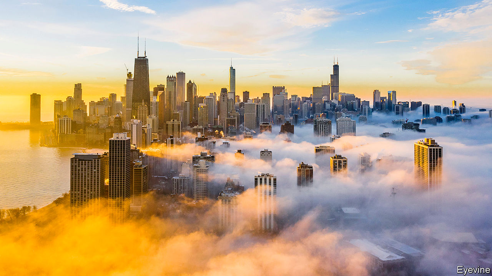
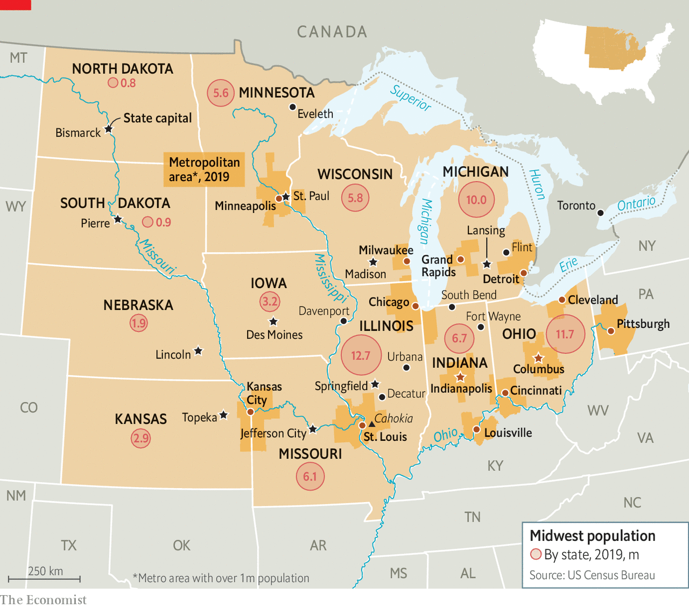

## The Midwest

# A region with outsized punch

> America’s Midwest matters out of proportion to its size, says Adam Roberts

> Jul 23rd 2020

TWICE RECENTLY an eruption in middle America has sent shock waves across the country and the rest of the world. Four years ago Midwestern voters were decisive in putting Donald Trump in the White House, to global consternation. Two months ago, residents of Minneapolis took to the streets after a white policeman had killed George Floyd, an African-American. The resulting protests shut down much of urban America for a spell, then provoked demonstrations and debate on racism everywhere.

Both events were reminders that the Midwest can pack an outsized punch. That is most obvious in politics: the stakes are high in a region in political flux. Unlike much of the coasts and the south, where voters for one or other party have a lock on outcomes, in this region many switch loyalty. If you want to know whether Mr Trump may win another term, a big part of the answer will be found, come November, in battlegrounds like Wisconsin, Michigan and Pennsylvania—three states he unexpectedly won in 2016—and Ohio or Iowa, which he might yet lose.

Second, as the reaction to Mr Floyd’s death showed, the Midwest merits attention because it is exceptionally divided. More than elsewhere, deep racial segregation persists in cities like Milwaukee, Chicago and St. Louis. Protesters’ anger has been focused on ill-trained, violent police and on structural problems. To flourish again, these cities need both economic recovery and reduced racial inequality. Put another way, America will not overcome its profound failures on race until the Midwest does.

Underlying this is a third reason for scrutinising America’s middle: its example for similar regions elsewhere. It grew rich from heavy industry and transport, then declined in the past half-century. A more recent bounce-back of some better-run cities offers lessons for others. Former industrial regions in Europe and Asia can learn from the Midwest.

The Midwest is not the place of rusting cities and reactionary farmers of popular imagination. Its reality is more complex and more interesting. Most Midwesterners wouldn’t know which end of a cow to milk, for they live, by and large, in sprawling metropolitan regions. Many of these cities boast revived downtowns, cultural expansion, diversifying economies, thriving universities. The census this year will show many of them gaining people, although the region overall will grow little. Bigger places like Chicago and Pittsburgh, and smaller ones like Ann Arbor and Madison, have done well of late. Even those with deeper troubles, such as Detroit and Cleveland, have been improving.

In politics, too, there has been cause for cheer. Some towns have become beacons of liberalism (even if that causes unease in rural parts). Illinois legalised marijuana this year and was planning to wipe clean prison records for thousands of people. In Michigan, early this year, lawmakers were seeking ways to shrink its jail population. Two years ago, each of two urban districts in Michigan and Minnesota elected Muslim women to Congress.

Chicago last year elected as mayor Lori Lightfoot, an African-American, lesbian, ex-prosecutor. At the start of this year another Midwesterner, Pete Buttigieg, a 38-year-old ex-mayor of South Bend, Indiana, was making a serious run to be the Democratic presidential nominee. Few fussed that he is married to a man. Amy Klobuchar, a senator from Minnesota, was offering centrist policies that appealed to many moderates.

This report makes a case that the hope for the region rests on its bigger cities that power the local economy, host successful universities and may again draw skilled immigrants. It is not clear how the turmoil of 2020 will change their prospects, but there are reasons to worry. Mr Trump wants to stop foreign workers and refugees coming. The covid-19 pandemic has already, temporarily, halted inflows. Universities, such as the big ten public ones in the region and many private ones, are unsure how to plan. If cities falter, the Midwest will suffer.

What of the longer term? The Midwest has been a laggard for too long. A report by the Brookings Institution think-tank compared the gains of three broad areas of America in the half-century to 2016. It found economic expansion in the combined coastal zones was a hearty 342%. The “western heartland”, a broad patch west of the Mississippi, grew by 475%. The slowcoach was the “eastern heartland”, the Midwest, which grew by just 187%.

Something depends on definitions. In 100-odd interviews for this report, at least 100 notions of the Midwest were offered. Flash, who serves the best fried chicken in Decatur, Illinois, says you are in “mid America” when someone says “over and back”, not “to and fro”. Farmers say crops tell the story: if you see cotton, it’s the south; if wheat, the west. Only when gazing on great expanses of corn or soyabean are you in the Midwest.

Values count as much as geography. It’s where you find “a good small big”, says a tech entrepreneur in Cincinnati. Some contrast “Midwestern nice” with “cut-throat” coastal folk. Others talk of the people’s warmth, hospitality, work ethic or fondness for the outdoors. The influence of Nordic and German settlers is obvious in place names and a love of sausages and beer. A prevalence of family-owned, midsized companies reminds some of Germany’s Mittelstand. Others describe a solid sense of duty. An Illinois trader says farm-gear previously owned by locals sells at a premium, as everyone knows middle Americans take better care of their tractors.

This report defines the region in two overlapping ways. It includes a dozen states, spread eastward from the middle of America, below the Great Lakes. Most attention is paid to a core of eight: Illinois, Indiana, Iowa, Michigan, Minnesota, Missouri, Ohio and Wisconsin. The four at the western fringe are Kansas, Nebraska and North and South Dakota. This region of 68m people, one-fifth of all Americans, is as populous as Britain or France.

Its collective gross product is worth nearly $4trn, ranking alongside Germany’s as the world’s fourth-biggest. Big companies call it home. Behemoths, with annual revenues over $100bn, are in health care (UnitedHealth, Cardinal Health), carmaking (Fiat Chrysler, Ford, General Motors) and retail (Kroger, Walgreens). Slightly smaller are retailers like Target and Procter & Gamble, State Farm, an insurer, Caterpillar, a machine maker, and Marathon, in energy. Unlisted giants include Cargill, in commodities, and Koch Industries, a big conglomerate.

A second way to see the Midwest is through its urban areas. Those who plan transport corridors think of “megaregions”, as do investors seeking talent pools, consumers or resources. The Federal Reserve treats cities with a broad hinterland as single labour markets. For example greater Chicago, with some 9.8m people, stretches north from Illinois to Wisconsin and south to Indiana. A focus on cities makes sense. When the British novelist Anthony Trollope toured the area in 1861, he wrote how “in this young world the cities have come first” and marvelled at Milwaukee, Cleveland and Chicago. Such spots—13 metropolitan regions with at least 1m people, from the Twin Cities to Columbus—show the greatest dynamism. Workers in big cities are more productive than those in small places. Counting cities also lets this report include Pittsburgh, just inside Pennsylvania.

These metro areas are not bound together. Rahm Emanuel, an ex-mayor of Chicago, scoffs at suggestions that he is a Midwesterner, saying simply, “I’m from Chicago.” Cities compete for migrants, investors, talent, federal funds and company headquarters. Universities sometimes co-operate. So do states. Seven governors co-ordinated their responses to covid-19. Now and then, as over the Great Lakes, they work out common environmental rules. More visionary folk talk of building a “hyperloop” system, to link places such as Chicago, Columbus and Pittsburgh with high-speed passenger and freight transport in depressurised pipes.

Yet no effective institutional structures unite the region. Richard Longworth, a writer in Chicago, argues that too many levels of government exist. He notes how Chicagoland alone has 1,200 separate official units, mostly elected and with some tax-raising powers, ranging from townships and school districts to city mayors. Hacking these back, not creating more, would make sense.

This report concludes that the Midwest can build on past progress, if its more successful cities can reinforce what they started to get right. They must continue to find ways to grow, to lure people and investors, and to become more equitable and attractive places. In short, the key for the region’s future is urban.■

Dig deeper:Sign up and listen to Checks and Balance, our [weekly newsletter](https://www.economist.com//checksandbalance/) and [podcast](https://www.economist.com//podcasts/2020/07/24/checks-and-balance-our-weekly-podcast-on-american-politics) on American politics, and explore our [presidential election forecast](https://www.economist.com/https://projects.economist.com/us-2020-forecast/president)

## URL

https://www.economist.com/special-report/2020/07/23/a-region-with-outsized-punch
