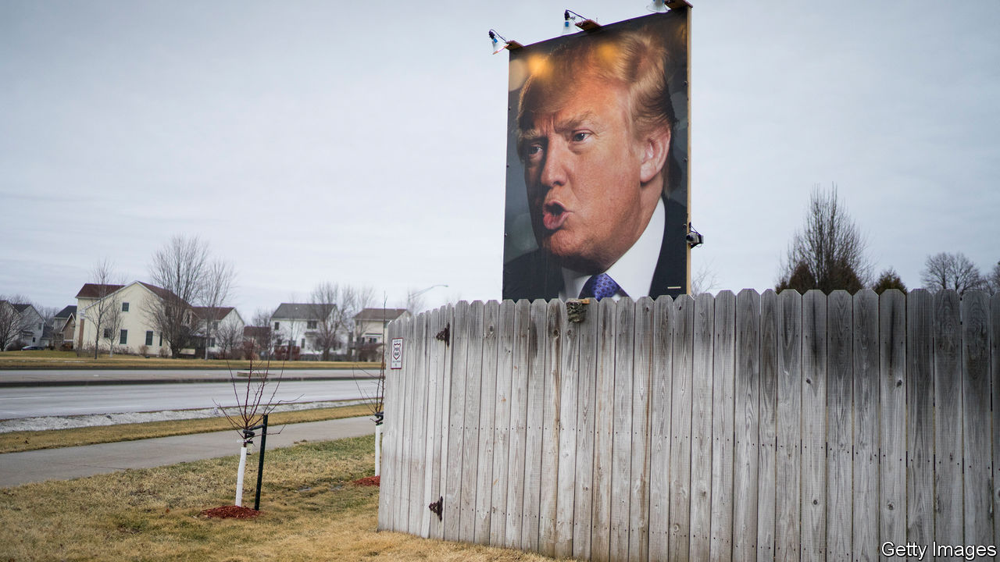
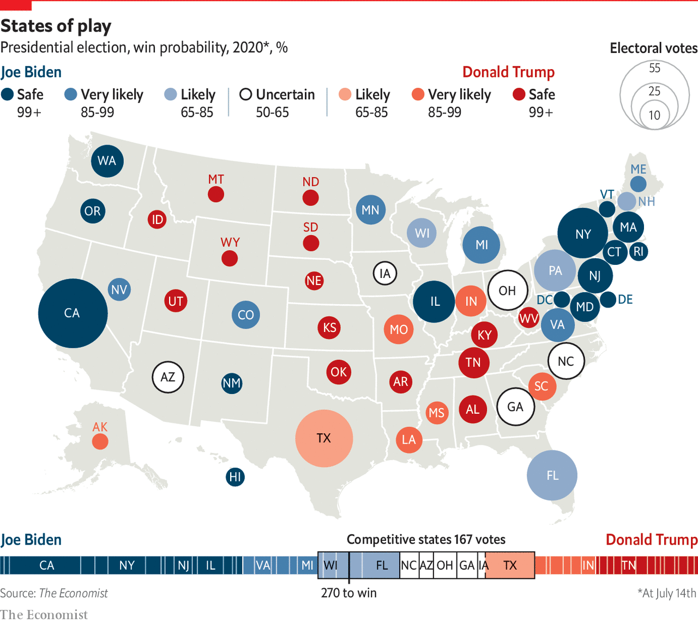

## Politics

# America’s divided middle

> The Midwest is still the political arena to watch

> Jul 23rd 2020

THE BEST explanation of how Donald Trump took the Midwest, and so the White House, came in a book published eight months before he did it. Kathy Cramer at the University of Wisconsin-Madison spent years interviewing small-town voters, such as retired farmers in rural petrol stations chatting over bad coffee. She asked how Wisconsin, a once-placid sort of place, had become bitterly confrontational. Her book, “The Politics of Resentment”, tracked how Scott Walker, the two-term Republican governor who left office in 2019, inspired fury from half the population and adoration from the other half. In every election of the past decade, voters were herded into rival camps. Democrats in populous cities, notably Madison and Milwaukee, were enraged as Republicans weakened unions and cut education funding. Their opponents in small towns in the north, centre and west were more resentful of urban folk and their overly liberal ways.

Small-town folk saw a recall election in 2012 (Mr Walker narrowly survived) as an unfair play by Democrats. The rural and low-paid imagined pampered office workers, especially public officials, living high on the hog in the city. Some conservatives were put off by debates on rights for minorities. Mr Trump’s approach—divisive and focused on firing up his base—fitted in perfectly, as it did in much of the Midwest. He took Wisconsin, Michigan and Pennsylvania on a low turnout. He tapped into the resentment that Ms Cramer found, while spreading cynicism among black voters in Milwaukee. The Democratic nominee, Hillary Clinton, inspired little affection. “She didn’t show up and ask for our vote, the first rule of politics,” grumbles one Midwestern voter. As Dan Kaufman points out in his book “The Fall of Wisconsin”, she blundered tactically, not campaigning (the first candidate to neglect the state since 1972) and spending little on television ads.

Four years on, might the Midwest again put Mr Trump in the White House? Of traditional swing states, Ohio was long the best-known of all. Mr Trump took it by eight points, a large margin, piling up votes from working-class, old manufacturing places along the Mahoning river, while also winning lots of rural votes, such as in 28 counties in the south. Ohio has a record of choosing who occupies the White House. But it has become more Republican. As in Wisconsin, Republicans have in the past two decades managed to take more votes from small-town, suburban and exurban places, no longer bothering with cities. Yet Ohio could switch back in 2020. Sherrod Brown, a senator from the state, says the economic slump and anger over Mr Trump’s handling of racism mean it is likelier than not to flip. As of early July, polls suggest it is a toss-up. But the state’s significance has slipped: Mr Trump could hold it and still handily lose the national contest.

Other Midwestern places may be more important. Though small, Iowa could be up for grabs. Barack Obama was popular with small-town voters in northern, once-industrial places. That area is notoriously disloyal to both parties. America’s greatest concentration of “pivot counties”, where voters picked Mr Obama as president but switched to Mr Trump, are 50 clustered near the northern stretch of the Mississippi river, in Illinois, Iowa, Minnesota and Wisconsin. Illinois is immovably Democratic, but any of the other three could quite possibly flip.

Back when the economy was in good shape, Mr Trump hoped to win Minnesota’s ten electoral-college votes. He lost there in 2016 by just 1.5%, or 45,000 votes, even as he took 78 of its 87 counties. The same rural-urban resentment that Ms Cramer tracked is clear in the state. In once-Democratic strongholds, such as the Iron Range mining district, Republicans have made big gains. Seen from run-down towns like Eveleth, Democrats are out of touch, focusing on the environment and immigration, not on rural, blue-collar interests. And race is undoubtedly also a factor. When Mr Trump attacks non-white Democrats such as Ilhan Omar, a congresswoman of Somali descent from Minneapolis, he hopes it resonates with small-town voters.

Polls suggest that Pennsylvania and Michigan are slipping away from Mr Trump. Partly that is because Joe Biden, as the Democratic nominee, is a powerful asset who appeals more than Mrs Clinton did to rural folk, as well as firing up African-Americans. He did dismally in the Iowa Democratic caucuses, coming a limp fourth, but he will do better with the wider electorate, appealing to independents and even moderate Republicans. He launched his campaign in a union hall in Pittsburgh, where his family has ties. Beth Hansen, a Republican strategist, points out that his father was in the car industry and calls the nominee “pragmatic, low-key, commonsense”. That is gushing praise in the Midwest.

In the 2018 mid-terms, Democrats scooped several suburban congressional seats, and even some exurban ones, that traditionally go Republican. Lauren Underwood, who won a largely rural district in Illinois for the first time, says she did it by focusing on older women voters and health care. If she can hold her seat, the Democrats can expect to retain the House. Democrats also replaced Republicans as governors in Illinois, Kansas, Michigan and Wisconsin. The closest victory was that of Tony Evers, an ex-teacher in Wisconsin, who won even as Republicans kept the state legislature.

In Wisconsin, watch especially the suburbs of Milwaukee, notably the wealthy and mostly white WOW counties—Washington, Ozaukee and Waukesha—where Republicans stack up votes. In recent state elections Republican margins of victory have shrunk, which bodes ill for them. Democrats may be moving in or independents may be turning. Women, particularly those with degrees, are queasy about Mr Trump. His behaviour after the killing of George Floyd put many off. Much Democratic effort will be trained on such places, especially after the Democratic convention is held in Milwaukee in August. Ben Wikler, the head of Wisconsin’s Democrats, says that there is no risk of complacency this time round.

Could this year’s dramatic events help their plans? By early July, all polls put Mr Biden ahead of Mr Trump, suggesting Democrats would make widespread gains in the region. For the Senate, one hopeful—John James, a rare Republican, African-American candidate, in Michigan—briefly looked capable of bringing down a Democratic incumbent, Gary Peters. But later Mr James fell behind in the opinion polls.

Mr Biden may have some leeway. In a tighter race he might have felt obliged to pick a running-mate from the Midwest, just as Mr Trump did with Mike Pence, a former governor of Indiana. Candidates could have included Gretchen Whitmer, governor of Michigan, Tammy Duckworth, a senator from Illinois, or Tammy Baldwin, one from Wisconsin. The region might yet gain its own champion in the White House.■

Dig deeper:Sign up and listen to Checks and Balance, our [weekly newsletter](https://www.economist.com//checksandbalance/) and [podcast](https://www.economist.com//podcasts/2020/07/17/checks-and-balance-our-weekly-podcast-on-american-politics) on American politics, and explore our [presidential election forecast](https://www.economist.com/https://projects.economist.com/us-2020-forecast/president)

## URL

https://www.economist.com/special-report/2020/07/23/americas-divided-middle
