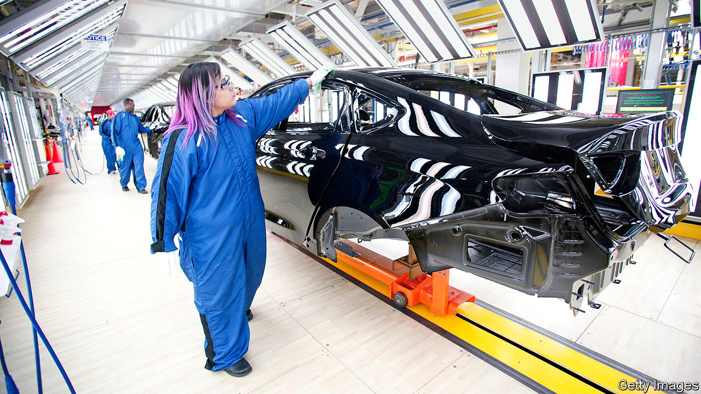
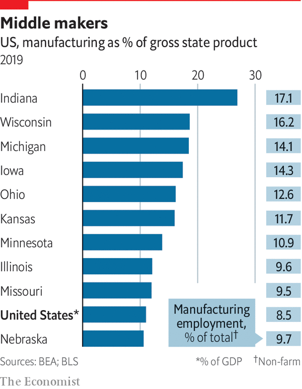

## Industry

# America’s Mittelstand

> Advanced manufacturing can thrive, as Grand Rapids shows

> Jul 23rd 2020

MIDWESTERNERS STILL like to make stuff. Manufacturing may have slid, but they do more of it than other Americans. In Indiana, it makes up 29% of gross state product (and employs 17% of workers). In Michigan it is 19% (and 14% of jobs). In each of the “core” eight states, it is above the national average of 12% of GDP. Companies plug into supply chains for car, aviation and retail industries, or for medical equipment, machine parts and the energy industry. Older-style work, such as furniture-making, persists.

Yet the mass employment of low-skilled workers has largely gone. That hurts those diverted to low-paid work in services. Tony Flora, a union leader in South Bend, asks “How can you provide a middle-class way of life if the jobs are serving omelettes in a restaurant?” Harvard’s Edward Glaeser observes that, as recently as 2000, manufacturing was the largest employer nationally of lower-skilled workers. Now it is one of the smallest.

Paul Krugman, an economist, suggests that rising economic nationalism, confrontation with China and pandemic-induced anxiety over supply chains could nudge some manufacturing back to the Midwest. Sherrod Brown, a senator from Ohio, sees this as a golden opportunity. Any recovery would be centred on those with skills in science, technology, engineering or maths (STEM). Bruce Katz and Jeremy Nowak from Brookings say STEM-related jobs (mostly in manufacturing) are better paid than average, employing 9% of Americans but contributing 17% of GDP.

Training does not have to mean four-year degrees. Instead what is needed are vocational skills that can be taught simultaneously by companies and colleges. Scot McLemore, of Honda, praises the community college in Columbus, Ohio, noting that “there are no more skilled trades, we need multi-craft technicians”, such as the computer savvy. David Harrison, who leads the college, says his 60 trainees study for two days a week in class and work for three at a firm. “Five years ago there was no path for this, now 30 manufacturers are in the programme.” It is an attempt at a German-style apprenticeship scheme.

How can Midwesterners develop more advanced manufacturing? An example of what to avoid is in Mount Pleasant village, in southern Wisconsin. A 20m-square-foot factory complex, planned in the past two years, belongs to Foxconn, a Taiwanese giant. In 2018 Donald Trump, wielding a golden shovel, vowed it would be the “eighth wonder of the world”, employing 13,000 factory workers on high wages. Supposedly Wisconsin’s economy would gain $51bn over 15 years. He talked less about promises to Foxconn of billions of dollars in subsidies.

The project always had a Potemkin air. It was a mystery what Foxconn would make, though television screens were talked of. It was rushed through as the showpiece of a manufacturing renaissance in a swing state. But Tim Bartik, at the Upjohn Institute for Employment Research in Michigan, says it was misconceived. The subsidies were ten times bigger than usual as a share of future wages, suggesting the underlying economics made no sense. Foxconn now talks of innovation and research instead.

A better example, says Mr Bartik, is Grand Rapids, Michigan, “the most successful intensive manufacturing city in America”. It once made furniture and car parts, but since 1985 has been transformed by a project called “the Right Place”. Change came from the ground up, starting with 13 businesspeople from banks and philanthropy, including the Van Andel and De Vos families, who wanted to make their home more attractive. The early idea was to get existing firms to stay, but later it became to lure newcomers. The burghers first restored the town centre. They built a 12,000-seat arena that hosted big-name performers like Elton John. Hotels, restaurants, coffee bars and other entertainment flourished. Students flocked in. The Van Andels set up the Van Andel Institute, a bioscience cluster. Michigan State University opened a big medical school to train health-care staff. Michigan Tech University set up a branch.

Manufacturers were pressed to modernise. Birgit Klohs, a German transplant who has run the Right Place since 1987, says “We’re still a manufacturing centre, like the Mittelstand. The bulk of our success is in advanced manufacturing, in family-owned, mid-sized firms in their third or fourth generation of ownership, just like in Germany.” She seeks foreign ideas. In the 1980s a Japanese adviser showed car-suppliers Toyota’s lean techniques. She leads forays to Germany to study “Industry 4.0” (high tech in factories) or Israel to see how to work with startups.

As important, foreign investors are urged to come to Grand Rapids. Again, the German connection helps. She says there are 136 foreign companies, including 50 from her former homeland. The city “makes a point of attracting foreign, especially German” firms, she says, “as we saw something in common”. The results are exceptional. The Grand Rapids metro area has more than 1m residents today, up from 740,000 in 2000. New types of manufacturers flourish, such as makers of medical devices and equipment. Ms Klohs’s group lists 79 suppliers of personal protective gear, such as face shields, masks, hand-sanitisers, swabs and more, currently in high demand.

The city is a model for deployment of social capital. Researchers have tried to understand why some collaborative efforts succeed but not others. Part of the answer is that, as with the Mittelstand, many firms in the Midwest are owned by families with a passion for their home towns. Mr Katz says Midwesterners benefit from a “deep commitment to place”. He notes how many institutions with huge endowments there are, including MacArthur in Chicago, Heinz in Pittsburgh, the Cleveland Foundation and the Howard G. Buffett (son of Warren) foundation in Decatur.

One research paper contrasts the fortunes of Allentown in Lehigh Valley, Pennsylvania, with the dim outcomes in Youngstown, Ohio, in the years since the 1970s. In Allentown the main concern, as in Grand Rapids, was to create conditions so firms would stay and grow. In Youngstown (as with Foxconn in Wisconsin) there was a narrower focus on helping a particular industry, in its case steel. The long slog of creating the right eco-system seems more likely to pay off than the short-term effort to pick a winner in a declining business.■

Dig deeper:Sign up and listen to Checks and Balance, our [weekly newsletter](https://www.economist.com//checksandbalance/) and [podcast](https://www.economist.com//podcasts/2020/07/17/checks-and-balance-our-weekly-podcast-on-american-politics) on American politics, and explore our [presidential election forecast](https://www.economist.com/https://projects.economist.com/us-2020-forecast/president)