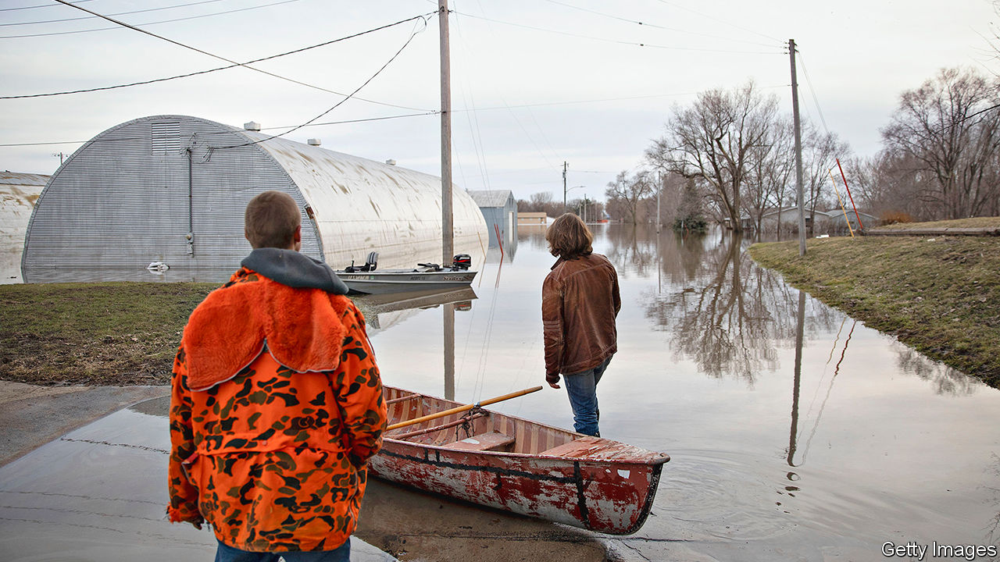

## Nature’s metropolis

# Don’t be the next Cahokia

> Two lessons from a great Midwestern city you’ve never heard of

> Jul 23rd 2020

WHERE TWO rivers meet is a good spot for a city. For 600 years a sizeable one existed where the Missouri joins the Mississippi. By 1100, at the city’s peak, 20,000 residents may have lived around it, as many as did in London. Today archaeologists call the place Cahokia, after a native American group. These pre-Columbians gave up the city two centuries after it peaked. But you can still explore 80 grass-covered mounds where Cahokia stood. The disappearance of the Midwest’s first great city offers two lessons.

The first concerns the environment, the likeliest cause of Cahokia’s collapse. Deforestation and polluted waterways put strains on nature. Getting enough food was hard. Researchers find evidence of big floods. Such pressures are not so different from those climate scientists warn of today. Predictions in the 1990s of warmer and wetter weather in the Midwest have proved accurate. In 2019 one of the worst floods in six decades drenched the region. Michigan, Minnesota and Wisconsin each had the wettest year on record in 2019. In Wisconsin, four in five of the wettest years have come in the past decade.

Rick Cruse, at Iowa State University, calls climate change a “monster” threat, mostly because of flooding. He suggests 10-12% of Iowa’s soil capacity has been lost, costing farmers $1bn a year. Last year’s deluge inundated cities like Davenport, Iowa. Overall damage was some $6.2bn. Tony Evers, Wisconsin’s governor, complains of “crazy weather happenings” and “100-year floods”. Lauren Underwood, a congresswoman from Illinois, lists this as one of voters’ main concerns. John Urbahns, who promotes development in Fort Wayne, Indiana, describes “weird late-season snowstorms”. The overfull Great Lakes, with one-fifth of the world’s fresh surface water, are eroding beaches, roads, piers and sewers.

West of Iowa, the region could get too little rain in future. But most places will get more. Hotter air carries moisture inland and can suddenly unleash water. Temperature swings can cause rapid snowmelt. In the 115 years to 2016, the Great Lakes area has warmed by 0.9ºC, slightly above the national rate. In the north, especially in winter, change is faster. Two-thirds of Minnesota’s counties have seen average mid-winter temperatures rise by more than 2ºC. In 2018 the National Climate Assessment predicted 30% more spring and summer rain by the century’s end.

Like the residents of Cahokia, presumably, most Midwesterners can see change happening. Polls show that even many Republicans accept that man-made climate change is real. “A day of ten-inch rain makes a believer out of people,” says Mr Cruse. That does not mean many people think it is time to act, for the Midwest is less badly hurt than other regions. Farmers even see some benefit. In Iowa, May 1st was long the unofficial start of planting, but mid-April is now the norm. In South Dakota some are even trying to grow corn. City-dwellers may welcome less bitterly cold winters. Kate Collignon, a consultant, asks if the Midwest might be a haven. If coastal places face worsening tornadoes, hurricanes and forest fires, the American middle may look appealing. But that depends, at least, on cities building better infrastructure—such as big, expensive storm drains, or stronger and higher bridges—to protect themselves. Voters in the region also need to get behind a faster switch to cleaner forms of energy.

The second lesson from Cahokia is demographic. The simplest explanation for its vanishing is that it didn’t import enough people. Modern cities, with low fertility rates, can also dwindle if they do not appeal to newcomers. Of Iowa’s 99 counties, says Art Cullen, a journalist in Storm Lake, 67 have lost population in every census since 1920. Gravity (population 187) could soon implode; Monowi in Nebraska is down to a single resident, Elsie Eiler, who is 84. Even as bigger places do well they rarely attract enough incomers, instead draining the young and the better educated from other parts of the Midwest.

As a whole, the region is stuck with low population growth. Six of the 16 biggest cities in America in 1950 have lost more than half their populations: Buffalo, Cleveland, Detroit, New Orleans, Pittsburgh and St Louis. But even successful places find people with specific skills in short supply. The region needs frequent top-ups of foreign talent. Without immigration, the Midwest’s demographic prospects would be dire. For its universities, health systems, farms and meat-packing plants, immigrants are crucial. In Illinois, for example, 18% of all workers are foreign-born. Among IT workers the rate climbs to 27%. For doctors and surgeons it is 32%. In Michigan and Ohio the numbers are high, too.

The Midwest used to be a more attractive gateway to immigrants. The foreign-born population has crept up, but by less than on the coasts. In 1970, in only one state in the region, Illinois, were more than 5% of residents foreign-born. By the latest census, in 2010, that had climbed to 14% in Illinois, 7% in Minnesota and 6% in Michigan. Those figures are probably higher now. The region was, until recently, exemplary in settling refugees. The mayor of Fort Wayne, Indiana, talks of the many Burmese families there. Dearborn, Michigan, is home to many Arab-Americans. Chicago has all sorts, including Ghanaians, Congolese and Ethiopians. St Cloud and the Twin Cities have many Somalis. Diversity has done wonders for local cuisine and entrepreneurialism, small businesses and livelier town centres.

The biggest threat to the Midwest is that it turns away from others. A misguided national policy under Mr Trump that chokes off inflows of foreigners, while ending the resettlement of refugees, could cost the region dear. The effects of covid-19 in stalling migration will make things worse. Together they threaten to make the Midwest a place that is home to a dwindling, ageing population—on a path not so different from Cahokia’s.

Leaders and voters should instead look for ways to open up. Companies, universities and cities, especially, should be urging national change. They need only look to booming Toronto to see how higher immigration drives growth. The most successful places are the most open. Grand Rapids wins by encouraging foreign investors and ideas. The universities of the Midwest need foreign students and staff, just as big companies seek talent from anywhere. Cities like Chicago, Minneapolis and Pittsburgh consider themselves open, welcoming and diverse. Those are values that have stood the Midwest well. They should do again.■

Dig deeper:Sign up and listen to Checks and Balance, our [weekly newsletter](https://www.economist.com//checksandbalance/) and [podcast](https://www.economist.com//podcasts/2020/07/17/checks-and-balance-our-weekly-podcast-on-american-politics) on American politics, and explore our [presidential election forecast](https://www.economist.com/https://projects.economist.com/us-2020-forecast/president)