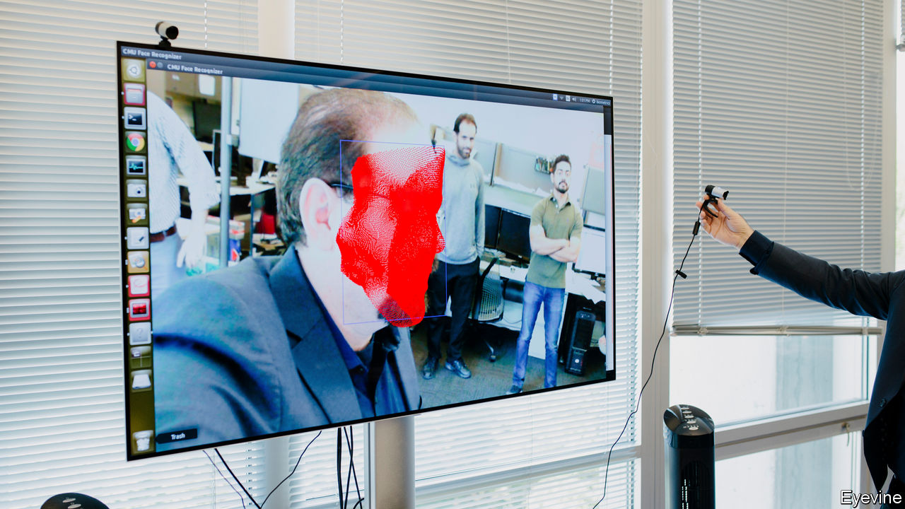

## Universities

# From rustbelt to brainbelt

> How higher education can drive prosperity

> Jul 23rd 2020

TO BUILD A great city is simple, the politician Daniel Patrick Moynihan once said. First create a university, then wait 200 years. By that logic, the Midwest has decent assets. It is home to lots of excellent universities, and hordes of more modest ones. All influence the cities around them. Those that thrive often have a university at their core; educated places do well long-term. Edward Glaeser of Harvard cites examples. If fewer than 5% of adults had a college degree in a city in 1940 then, 60 years on, no more than 19% did. In cities where more than 5% were graduates in 1940, the later share was up to 29%. Gains made early are felt for generations. He divides the Midwest in two. States in the west, such as Minnesota, Wisconsin, Iowa and Illinois, are better educated than those in the east and have prospered more.

John Austin, at the Chicago Council of Global Affairs, has written a study arguing that the Midwest’s institutional brainpower is exceptional. He says 15 of the world’s 200 top-ranked research universities are there. (In fact, by defining the Midwest expansively, he counts 20.) The “big ten” state universities, which oddly number 14, have 600,000 students, 50,000 faculty and draw annual research funds of $10.6bn, more than the Ivy League and Californian universities combined. The Midwest has 16 of the country’s 50 top-ranked medical schools, five of the 25 best computer-science ones, and 17 of 63 leading research universities. It does not do so well in STEM subjects, claiming just six of 25 top-ranked STEM colleges. Mr Austin tots up 21% of America’s patent filings, by companies and universities in the region. Almost a quarter of National Institutes of Health federal grants for developing drugs and medical technologies go to Midwestern institutions.

They in turn spread prosperity, in three ways. One is to bring in young people, often a city-sized population. Mayors want to revive town centres, so luring youthful consumers is a big plus. As a natural experiment, ask how they suffered when covid-19 sent people home. A resident of Columbus, Ohio, laments how the absence of 30,000 students and staff sapped demand for local businesses. Another example is South Bend, Indiana, where Pete Buttigieg often presents revival as mostly about political leadership. But he concedes that nearby Notre Dame university (where his father taught) mattered. Having 8,500 students beside a city of 100,000, including active ones who volunteer in local schools, is helpful. It was a boon to deploy researchers’ ideas, for example to fit wifi-enabled sensors in sewers to monitor water flow and save money. “We have a Beta City concept, we take intellectual property from the university and apply it,” he says.

Second, universities pool employable talent. Not all graduates hang around their alma mater, but cities that keep them outdo rivals. Rahm Emanuel boasts that, when he stood down as Chicago’s mayor last year, 39% of its adults had four-year degrees, far above the national average. No big city has more, he says, though that rests on defining big. In Minneapolis over 49% of adults have a degree; in Madison 58%. This helps explain why both cities have flourished, especially in medicine and pharmaceuticals, which need educated workers. On average, 32% of Americans (25 or older) have at least a bachelor’s degree. Of 12 states in the broad Midwest only Illinois, Kansas and Minnesota surpass that. The least educated state is Indiana, where barely a quarter have a degree. That is a reminder that early education remains a challenge. In Chicago Mr Emanuel struggled to lift the high-school graduation rate from a dismal 56% in 2012 to a somewhat better 78% last year. He also got more people to take vocational training in community colleges. That matters partly because firms come for Chicago’s supply of educated workers. Every June, he says, 140,000 graduates from across the Midwest flock in to start jobs.

Third, universities can refocus a city’s economy. John Cranley, Cincinnati’s mayor, says “By far the best driver is the co-location of an urban, diverse population near a tier-one research and development institution.” Lori Lightfoot, Chicago’s mayor, calls the University of Chicago “one of our crown jewels”. The university says that in two decades it helped found over 300 companies (including Grubhub, a food-delivery firm), with $1.2bn in funding.

The University of Illinois in Urbana-Champaign (U of I) offers a study in a lost chance to commercialise research. One of its computer-science students, Marc Andreessen, created the world’s first widely used web browser, Mosaic, while studying there in 1992. Sadly for Illinois, he went on to commercial success, co-founding Netscape and more, only after moving to the west coast. Laura Frerichs, head of development at U of I, says her university—with 13,000 engineering students and more mathematics PhDs than anywhere in America—learned from that experience. It has since put up 17 buildings for entrepreneurial students and recent graduates. These contain over 120 small companies, employing 2,200, often partnering with large firms such as State Farm. One student from Iran, whose firm has 35 staff, uses AI to create 3D images for construction companies around the world. Another uses a supercomputer to help cancer patients plan treatment. A third produces “ultra-compact robots” to walk through fields monitoring crops.

The plan is to scale up. The University of Chicago says it expects to become a centre for quantum information engineering, a new form of computing. This year the governor of Illinois, J.B. Pritzker, said he would direct $500m to launch the Discovery Partners Institute (DPI), in southern Chicago, where university research can be commercialised and tech graduates trained. Robert Jones, U of I’s chancellor, likens the plan to Tech Park on Roosevelt Island in New York, saying it will lift Chicago “from being a lower-tier city for innovation to the first tier”.

Another model is Pittsburgh, a once-dying steel city now nicknamed “Roboburgh” for a boom in robotics, artificial intelligence, self-driving cars and biomedical research. Zoom, a video-conferencing firm, recently said it would open a research centre there. Tom Murphy, a former mayor, says the way to understand Pittsburgh’s success is to look at Carnegie Mellon University and its entrepreneurial culture. Bruce Katz and Jeremy Nowak see Pittsburgh as a case study in regeneration driven by a university. They trace much of it to a robotics institute at Carnegie Mellon’s computer-science school, which got attention by working on the Three Mile Island nuclear accident. It inspired a cluster of local tech firms. Rather than choosing which company should flourish, the city and university concentrated on producing lots of graduates, and importing more, a process the authors call “talent sprouting”. In turn, they encouraged entrepreneurial activity.

Can these trends go on? Not every city can bank on a university. And many smaller colleges are threatened by demographic change, lower immigration, the pandemic and, for public ones, looming cuts in funding. But federal authorities, seeking ways to recharge the economy, could adopt an idea of professors at MIT to “jumpstart America” through $100bn of investment in 20 new centres of high-technology, innovation and commercialised research, similar to DPI in Chicago. The idea is that lots of rivals to Silicon Valley could bloom. Of the top 20 candidates in the professors’ list, 13 were around universities in the Midwest. With luck it will take less than 200 years to produce results.■

Dig deeper:Sign up and listen to Checks and Balance, our [weekly newsletter](https://www.economist.com//checksandbalance/) and [podcast](https://www.economist.com//podcasts/2020/07/17/checks-and-balance-our-weekly-podcast-on-american-politics) on American politics, and explore our [presidential election forecast](https://www.economist.com/https://projects.economist.com/us-2020-forecast/president)