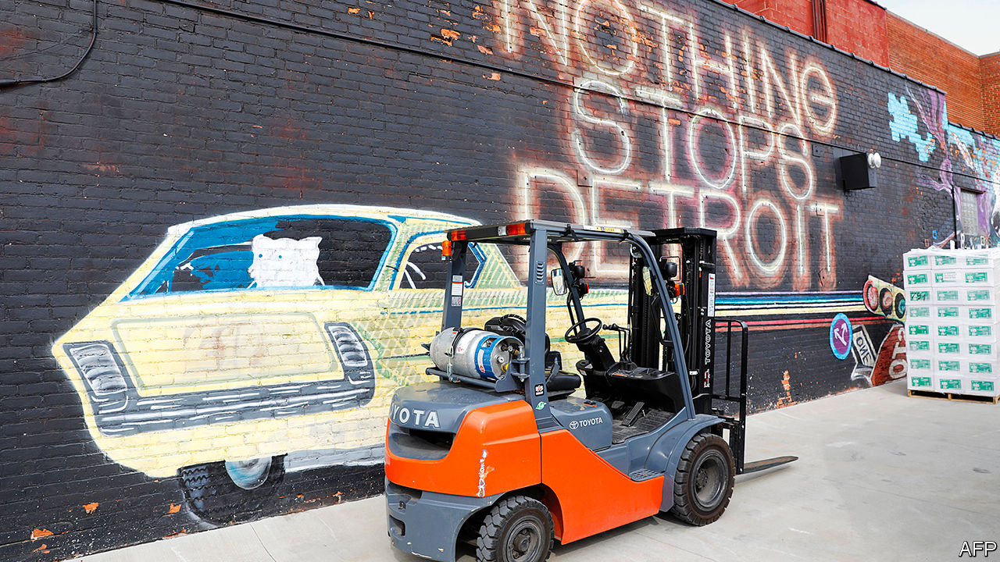

## Cities

# The urban prairie

> For the region to prosper, its bigger cities must flourish

> Jul 23rd 2020

EXPLORE THE Midwest and you spend lots of time between places. Flat expanses are “littered with has-been towns” as Richard Longworth wrote a decade ago. His comment is not much appreciated in places like Assumption, Illinois (population 1,066 and falling). Then again, some Assumption residents express their own prejudice. “People down here want to push Chicago out of Illinois,” says Chris, who sells high-tech farm equipment. The city is too liberal and its voters too dominant. Dan Caulkins, a Republican state representative, sees a “cultural, political, economic divide” pitting Chicago “versus the rest”. Those white-collar Chicagoans “run by one party for generations” might be from a different country. Yet the Midwest’s metro areas are outgrowing states around them. Rural folk may not admit it, but it is urban ones who pay their subsidies.

A report last September by a group of mayors noted that 86% of Americans live in metro areas, producing 91% of national income. The mayors talk of gross metropolitan product (GMP): 38 metro areas, including ten Midwestern ones, have GMPs of $100bn or more. Chicagoland is the Midwest’s biggest. Its $716bn-strong economy is 83% of Illinois’s. The Minneapolis metro area produces $273bn, or 74% of Minnesota’s output. Even troubled Detroit’s metro area, valued at $273bn, makes up over 50% of Michigan’s economy, as St. Louis does of Missouri’s.

Metro areas in the Midwest have had a tough year. Covid-19 struck hard in Cook county, containing Chicago, which saw over 4,500 deaths by July. Wayne county, Detroit, had over 2,700. These were two of the highest death tolls outside New York. But some small-town dwellers railed against lockdowns. In southern Michigan, Illinois and Wisconsin, residents grumbled about fear-mongering city folk. Gun-toting protesters in Michigan entered the state capitol, angry at the lockdown imposed by Gretchen Whitmer, the governor. Conservatives in Wisconsin even got the state’s Supreme Court to overrule its governor, Tony Evers.

The pandemic also spread economic pain. Tourist spots, such as Michigan’s upper peninsula or northern Wisconsin and Minnesota, will see summer revenues slump. But it is cities that will suffer the most. Chicago had expected some 60m visitors this year; it will be lucky to get half. The city predicts a $700m hole in its $11.6bn budget. A University of Illinois study reckons the state will lose the equivalent of 550,000 year-long jobs in 2020, and $76bn in economic activity.

On top of this came the early summer disruption, when hundreds of cities were convulsed by protests against racist policing. Mayors ordered curfews in many cities and the National Guard appeared on the streets. Shops that were tentatively reopening as public-health restrictions eased were boarded up. Some owners of looted places said they would not open again.

The lesson from other big shocks is that they are more likely to accentuate existing trends than to change prospects entirely. The influenza pandemic of 1918 did not stop the rise of America’s cities, including in the Midwest. Big protests in Detroit in 1967 and again after the murder of Martin Luther King in 1968 coincided with (and maybe sped up) the decline of some cities. But those declines were caused by underlying economic trends.

Detroit is a test case. In the past 70 years it has suffered a dramatic slump. Its population peaked at 1.8m in the 1950s, and has since fallen to 670,000. City officials, businesses, community activists and philanthropists claimed it was starting to shine again pre-pandemic. Its town centre appeals to artists and draws tourists for Motown music and trendy restaurants. Suburbanites, craving cultural activity, also flock in. Some companies are even moving headquarters there. Michael Duggan, the mayor, lauds high-rises being built as new sorts of jobs grow, beyond the car industry. Too long dominated by a few huge firms, Detroit is encouraging startups. “Five years ago, you’d step out of your office on a weekday afternoon and the streets were deserted,” says Ray Waters, a businessman. “Today, there are people everywhere, going for dinner, to a show. The city is back.”

Detroit is following a well-trodden path of cities that have scrambled to diversify economies, renovate town centres, stop population loss, draw in youngsters, tackle crime and lure investors. Spend a day with Pete Buttigieg, former mayor of South Bend in Indiana, and he ticks off the usual achievements: a riverfront rehabilitation; the demolition of abandoned houses; improving public finances; luring tech and retail firms to fill old buildings previously given over to manufacturing.

Bruce Katz and Jeremy Nowak, with the Brookings Institution, have scoured the Midwest for examples of such “vanguard cities”, arguing in a recent book that they are gaining clout. Many have added population in the past decade. More people living alone or in households of two drive this, but it also reflects the arrival of young folk to do knowledge-based jobs. Baby boomers who prefer central-city life to sleepy suburbs also count.

Almost nowhere is housing cheap. Renting a home can absorb 30% of incomes. But Midwestern cities are more affordable than coastal ones. Anika Goss-Foster of Detroit Future City, a charity, points out that the housing stock is mostly old—built before 1970—but there is abundant space. Whereas Manhattan has 69,500 residents per square mile, Detroit has just 5,100.

In North End, a scrappy, sparsely occupied district once home to jazz clubs, Diana Ross and Smokey Robinson, redevelopment is under way. Sonya Mays stands in a small house that smells of freshly cut wood and new paint. A property developer, she has plans to construct 1,000 housing units, two-thirds of them in similar, once run-down neighbourhoods. Half will be affordable homes that get support from J.P. Morgan, a bank. If the quality of the housing stock improves, the population will return.

Mr Katz says that, until the pandemic struck, cities in the Midwest were “perfecting this playbook” of selling themselves as more fun than before and more affordable than elsewhere. Companies, too, recognised that it was cheaper to employ staff in cities with lower housing costs. He cites Pittsburgh as an early example of a city that got over the collapse of the steel industry and remade itself as a centre of new technology, robotics, artificial intelligence and more. Tom Murphy, a former mayor, says a tough decision to cut spending, notably on police, created a fund for buying land from former steel mills to be used by other businesses.

One insight: rather than luring investors with incentives, cities should just create appealing living conditions. A second: cities have more assets than they realise. Public land can be exploited to raise funds for redevelopment and better public transport.

The region bursts with examples. Minneapolis and Madison have done well in health care, helped by the Mayo Clinic and firms like Medtronic, a maker of medical devices with revenues of $31bn and 90,000 staff. John Cranley, the mayor of Cincinnati, says his city has studied and tried to emulate Pittsburgh. Chicago’s success is exceptional: its central population has surged from 18,000 in 1980 to 110,000 today. Columbus, Ohio’s capital, has been gaining an extra 10,000 residents a year, making it one of the fastest-growing cities in America. Its boom, says Kenny McDonald, who leads the One Columbus redevelopment agency, reflects a diversified economy and good location for logistics.

Not everywhere prospers. When states barely add to their population (or, like Illinois, shrink) one city’s gain is another’s loss. Cleveland has lost out to Columbus and Cincinnati. The small tend to be eclipsed by the big. Decatur, Illinois, has slumped over the past decade, after the American headquarters of ADM and Tate & Lyle, two food-processing giants, moved to Chicago.

Aaron Renn, formerly of the Manhattan Institute think-tank, has assessed America’s “stagnating cities” in a report focusing on those that have shed 20% of their population since their peak. He talks of the Midwest coping with a “decline phase”, when “people pool into the places that are still successful”. Bigger urban areas keep growing by slurping up young graduates from smaller ones. Midwestern cities struggle with entrepreneurship. He cites Indiana as an exception that is also prepared to experiment with reform of government. Mr Renn, who lives in Indianapolis, praises a decision in the 1980s to merge the city and nearby county governments. That has lifted the city’s official population and propped up its tax-base. Crucially it binds suburban residents to the city.

Detroit would love to do the same, but it cannot easily annex nearby places because of a century-old state law. It could learn other lessons, such as the unusual readiness of Indianapolis to persuade companies to bid for municipal business, which has helped to repair the city’s finances. Sadly, Indiana’s market-friendly approach is not typical. A report in May by Heartland Forward, a think-tank of the Walton family (who own Walmart), laments that old, big companies do well in the region, but young firms rarely flourish. That is especially true in places that fail to encourage research and innovation. The young firms are likelier to generate new jobs, but regulation chokes small ones and stymies the entrepreneurial-minded. Occupational licensing for businesses such as hairdressers, or telling a bodega that it will need 15 permits to open, saps economies everywhere.■

Dig deeper:Sign up and listen to Checks and Balance, our [weekly newsletter](https://www.economist.com//checksandbalance/) and [podcast](https://www.economist.com//podcasts/2020/07/17/checks-and-balance-our-weekly-podcast-on-american-politics) on American politics, and explore our [presidential election forecast](https://www.economist.com/https://projects.economist.com/us-2020-forecast/president)