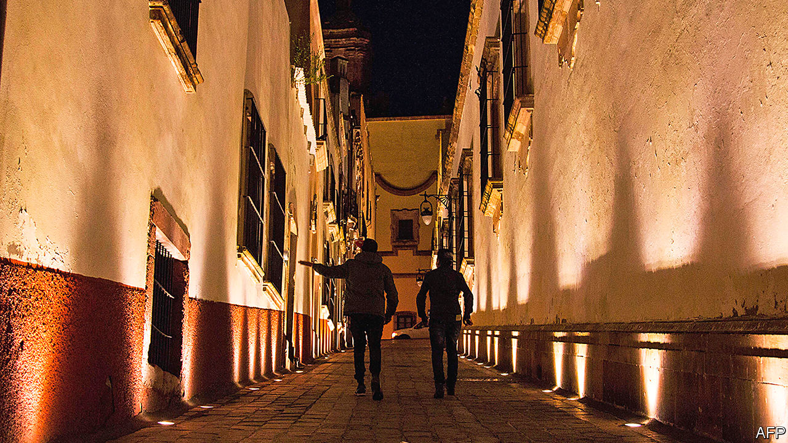

## Youth departs

# Mexico’s emigrants in America are ageing

> That is a challenge for the places they left behind

> Jul 23rd 2020LOS HARO

TWO KINDS OF EMPTY homes bespeckle the hills and valleys of central Mexico and they could not be more different. The first are the crumbling grey cinder-block houses of people who left long ago and never returned. Then there are the dazzling two-storey mansions built with the dollars of migrants working in the United States, which briefly fill with light and laughter each year when their owners come to visit.

Now another migrant-funded flourish is appearing in the Mexican countryside. Over the past five years in Los Haro, a farming village in the state of Zacatecas, “ridiculous” towering graves have sprouted up in the local cemetery, says Norma Nava, a farmer. The migrants who left half a century ago are starting to die. Just like their fancy houses, their mausoleum-style tombs cast shadows over the humble resting places of neighbours who never left.

Though still the world’s largest international migrant group, the number of Mexicans moving to the United States has been falling for 20 years. The Mexican population there is now shrinking. Mexico’s birth rate has been falling for decades, so there are fewer young adults—the age group most likely to up sticks. And the border has become far harder and riskier to cross, which discourages many from trying. From 2007 to 2018, the median age of a Mexican in the United States rose from 35 to 44.

Covid-19 has caused a flurry of worry about remittances. They seem to be holding up for now. But their long-term future is uncertain. Mexico’s emigrants send back less as they age. Their American-born children are unlikely to pick up the slack after they are gone. That will hit remittance-dependent states. It will also imperil villages that rely on social and economic ties to those who departed while young.

To catch the first glimpse of this future, turn to Zacatecas. The state’s emigrating tradition is among Mexico’s oldest and deepest. From 1955 to 1959 one Zacatecan in 16 headed to the United States. Juan Saldivar Flores, an 80-year-old in Los Haro, recalls how his young son would hear gushing descriptions from uncles over the phone of Napa Valley in California, to which nearly all of Los Haro’s migrants flock. “He reproached me” for staying put, foredooming him to a birth in Mexico, Mr Saldivar says. No matter. A few years later his son had taken off to Napa, where he still lives and works.

A third of those born in Zacatecas live in America. But unlike in other states such as Oaxaca and Veracruz, much of its exodus came before 1982, qualifying migrants for an amnesty Ronald Reagan enacted in 1986. Four-fifths of Zacatecans in the United States have legal status, compared with a minority of Mexicans overall, says José Juan Estrada, the state’s migrants minister.

For all its benefits, migration has imposed a demographic cost on the state, argues Rodolfo García Zamora, an economist at the Autonomous University of Zacatecas. Women outnumber men. Silvia Díaz Vargas, the mayor of an idyllic village named Susticacán, recalls a friend fretting: “I don’t know who my daughters will marry.” And ageing takes a toll. “It is very difficult to sustain a municipality” when all the people aged 20-40 are leaving, says Antonio Aceves, the mayor of Jerez de García Salinas, a Zacatecan town of 50,000 close to Los Haro.

But migration has an uncanny ability to fortify the very places it fractures. Polo Larez was born in El Sauz, a Zacatecan village. As a child he walked barefoot for miles each morning to sell buckets of maize harvested by his parents. When he was 11, in 1979, they paid a “coyote” $600 to smuggle him to California in the back seat of a car with a fake birth certificate. “I had to say my name was Hugo Salas,” he recalls with a smile. For four decades while working as a gardener, Mr Larez sent money to his sister in El Sauz. His first gift to her was a washing machine, saving her a long walk to the nearest river. Mr Larez now has a house in Jerez awaiting him when he retires. It has a jacuzzi.

Zacatecans were also pioneers in the practice of sending collective remittances to improve infrastructure back home. The state, federal and municipal governments would all match what migrants’ clubs in America sent. Some 5,500 public works, worth 3.5bn pesos ($270m), were completed under the “3x1” programme in two decades before President Andrés Manuel López Obrador scrapped it last year. Migrants liked to give money because improvements raise property values, says Efraín Jiménez, of FEDZAC, a migrants’ club.

Returned migrants enrich their hometowns with knowledge as well as money. At a cafe in the centre of Jerez, Erika González Ramírez sells cappuccinos with tiny pieces of ginger floating inside. She picked up this technique to warm the soul while living in chilly Alaska. Rogelio Trujillo, a retired gardener whose bristling moustache reaches his chin and who moved to California in the 1960s, volunteered for the mayor of Jerez during a stint back home, uprooting old trees that had ceased to blossom and planting magnolias in their place.

In Los Haro, Ms Nava’s parents put her to work in the fields after she finished primary school. But her education resumed when she began working in the Napa Valley in her 20s. Back farming in Mexico since 2010, she points with pride to the pipes in the ground as she strolls through her plum tree orchard. She learned about irrigation in Napa while working in a nursery. She has also learned to plant the occasional Santa Rosa plum tree, brought down from California. Their plums are worse than the local Heroda ones but they spread pollen through the rest of the orchard, ensuring a bountiful harvest, she explains. It is hard to learn such tricks without leaving the village.

The problem is that this gainful chapter of Mexican history may be coming to an end. Today a sixth of Zacatecan households receive remittances, more than in any other state. Some $1.1bn, equivalent to 70% of the state’s budget, was sent in 2019. But Zacatecan migrants are much older than the national average of 45 years. Migrants are likeliest to send remittances around the age 40, and send the largest sums in their early 50s, says Jesús Cervantes of the Centre for Latin American Monetary Studies. Much of Mexico is “probably at peak remittances right now”, says Douglas Massey, a sociologist at Princeton.

For a while, retirees returning home may make up for lost remittances, by hiring construction workers and the like. Longer term, parts of the state face a decline. With the border-crossing now so much harder, other places in Mexico are more attractive. Mr Aceves in Jerez describes a cycle in which the town’s residents move to nearby bigger cities, like Zacatecas and Aguascalientes, with the youth from the villages moving to Jerez to replace them. That supply of rural youth is dwindling.

Meanwhile many former residents, and certainly their kin, feel more attached to their American surroundings than to their Mexican homeland. In Palo Alto, a village of 50, Nicolás Galdez Navarro sits alone inside his stone house. He grew up so poor that he had to make his own underwear out of old sugar sacks. Now a flashy flat-screen TV adorns his wall. But so do photographs of grandchildren he has never seen. Of his 13 children, ten live in the United States. “They used to visit every year, but now they say it’s complicated,” he says.

What will the young left in Zacatecas do? Mr Saldivar’s granddaughter, Italia, was raised in Jerez and studies automotive engineering in Zacatecas city, the state capital. The state has no car factories. To use her studies, she says she will need to move. José Luis Ureño, a 22-year-old peach farmer from El Cargadero, ponders the future in his kitchen. His older sister lives in California but without legal status, so she cannot come back for a visit. “The people there work too hard and then sleep. Here you can relax and enjoy nature,” he says.

And yet Mr Ureño covets a slice of such a life. He is studying business administration in Jerez, and wants to go to California when he finishes. He wants a garage for his car and a house like his neighbour’s. “It’s sad” that so many kids want to leave, his mother explains. “But it’s what we do.”

Some communities may just disappear. Back near Los Haro, Ms Nava parks her truck at Los Huertas, the village where her late husband grew up. It has been entirely abandoned since the 1980s. Trees grow where bedrooms once stood. Bees fly about a hive in an old living room. Ms Nava bends down and plucks a fork hidden beneath the weeds. “Stainless steel,” she says. “From the United States.” ■

## URL

https://www.economist.com/the-americas/2020/07/23/mexicos-emigrants-in-america-are-ageing
