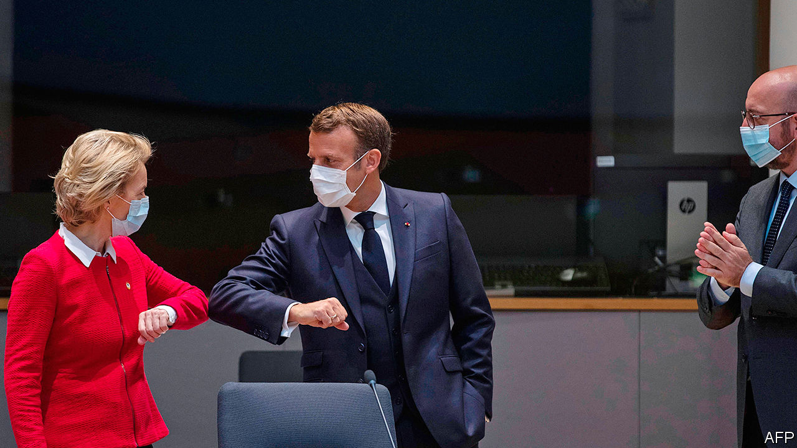
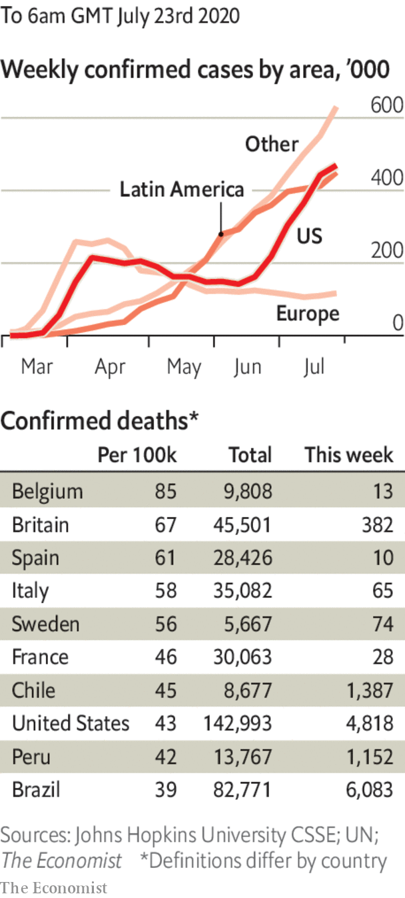

# Politics this week

> Jul 23rd 2020

After intense wrangling, the heads of government in the European Union agreed to a €750bn ($869bn) stimulus package. The negotiations were even more tricky than usual, though the outcome was hailed as a breakthrough. It is the first time the EU as a bloc will issue bonds on a huge scale to back stimulus, spreading the fiscal risk among all member countries. See [here](https://www.economist.com//node/21790050) and [here](https://www.economist.com//leaders/2020/07/25/europes-eu750bn-rescue-package-sets-a-welcome-precedent). 

A long-delayed report into Russian interference in British political life was published by Parliament’s intelligence and security committee. The report stated that the threat from Russia was more embedded, and has been a problem for longer, than previously thought. Russian interference is seen as the “new normal”. It said the government is playing catch-up, especially in cyber-espionage, in which Russia is a “highly capable” adversary. See [article](https://www.economist.com//britain/2020/07/25/russian-interference-highlights-britains-political-failings). 

Iran’s president, Hassan Rouhani, said that as many as 25m Iranians, nearly a third of the population, have been infected with covid-19 since the beginning of the outbreak, and that the situation is getting worse. Restrictions have been reimposed in many cities.

Israel banned indoor gatherings of ten or more people and shut some businesses. The country appeared to have contained the coronavirus earlier this year. Thousands of Israelis protested against the government’s handling of the outbreak and alleged corruption by Binyamin Netanyahu, the prime minister. See [article](https://www.economist.com//middle-east-and-africa/2020/07/25/binyamin-netanyahu-boasted-too-soon-of-defeating-the-coronavirus). 

The United Arab Emirates successfully launched the Arab world’s first mission to Mars. Its Al Amal probe is expected to reach the red planet by next February and then orbit it for 687 days (a Martian year), gathering data about its atmosphere. It is the first of three international missions to Mars this summer.

Police in Zimbabwe arrested Hopewell Chin’ono, a journalist known for exposing corruption, after he published a report alleging that members of the government were involved in corrupt deals for supplies to fight the coronavirus.

Mass protests continued into their second month in Mali after opposition activists rejected attempts at mediation. Demonstrators are demanding the resignation of Ibrahim Boubacar Keita as president and the dissolution of parliament. Mali has been rocked by a brutal jihadist insurgency since 2012.

Violent incidents involving jihadist groups in Africa jumped by 31% in the 12 months to June 30th, according to the Africa Centre for Strategic Studies, which is part of America’s defence department.

Brazil’s government swore in its fourth education minister, Milton Ribeiro, an evangelical pastor. Days later he and another minister tested positive for covid-19.

The Inter-American Commission on Human Rights, a branch of the Organisation of American States, asked Brazil’s government to take steps to protect indigenous groups from the pandemic. More than 15,500 indigenous Brazilians have been diagnosed with covid-19 and more than 500 have died. The virus has reached even remote tribes in the Amazon rainforest, brought in by health workers and illegal miners.

Matiullah Jan, a journalist in Pakistan, was briefly abducted in an attack that appeared to involve police vehicles. Mr Jan had poked holes in the Supreme Court’s verdict against one of its own justices, an unusually fierce critic of the powerful armed forces.

New Zealand’s main opposition, the National Party, elected Judith “Crusher” Collins as its new leader. Her predecessor, Todd Muller, lasted two months in the job. An election is due on September 19th.

Xu Zhangrun, a Chinese law professor who was recently detained by police for a few days, was formally notified of his dismissal by Tsinghua University. Mr Xu is an outspoken critic of China’s leader, Xi Jinping.

America ordered the closure of China’s consulate in Houston, citing a need to “protect American intellectual property”. China called it an “unprecedented escalation”. America also added 11 more Chinese companies to its blacklist of those allegedly involved in human-rights violations in China’s western region of Xinjiang.

Donald Trump ordered the deployment of quasi-military federal officers to more American cities to tackle a recent increase in shootings and homicides in areas that he has described as being run by the “radical left”, such as Chicago. The deployment of federal officers to Portland, however, has failed to quell protests there, and brought more demonstrators onto the streets.

Congress considered measures to remove the names of Confederate generals from army bases, which Mr Trump has said he would veto. Earlier the Pentagon in effect banned the display of Confederate flags at military installations by issuing a list of official standards that can be flown.

Mr Trump denied a report that he asked America’s ambassador in London to press the British government to get the British Open staged at the Trump Turnberry golf course in Scotland, which would have been lucrative publicity.

The World Health Organisation reported new record daily increases for global infections and deaths.

The spread of covid-19 accelerated in Australia; the number of cases detected on July 22nd, eclipsed the previous record.

A quarter of Delhi’s population has had the virus, according to a government study.

Argentina began easing restrictions it imposed in March at the start of its lockdown, one of the longest in Latin America.

The Bahamas banned most tourists from entering the islands either by air or sea. Visitors who test negative from Britain, Canada and the EU will still be allowed in, though Americans are by far the biggest group of visitors.

With infections soaring in the United States, Donald Trump urged Americans to wear face masks, calling it “patriotic”. See [article](https://www.economist.com//united-states/2020/07/25/the-geometry-of-the-pandemic-in-america). 