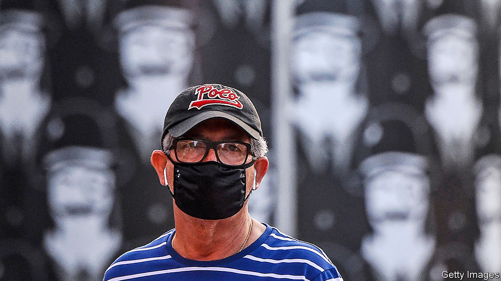
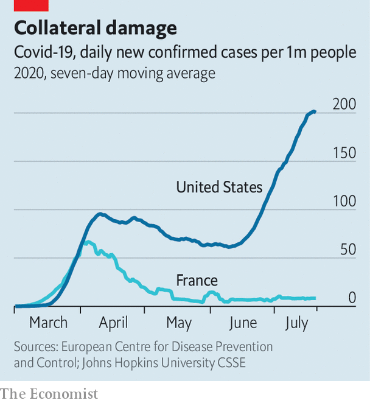

## Easing lockdowns and covid-19

# The geometry of the pandemic in America

> Even modest changes in behaviour can cause huge rises in coronavirus infections

> Jul 23rd 2020

Editor’s note: Some of our covid-19 coverage is free for readers of The Economist Today, our daily [newsletter](https://www.economist.com/https://my.economist.com/user#newsletter). For more stories and our pandemic tracker, see our [hub](https://www.economist.com//news/2020/03/11/the-economists-coverage-of-the-coronavirus)

WHY HAVE covid-19 cases risen so fast? The answer may seem blindingly obvious. But it is not. And the implications of the real answer are even more worrying than those of the obvious one.

The manifest and palpable explanation is that, when lockdowns were eased, people started moving around more, and those who were infected started passing the virus on. This is consistent with the chronology. Most states began to lift restrictions around the end of April or the start of May. Allowing a few weeks for the disease to develop brings you to the start of June when cases began their recent spike.

This is not wrong, but nor is it the whole story, because the pattern of people’s activity does not match the pattern of infection. As the chart shows, new infections fell gradually and gently from 100 cases per million people in mid-April to about 60 in mid-June. America at this point seemed to be following Europe and East Asia down the other side of the mountain of infections. But in mid-June, something extraordinary happened. Infections exploded, increasing fourfold in the next four weeks.

Indices of day-to-day activity, however, show a different pattern. Such data, which are based on mobile-phone tracking, reveal no real change as lockdowns were eased. Unacast, an American-Norwegian firm that provides information to retail businesses, uses anonymised phone data to track how far people are travelling, how often they are making non-essential visits (for example, to cinemas or restaurants) and how often they are meeting others. All three indices show a big fall in activity until mid-April (ie, early in the pandemic), then a wobbly, gradual rise from April to now. As lockdowns ended, most people did not stampede to bars or beaches. SafeGraph, another retail-information company, shows a similar pattern in visits to restaurants, shops and hotels. Human-activity levels have increased linearly and gradually since April, whereas coronavirus cases first fell, then rose exponentially. Does that mean the easing of lockdowns is not to blame, because it has not made a clear difference to people’s behaviour or to the spread of the virus? In a word: no.

The explanation for the pattern of American infections lies in something of central importance to the spread of a virus: geometric progression, such as 1, 2, 4, 8, 16. If one person infects two, two infect four and so on. Unless the rate of infection is driven down by reducing contacts, any geometric increase quickly balloons: 256, 512, 1,024. This is the lesson of the inventor of chess, who in legend asked, as a reward, for one grain of rice on the first square and twice as many on each successive square. There was not enough rice in India to pay his reward. That is one explanation for America’s explosively rising caseload. With almost 4m infections, the country is on square 23.

Another explanation is that the starting point matters. If you begin a geometric progression at one, the tenth in the sequence is 512. If you begin at three, the tenth iteration is 1,536. American states began easing lockdowns, as it were, at three: their caseloads were three or more times higher than in Europe, in part, argues Jarbas Barbosa of the Pan-American Health Organisation, because most states never had full lockdowns. Texas had 1,270 new cases on the day its governor said restaurants could re-open: 44 per million. In Georgia, the rate was 95 per million. Disney World reopened the day before Florida announced a record 15,000 new cases in a day. Just as incredibly, in two-thirds of states, infections were rising when governors started to ease lockdowns. By contrast, France, Spain and Italy had 13-17 new cases per million when they began to re-open their economies and numbers were falling fast.

Rajiv Rimal of Johns Hopkins University has modelled the effect on infections of different levels of activity. On April 12th, he reckons, 95% of the population was staying at home (leaving the house only for essential visits), with 5% ignoring lockdown rules. Based on those assumptions, his model predicts that America would have had 559,400 cases on that day—an accurate assessment (it actually had 554,849). On July 14th, Mr Rimal assumed that 80% of the population was staying at home, ie, only a gradual change. On this basis, his model predicts the country would have 3.6m cases, again not far off the actual number and confirming the impact of modest rises in activity. If people really alter their behaviour, the number would rise even further: to 5.6m cases if the stay-at-home share drops to 60% and to 9.5m if it falls to 20%. In that worst case, America’s death toll could top 400,000. Such is the dark logic of geometric growth.

The implication of these figures is that, when the virus is widespread, even small amounts of activity can make infections soar. You do not need vast, mask-less crowds, though America had those, too. So the public-health task is clear: to drive the level of infection down to perhaps a tenth of what it is now (closer to European or Asian levels). That seems to require full lockdowns. At the moment, few politicians seem prepared for such a thing. True, nine states have reversed some restrictions and 13 have paused their reopenings. At his first televised news conference about the virus since late April, President Donald Trump urged people to “get a mask”. But no governor has yet been willing to tell everyone to stay home. Some reopenings continue and Georgia’s governor sued the mayor of Atlanta when she ordered people to wear masks. “We’re having a dozen New Yorks all over the country,” says Peter Hotez, of the Texas Children’s Hospital in Houston. “It’s predominantly in low-income metro areas. Hispanic communities are being devastated. And there’s no leadership dealing with it.” ■

Editor’s note: Some of our covid-19 coverage is free for readers of The Economist Today, our daily [newsletter](https://www.economist.com/https://my.economist.com/user#newsletter). For more stories and our pandemic tracker, see our [hub](https://www.economist.com//news/2020/03/11/the-economists-coverage-of-the-coronavirus)