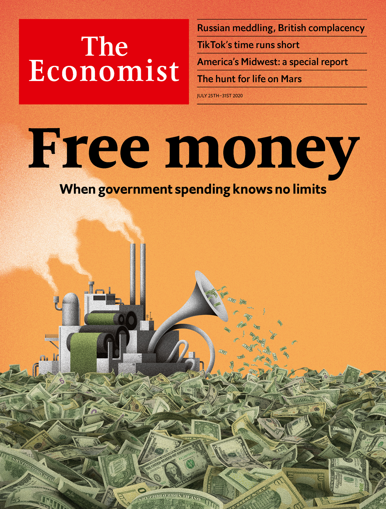

## Free money: When government spending knows no limits

### The world this week
#### [Politics this week](./The%20world%20this%20week/politics-this-week.md)
#### [Business this week](./The%20world%20this%20week/business-this-week.md)
#### [Kals cartoon](./The%20world%20this%20week/kals-cartoon.md)
### Leaders
#### [Governments must beware the lure of free money](./Leaders/governments-must-beware-the-lure-of-free-money.md)
#### [Europes eu750bn rescue package sets a welcome precedent](./Leaders/europes-eu750bn-rescue-package-sets-a-welcome-precedent.md)
#### [The best run cities of americas midwest offer lessons in recovery](./Leaders/the-best-run-cities-of-americas-midwest-offer-lessons-in-recovery.md)
#### [Tanzanias statistics smell wrong](./Leaders/tanzanias-statistics-smell-wrong.md)
#### [Mars may be a pristine ecosystem](./Leaders/mars-may-be-a-pristine-ecosystem.md)
### Letters
#### [Letters to the editor](./Letters/letters-to-the-editor.md)
### Briefing
#### [The covid 19 pandemic is forcing a rethink in macroeconomics](./Briefing/the-covid-19-pandemic-is-forcing-a-rethink-in-macroeconomics.md)
### Asia
#### [Even as india urbanises caste discrimination remains rife](./Asia/even-as-india-urbanises-caste-discrimination-remains-rife.md)
#### [The philippine peso is the champion of emerging market currencies](./Asia/the-philippine-peso-is-the-champion-of-emerging-market-currencies.md)
#### [Central asian governments admit they have a problem with covid 19](./Asia/central-asian-governments-admit-they-have-a-problem-with-covid-19.md)
#### [As crews grow old japanese shipping firms try to do without them](./Asia/as-crews-grow-old-japanese-shipping-firms-try-to-do-without-them.md)
#### [In the south china sea america is churning waters claimed by china](./Asia/in-the-south-china-sea-america-is-churning-waters-claimed-by-china.md)
### China
#### [China is growing more willing to review dodgy convictions](./China/china-is-growing-more-willing-to-review-dodgy-convictions.md)
#### [In south western chinas yunnan province mushrooms mean money](./China/in-south-western-chinas-yunnan-province-mushrooms-mean-money.md)
#### [A hit tv drama in china asks hard questions about right and wrong](./China/a-hit-tv-drama-in-china-asks-hard-questions-about-right-and-wrong.md)
### United States
#### [Americas backwards coronavirus strategy](./United%20States/americas-backwards-coronavirus-strategy.md)
#### [Generous unemployment benefits are not keeping americans from work](./United%20States/generous-unemployment-benefits-are-not-keeping-americans-from-work.md)
#### [The geometry of the pandemic in america](./United%20States/the-geometry-of-the-pandemic-in-america.md)
#### [What is a police department for](./United%20States/what-is-a-police-department-for.md)
#### [Donald trumps divisive method culminates in portland](./United%20States/donald-trumps-divisive-method-culminates-in-portland.md)
### The Americas
#### [Mexicos emigrants in america are ageing](./The%20Americas/mexicos-emigrants-in-america-are-ageing.md)
#### [Barbados invites you to work from the beach](./The%20Americas/barbados-invites-you-to-work-from-the-beach.md)
#### [Peru is heading towards a dangerous new populism](./The%20Americas/peru-is-heading-towards-a-dangerous-new-populism.md)
### Middle East & Africa
#### [Why tanzanias statistics look fishy](./Middle%20East%20&%20Africa/why-tanzanias-statistics-look-fishy.md)
#### [Can uganda have a fair election amid covid 19](./Middle%20East%20&%20Africa/can-uganda-have-a-fair-election-amid-covid-19.md)
#### [Binyamin netanyahu boasted too soon of defeating the coronavirus](./Middle%20East%20&%20Africa/binyamin-netanyahu-boasted-too-soon-of-defeating-the-coronavirus.md)
#### [Vloggers show how to migrate illegally on a jet ski](./Middle%20East%20&%20Africa/vloggers-show-how-to-migrate-illegally-on-a-jet-ski.md)
#### [Bigotry against black people poisons the arab world too](./Middle%20East%20&%20Africa/bigotry-against-black-people-poisons-the-arab-world-too.md)
### Europe
#### [The eus leaders have agreed on a eu750bn covid 19 recovery package](./Europe/the-eus-leaders-have-agreed-on-a-eu750bn-covid-19-recovery-package.md)
#### [The founding partnership behind this weeks eu deal](./Europe/the-founding-partnership-behind-this-weeks-eu-deal.md)
#### [After spreading covid 19 a huge european abattoir vows reforms](./Europe/after-spreading-covid-19-a-huge-european-abattoir-vows-reforms.md)
#### [A hotel developer in athens obstructs the acropolis](./Europe/a-hotel-developer-in-athens-obstructs-the-acropolis.md)
#### [A seaside villa scandal sparks huge protests in bulgaria](./Europe/a-seaside-villa-scandal-sparks-huge-protests-in-bulgaria.md)
#### [Spains king felipe is distancing himself from his father](./Europe/spains-king-felipe-is-distancing-himself-from-his-father.md)
#### [Why the eu is becoming more like a chekhov play](./Europe/why-the-eu-is-becoming-more-like-a-chekhov-play.md)
### Britain
#### [Russian interference highlights britains political failings](./Britain/russian-interference-highlights-britains-political-failings.md)
#### [Starmers tough stance on russia and anti semitism](./Britain/starmers-tough-stance-on-russia-and-anti-semitism.md)
#### [Britains baby bust](./Britain/britains-baby-bust.md)
#### [Britains gypsies and travellers demand justice](./Britain/britains-gypsies-and-travellers-demand-justice.md)
#### [Anxiety levels rise among furloughed britons](./Britain/anxiety-levels-rise-among-furloughed-britons.md)
#### [Britains fragile property boom](./Britain/britains-fragile-property-boom.md)
#### [How fisheries could sink a brexit trade deal](./Britain/how-fisheries-could-sink-a-brexit-trade-deal.md)
### International
#### [The pandemic shows the urgency of reforming care for the elderly](./International/the-pandemic-shows-the-urgency-of-reforming-care-for-the-elderly.md)
### Special report
#### [A region with outsized punch](./Special%20report/a-region-with-outsized-punch.md)
#### [The urban prairie](./Special%20report/the-urban-prairie.md)
#### [Separate downtrodden](./Special%20report/separate-downtrodden.md)
#### [Americas mittelstand](./Special%20report/americas-mittelstand.md)
#### [From rustbelt to brainbelt](./Special%20report/from-rustbelt-to-brainbelt.md)
#### [Americas divided middle](./Special%20report/americas-divided-middle.md)
#### [Dont be the next cahokia](./Special%20report/dont-be-the-next-cahokia.md)
### Business
#### [Tiktoks chinese parent is scrambling to hang on to its hit app](./Business/tiktoks-chinese-parent-is-scrambling-to-hang-on-to-its-hit-app.md)
#### [Indian it consultancies struggle against technological obsolescence](./Business/indian-it-consultancies-struggle-against-technological-obsolescence.md)
#### [How small businesses have dealt with the crisis](./Business/how-small-businesses-have-dealt-with-the-crisis.md)
#### [America inc braces for an earnings bloodbath](./Business/america-inc-braces-for-an-earnings-bloodbath.md)
#### [Corporate dealmakers emerge from pandemic hibernation](./Business/corporate-dealmakers-emerge-from-pandemic-hibernation.md)
#### [A state tobacco monopoly looms over chinas e cigarette makers](./Business/a-state-tobacco-monopoly-looms-over-chinas-e-cigarette-makers.md)
#### [Mercadolibre is a wannabe alibaba](./Business/mercadolibre-is-a-wannabe-alibaba.md)
### Finance & economics
#### [Banks lose out to capital markets when it comes to credit provision](./Finance%20&%20economics/banks-lose-out-to-capital-markets-when-it-comes-to-credit-provision.md)
#### [Unusually copper and gold prices are rising in tandem](./Finance%20&%20economics/unusually-copper-and-gold-prices-are-rising-in-tandem.md)
#### [Ant group announces plans to list in shanghai and hong kong](./Finance%20&%20economics/ant-group-announces-plans-to-list-in-shanghai-and-hong-kong.md)
#### [A shift from paper to virtual cash will empower central banks](./Finance%20&%20economics/a-shift-from-paper-to-virtual-cash-will-empower-central-banks.md)
#### [Chapter 11 is no longer a haven for deadbeat debtors](./Finance%20&%20economics/chapter-11-is-no-longer-a-haven-for-deadbeat-debtors.md)
#### [Why real time economic data need to be treated with caution](./Finance%20&%20economics/why-real-time-economic-data-need-to-be-treated-with-caution.md)
### Science & technology
#### [Is there life on mars](./Science%20&%20technology/is-there-life-on-mars.md)
#### [The hunt for the origins of sars cov 2 will look beyond china](./Science%20&%20technology/the-hunt-for-the-origins-of-sars-cov-2-will-look-beyond-china.md)
### Books & arts
#### [Two books penetrate the mystery and evoke the tragedy of tibet](./Books%20&%20arts/two-books-penetrate-the-mystery-and-evoke-the-tragedy-of-tibet.md)
#### [Bullfighting in the era of covid 19](./Books%20&%20arts/bullfighting-in-the-era-of-covid-19.md)
#### [David mitchells new novel is the story of a rock band](./Books%20&%20arts/david-mitchells-new-novel-is-the-story-of-a-rock-band.md)
#### [Catch 22 and the caprices of bureaucracy](./Books%20&%20arts/catch-22-and-the-caprices-of-bureaucracy.md)
#### [The shadowlands of language](./Books%20&%20arts/the-shadowlands-of-language.md)
### Economic & financial indicators
#### [Economic data commodities and markets](./Economic%20&%20financial%20indicators/economic-data-commodities-and-markets.md)
### Graphic detail
#### [Empty stadiums have shrunk football teams home advantage](./Graphic%20detail/empty-stadiums-have-shrunk-football-teams-home-advantage.md)
### Obituary
#### [John lewis died on july 17th](./Obituary/john-lewis-died-on-july-17th.md)
