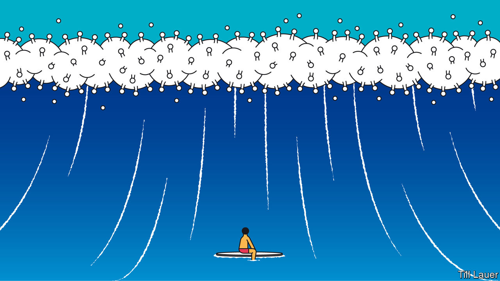

## Banyan

# A second covid-19 wave is worrying Australia, Japan and Hong Kong

> Even Asia’s standouts sometimes lower their guard

> Aug 1st 2020

YOUNG AUSTRALIAN returnees in quarantine hotels made whoopee with the security guards who were supposedly supervising their isolation. Presumably they were not thinking of how the 6.6m inhabitants of Victoria state might react. They know now. Some guards took the virus home, from where, in July, it spread fast, just weeks after the state had emerged from a long but successful lockdown. Now Melbourne, Australia’s second most populous city, has reimposed tight restrictions. “Sequels”, tweeted Eric Bana, an actor trapped in his Melbourne home, “are the worst.”

The whole state is isolated, its borders closed, though not before the outbreak snuck out and seeded clusters in restaurants and at funerals in Sydney in next-door New South Wales. Its residents have not yet been shooed back indoors. But the numbers allowed into pubs and clubs have been sharply curtailed, while Queensland and the Northern Territory have banned entry to Sydneysiders, too. Not since the Spanish flu a century ago has the great untrammelled continent thrown up internal barriers in this way.

Australia is recording more daily cases of covid-19—744 on July 30th—than at the peak of the first wave in March and April. Back then its handling of the pandemic earned worldwide admiration. The latest infections undermine a hard-earned reputation and throw plans for economic recovery into disarray. But Australia is not alone among Asian standouts now suffering a troubling second wave of covid-19.

In recent days Japan has recorded sharply higher numbers of infections than during the first peak, notably in Tokyo and Osaka (over 200 daily cases each). Sexual attraction has again reared its head. Outbreaks have been seeded in hostess bars and host clubs, where young staff are paid to flirt with customers. The prime minister, Abe Shinzo, has ruled out another state of emergency. But his government is looking flat-footed. In the lead-up to a four-day national holiday in late July, its “GoTo” travel campaign, intended to boost domestic travel, at first included Tokyo as a destination even as its governor, Koike Yuriko, was urging people to stay at home.

Hong Kong, too, was exemplary earlier this year. Many Hong Kongers swiftly took precautions, their memories of the deadly SARS outbreak in 2003 still vivid. The territory closed borders, schools and restaurants; urged office workers to work from home; and instituted a strict system for returnees that included testing, electronic tagging and isolation. Though there was never a full lockdown, just seven people died of covid-19 in the first wave. By June daily life in the territory of 7m was back almost to normal.

Yet the coronavirus will seek ways in. Quarantine rules were laxer for pilots and seafarers, among others. An imported, and more infectious, strain spread via a hotel where pilots often put up; some took tram trips to the Peak, a tourist spot, while waiting for their test results. Daily infections recently leapt to well over 100. Deaths jumped, to 24. Restaurants and bars have shut again, masks are compulsory even when jogging, and gatherings of more than two people prohibited. On July 20th the chief executive, Carrie Lam, warned of a collapse in Hong Kong’s hospital system.

The new wave of infections is mainly among the young. This helps explain why deaths have not climbed as fast as infections. But the danger is of more vulnerable folks being exposed. The virus is now tearing through Victoria’s nursing homes. There are clusters in Hong Kong homes and wards for the elderly, who account for nearly all of the territory’s recent deaths from covid-19.

Even with these latest spikes, the performances of Australia, Japan and Hong Kong show the United States, Latin America, parts of Europe and struggling India in a dismal light. Nor can other Asian standouts that have avoided second waves, notably New Zealand, South Korea and Taiwan, afford to feel smug about their abilities to detect, contain and treat. Near misses are many. In New Zealand, for instance, two recent returnees were given special permission to leave their isolation to attend their father’s funeral; they later tested positive. Others, including those carrying the virus, have broken free of quarantine facilities, including one who had to sate a craving for pinot noir. Until an effective vaccine is found, or the pandemic burns itself out, the virus will always look for a way to sneak in—and covid-19 carriers for a way to sneak out.

Editor’s note: Some of our covid-19 coverage is free for readers of The Economist Today, our daily [newsletter](https://www.economist.com/https://my.economist.com/user#newsletter). For more stories and our pandemic tracker, see our [hub](https://www.economist.com//news/2020/03/11/the-economists-coverage-of-the-coronavirus)