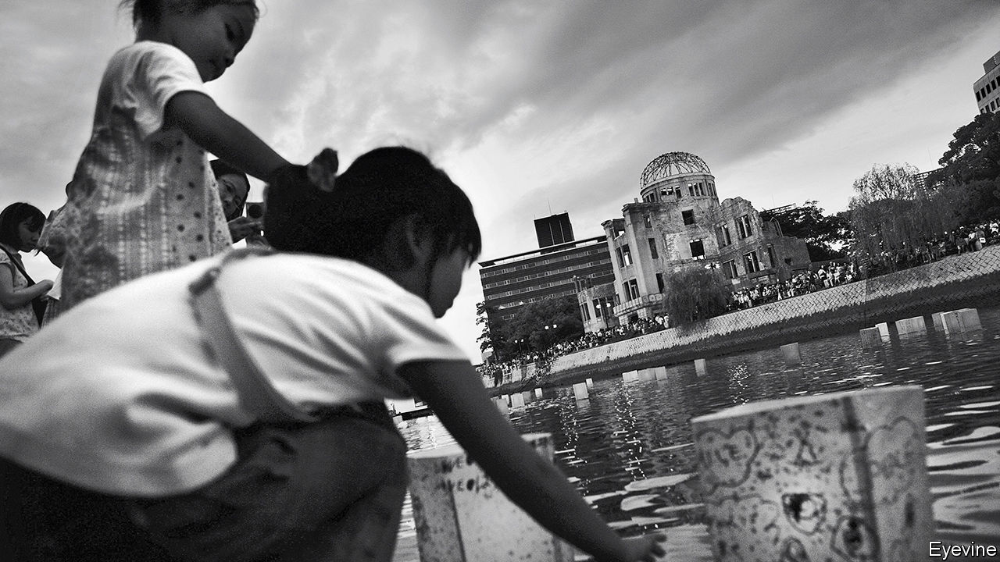
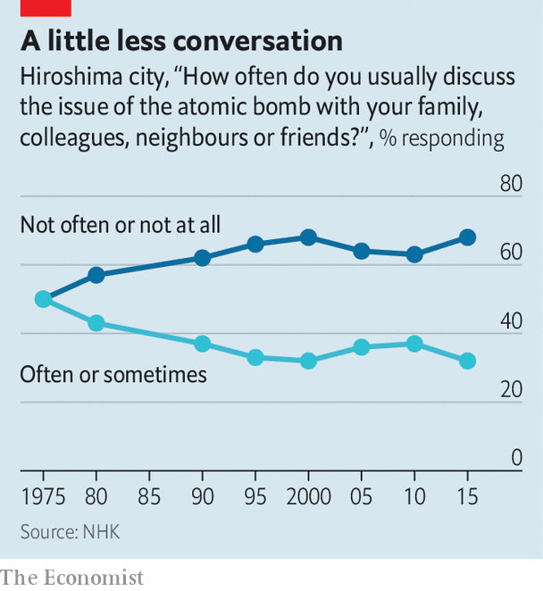

## Hiroshima, 75 years on

# Atomic-bomb survivors seek new ways to keep their memories alive

> Around the world, non-proliferation efforts are faltering

> Aug 1st 2020HIROSHIMA AND NAGASAKI

FOR SEVENTEEN-YEAR-OLD Takeoka Chisako, August 6th, 1945 was supposed to be a day off. She had planned to meet two girlfriends at 8:15 that morning, at a train station on the west side of Hiroshima. She was running late, and as she stepped outside her house she lifted a pocket mirror to her face. Then she saw a flash and heard a bang. When she regained consciousness she found herself lying in a potato field 30 metres away, a mushroom cloud rising in the sky. People with charred skin dangling from their arms came rushing over a nearby hillside. They cried for help, but were too feeble to speak their names and too weak to drink the water Ms Takeoka brought them. “Then one by one, they died,” says Higashino Mariko, Ms Takeoka’s daughter.

Ms Higashino tells this tale with the precision of an eyewitness. Yet she was born eight years after American forces flattened Hiroshima with Little Boy, the first atomic bomb used in combat. For decades survivors such as Ms Takeoka, known in Japan as hibakusha, or bomb-affected people, have told their stories publicly. Now their ranks are “declining drastically”, says Takigawa Takuo, director of the Hiroshima Peace Memorial Museum. So the city government in Hiroshima has recruited scores of volunteers like Ms Higashino to become denshosha, or “legacy successors” who take on the job of recounting their experiences. (Ms Higashino is unusual in that she inherited her own mother’s story; most take on a stranger’s.) Nagasaki, which was bombed on August 9th, has created a similar group.

These programmes reflect anxiety in Hiroshima and Nagasaki about fading wartime memories. In August Japan marks the 75th anniversary of the atomic bombings. Although there are still more than 130,000 living hibakusha, their average age is over 83. This will be the “last chance” to hear first-hand from witnesses during a major anniversary, laments Kubo Masayuki, director of the Hiroshima National Peace Memorial Hall.

The suffering of the hibakusha animates Japan’s post-war pacifism, as well as anti-nuclear activism internationally. Many worry that the war’s lessons are being forgotten. Fewer than 30% of Japanese can correctly name the dates of the atomic bombings (in Hiroshima and Nagasaki the numbers are higher). Yuzaki Hidehiko, the governor of Hiroshima Prefecture, says that “fading memories—not only in Japan but around the world” are leading to growing naivety about the horrors of conflict.

Abe Shinzo, Japan’s prime minister, has sought to revise the constitution that America imposed on Japan after the war. He has failed to gather enough votes in the Diet to change Article 9, which renounces war and bars Japan from maintaining “land, sea and air forces”. Japan in fact maintains powerful military forces; Mr Abe wants to make explicit that they are constitutional, and to stretch the limits to what they can do. He has not convinced the public: support for altering Article 9 has fallen from 33% in 2013 to 26% this year. Still, he has increased defence spending, pleasing America.

As Hiroshima and Nagasaki prepare for their anniversaries, politicians in Tokyo have been debating whether to acquire weapons that would enable the country pre-emptively to strike missile bases and other facilities of enemies who may be preparing to attack it. Many hibakusha are aghast. “As we look stronger, it will invite potential attackers to attack earlier,” Mr Yuzaki argues. “We have to be very careful.”

Globally, non-proliferation efforts are faltering. In January the Bulletin of Atomic Scientists moved its Doomsday Clock, a subjective measure of humanity’s proximity to self-annihilation, closer to midnight than at any time since its establishment in 1947. Donald Trump has withdrawn America from the Iran nuclear deal and the Intermediate-Range Nuclear Forces Treaty (after accusing Russia of cheating). Hibakusha are pleased that 82 countries have signed a Treaty on the Prohibition of Nuclear Weapons, created in 2017. It invokes their “unacceptable suffering” in its preamble. Yet no country with nuclear weapons has signed up to it. Nor has Japan, which shelters under America’s nuclear umbrella. Mr Yuzaki regrets that Japan has not used its moral authority as the only victim of atomic weapons to push harder for their abolition.

The hibakusha worried about amnesia even while the rubble was being cleared. “As Hiroshima recovers, the memory of the devastation is fading from people’s minds,” Kimura Kazuo, a college student, wrote in his diary in 1946. Yet equally troubling for some in Japan, and for many in the rest of Asia, is the selectivity of Japanese wartime memory. Hiroshima and Nagasaki’s museums emphasise Japanese suffering but downplay the war that precipitated it. Hiroshima became central to Japanese wartime memory in part because it “allows the victim narrative to dominate”, rather than the atrocities Japanese soldiers committed abroad, argues Fujiwara Kiichi of the University of Tokyo. Both museums place materials about Japan’s aggression in China and the Pacific at the end of their exhibitions. One section at the Nagasaki museum entitled “Events Leading up to the Nagasaki Atomic Bombing” begins by detailing American discussions in 1943 about which places in Japan to target. The Hiroshima museum makes scant mention of foreign nationals who perished during the bombing, such as the tens of thousands of Korean victims, most of them forced labourers.

Yet Hiroshima’s messages are powerful, and preserving its stories is essential. Mr Takigawa speaks of creating “an everlasting museum”. The denshosha programme is part of that effort. Volunteers go through three years of study, training and discussion with hibakusha before being certified to talk in public. There are now 150 practising denshosha, with another 197 in training. Nagasaki’s programme has 83 participants. Anti-nuclear activists have long called for the bomb to be abolished before the last hibakusha passes away. That is unlikely. But their stories may deter the world from ever using it again.■