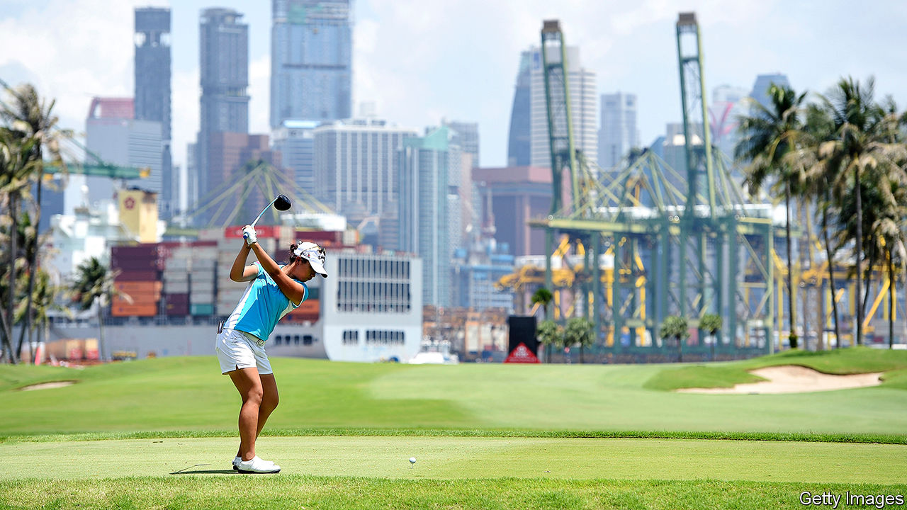

## From fairway to highway

# Demand for land in Singapore is bad news for golfers

> Courses are shrinking or closing to make way for concrete and steel

> Aug 1st 2020SINGAPORE

CLOCKS ABOVE the reception at Singapore Island Country Club show the hour in Augusta, Georgia, and St Andrews in Scotland—both places with famously wonderful golf courses. But time may be running short for golf in Singapore. The government is forcing some courses to shrink or close. Greens will give way to cranes; irons to concrete and steel.

Golf in the city-state has had powerful champions. Lee Kuan Yew, Singapore’s first prime minister, loved it. (Golf was his “principal recreation and passion,” said his son, Lee Hsien Yang, in 2015.) The royal and ancient game was once a symbol of middle-class aspiration, says Harvey Neo, a geographer at the Lee Kuan Yew Centre for Innovative Cities. During the 1990s and 2000s Singaporeans were said to covet the “5cs”: cash, car, condominium, credit card and country-club membership.

Yet in 2013 the government, which owns most of the land in Singapore, announced that it would gradually reallocate much of the space taken up by golf courses to public housing and infrastructure. The ruling party, stung by its disappointing performance at elections in 2011, felt it needed to respond to critics who said that it was out of touch with ordinary Singaporeans and who argued that it had overcrowded the tiny island by welcoming too many immigrants. At the time of its announcement 2.1% of Singapore’s land was given over to greens and fairways. By 2030 the number of courses is expected to fall by 40% or so from its peak in 2010. Closures are expected to leave Singapore with one course for every 430,000 residents by 2040, down from one for every 250,000 three decades ago.

Many Singaporeans shrug. The game’s grip on the national imagination is weakening. The number of people who play regularly has not much changed for years, thinks Jerome Ng, general manager of the Singapore Golf Association. Some 55% of golf-club members are 55 or older. “Young people are now into other sports,” says Lee Lee Langdale, who brokers country-club memberships. She says youngsters are put off by the exorbitant cost. Some clubs charge hundreds of thousands of dollars just to join. Garish clothes aren’t cheap, either. The game’s image has suffered. One banker says that he sometimes feels “self-conscious” admitting that he is a golfer.

It will be possible to play golf in Singapore for years to come. But the government has yet to renew the lease of any club beyond 2040, which worries enthusiasts. “We will lose everything,” says Ms Langdale. Others are sanguine. “The people we used to play with are either dead or not playing any more,” says Aidan Wong, who has been swinging irons since he was 12. When his club closes in 2021, he says, “I will probably put my clubs away.”■

## URL

https://www.economist.com/asia/2020/08/01/demand-for-land-in-singapore-is-bad-news-for-golfers
