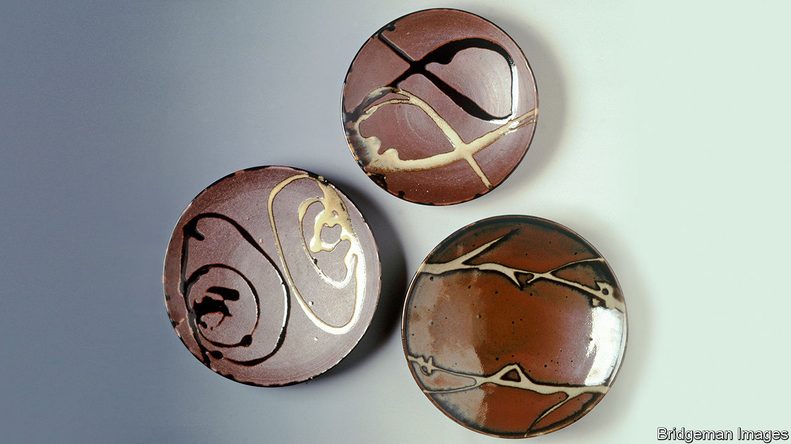

## Attention pays

# Finding beauty in ordinary things

> The Japanese aesthetic of mingei is a consolation during lockdown

> Aug 1st 2020TOKYO

THE BOWL is small enough to balance in the palm of your hand. It is deep enough for tofu, but too shallow for soup. A ghostly white glaze, translucent in the right light, covers the surface. These clay walls are its maker’s gallery. A lone blue figure fills the centre of the bowl, his face a blank oval with a whiskery beard. His spine curves along the same arc as the rim.

At the Nihon Mingeikan (Japan Folk Crafts Museum) in Tokyo, visitors find little by way of description or context alongside this artefact or the hundreds of other simple ceramics, textiles and crafts on display. Yanagi Soetsu, the museum’s founder, believed that nothing should distract from the beauty of the objects. For Yanagi, a prolific writer and collector, “miscellaneous things represent the most original of Japanese arts.” He and two potters, Hamada Shoji (who made the plates in the picture) and Kawai Kanjiro, dubbed these wares mingei, a neologism fusing the characters for “the masses” and “crafts”.

Over several decades from the 1910s, he amassed a collection of more than 17,000 such pieces from around Japan and its expanding empire, which became the foundation of the Mingeikan. By the time Yanagi died in 1961, mingei had entered the language. His ideas left an enduring mark on Japanese design, visible today in the fashion stylings of Issey Miyake and the popular homeware sold by the retailer Muji. At a time when people everywhere find themselves confined to familiar surroundings, his attentive way of looking at the world is a salutary consolation.

Mingei encompasses all manner of everyday things, from clothing and furniture to utensils and stationery. These objects, Yanagi wrote, are “deeply embedded in the life of ordinary people”. They stand in contrast to aristocratic fine arts and eschew needless decoration. Works of mingei are crafted with quotidian use and owners in mind; they are typically the handmade creations of anonymous artisans possessing “unconscious grace”. In the parlance of the pandemic, mingei might be called the essential workers of the material world: “Since these utilitarian objects have a commonplace task to perform, they are dressed, so to speak, in modest wear and lead quiet lives,” Yanagi wrote. “They work thoughtlessly and unselfishly, carrying out effortlessly and inconspicuously whatever duty comes their way.”

Yanagi sought to identify and celebrate the functional beauty of these overlooked items. He believed that defining beauty purely in visual terms, to the exclusion of practicality, was mistaken. “Our aesthetic sense has been severely impaired owing to the fact that beauty and life are treated as separate realms of being,” he argued. Yet this did not mean extolling any old (or new) thing. For Yanagi, objects made with vulgar colouring, shoddy materials and thoughtless forms were not simply eyesores, but “amoral and unethical”. Like the Arts and Crafts movement in Britain which it followed, mingei was in part a response to mechanisation, setting out to elevate older methods over mass production.

Born in Tokyo in 1889 to a family of Meiji-era naval officers, Yanagi’s intellectual life began in the Shirakaba (White Birch) group, a collective of writers and thinkers who explored Western art and literature in their eponymous journal. Yanagi wrote on topics ranging from Tolstoy to Rodin to William Blake. He befriended the English ceramicist Bernard Leach, who would first render Yanagi’s thoughts into English in “The Unknown Craftsman” (published in 1972). A collection of his essays that was recently released as “The Beauty of Everyday Things” is the second widely available English-language volume of his work.

Like many of his peers, Yanagi’s interests drifted towards questions of cultural identity. How should the East assert itself in response to the West? What was Japan’s relationship with the rest of the region? What made Japanese culture distinctive? An encounter with Korean ceramics in 1914 led to his interest in folk crafts. He spent years collecting and promoting Korean work, ultimately opening a small museum in Seoul. His engagement with the crafts of Japan’s colonies led him to speak out against the Japanese empire’s assimilationist and expansionist policies in both Korea and Okinawa, another important venue for his collecting. In “A Letter to My Korean Friends”, written amid a crackdown on Korean independence movements in 1919, Yanagi lamented that “Japan does not yet fully possess a human heart.”

Yet for all his humanism and pacifism, his views could also be interpreted more darkly. In recent decades scholars have advanced a revisionist sense of mingei as a kind of cultural nationalism, an “oriental Orientalism” that became the aesthetic accompaniment to Japanese imperialism. Japanese ultranationalists found much to like in Yanagi’s promotion of the collective over the individual, his search for beauty among the masses, his championing of tradition and his quest for an essential Japaneseness. As Kim Brandt argues in “Kingdom of Beauty”, her study of mingei, “Government ideologues and propagandists embraced the arts and crafts of an idealised folk as a means of insisting on national, and also imperial, unity.” When, during the second world war, the American firebombing of Tokyo brought flames to the Mingeikan’s walls, Yanagi and his wife doused them with brooms and buckets of water, their son Yanagi Sori later recalled.

Sori helped give mingei a second life through his work as a pioneering industrial designer. His iconic pieces, such as his graceful butterfly stool, fused a European modernist training with his father’s mingei spirit. Sori saw an overlap with the Bauhaus movement in mingei’s emphasis on function over form, and, in its belief in the craftsman’s unconscious intimation of beauty, with Surrealism.

After his father’s death, Sori took over as the Mingeikan’s director, inspiring a generation of designers to seek models in mingei. Today there are dozens of affiliated mingei museums in Japan. Martha Longenecker, an American potter, founded the Mingei International Museum in San Diego in the 1970s. Sori’s successor as director of the Mingeikan, the designer Fukasawa Naoto, is himself evidence of mingei’s enduring influence. Mr Fukasawa had a hand in Muji’s designs for suitcases, chairs, lamps, kettles and much else, aiding the firm’s rise to global prominence. Its goods, he says, are examples of “modern-day mingei”. (The name Muji means “no brand”.)

Mingei involves approaching the world with a heightened awareness of the objects that fill everyday lives. Yanagi urges you to ponder the coffee mug that fuels endless Zoom meetings with the same intensity as you contemplate a Cézanne (whose work he once hung in the reception room of the Mingeikan). “Today, when everything is trending toward the frail and sickly, the beauty we see in these common objects is both a blessing and a joy,” he wrote with eerie resonance. He asks people, in short, to appreciate what is under their noses.

Take the humble face mask. Your correspondent’s is sewn out of tan cloth and patterned with fish. Its light-blue ear straps, now frayed, suggest the ocean. A blue mahi-mahi stretches its bulbous forehead over the crease of the nose. A silver tigerperch edges towards the ear. The yellow spines of a John Dory’s dorsal fin spread across the cheek, evoking the beard of the man in the bottom of the mingei bowl. ■