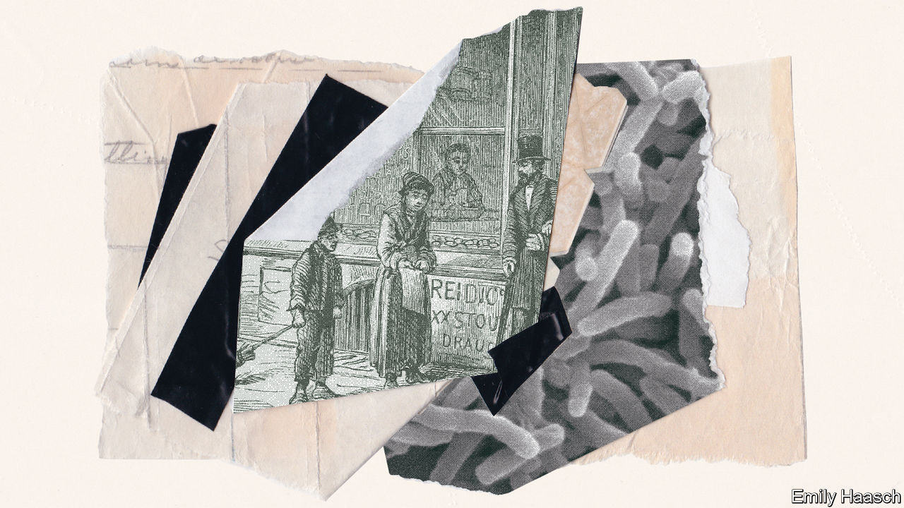

## Perspectives: Hygiene

# How hand-washing explains economic expansion

> The history of economic growth is, in many ways, a tale of cleaniness

> Aug 1st 2020WASHINGTON, DC

IN THE DECADES after the Industrial Revolution cities choked with dirt. Charles Dickens, the great chronicler of the hardships of early modern life, wrote in “Oliver Twist” of a slum in Bermondsey, in south London, that consisted of “rooms so small, so filthy, so confined, that the air would seem too tainted even for the dirt and squalor which they shelter”. It contained, he continued, “every repulsive lineament of poverty, every loathsome indication of filth, rot, and garbage”.

Today London is a powerhouse. When not besieged by covid-19, its gleaming skyscrapers contain floors of high-income knowledge workers. Its economy accounts for roughly a quarter of British output. Partly thanks to such riches, its residents and those in its commuter belt live longer than those anywhere else in Britain. In Bermondsey the slums have long been replaced with barista coffee shops and art galleries.

London resembles most other cities in the world—in which people, activity and innovation are increasingly concentrated. Two millennia ago, real incomes across much of the world, such as they were, stood between perhaps $1,000 and $1,500 or so in today’s money. Incomes in advanced economies are now 20 times that or more. High incomes are the consequence of decades of compounding economic growth, a process in which urbanisation has played a fundamental role. By crowding people together cities have long been humanity’s best means of creating large markets and gathering places where people come together to exchange ideas; from the Lyceum of Athens to the startup incubators of Silicon Valley.

But whenever people have come together to swap goods and ideas, the exchange of germs has inevitably occurred, too. Indeed, for a time the progress of the industrialising world seemed threatened by the kind of filth that Dickens described. In order to unleash the economic power of humankind, a revolution was required in the way that people live and how they interact with others. To become rich people had to learn how to clean up themselves and their cities. The story of economic growth is in large part a tale of the evolution of hygiene.

The Roman Empire, which had high levels of urbanisation, was repeatedly ravaged by pandemics. These occasionally threatened to topple the state: including, in the 6th century CE, the first major outbreak of bubonic plague, which killed as many as 30m people. When the plague again roamed across Eurasia eight centuries later, claiming the lives of between 30% and 60% of Europeans, it once more followed traders from city to city. People in the 14th century had no knowledge of the microscopic world around them. Illness was commonly viewed as a matter of bad fortune or divine retribution.

Even so, the progression of the bubonic plague from settlement to settlement was obvious enough to make people aware of the threat of contagion. Communities began taking some of the first steps toward preserving public health by closing themselves off to foreigners or otherwise limiting access to their towns. It was this second plague epidemic, which began in 1348 and raged intermittently for five centuries, which gave the world the word quarantine, from the Venetian word quarantena, or “40 days”: the amount of time arriving ships were required to sit in isolation before passengers could come ashore.

Quarantine aside, day-to-day life in the late Middle Ages remained a mucky affair. People ate with unwashed hands from shared plates. They crowded together in close proximity to household refuse and human waste. In homes with earthen floors, residents would often urinate on the ground. Spitting was common; people blew their noses into their hands.

Habits changed slowly—though improvements were rarely responses to concerns about health or disease. Instead, conducting oneself in a manner intended not to cause offence to others became a mark of refinement, and a means of distinguishing a class from the literally unwashed masses. Norbert Elias, a German sociologist, described the centuries-long accumulation of hygienic habits as the construction of an “invisible wall of affects” which activates “at the mere approach of something that has been in contact with the mouth or hands of someone else”.

Consider the use of forks, which slowly spread across Western Europe during the late Middle Ages. These provided a more hygienic means of moving food to the mouth than fingers. But their power as a status symbol derived more from the dainty, dexterous handling required by the utensil. In the absence of a germ theory, fashion could only take society so far. Giovanni Della Casa, an Italian poet and authority on 16th-century etiquette, discouraged his readers from hand-washing after using the privy, “as the reason for...washing will arouse disagreeable thoughts in people”.

By the 18th century the first stirrings of a more systematic approach to public health began to appear. Larger cities established public bodies charged with determining when and how to conduct quarantines in response to outbreaks of diseases like smallpox. Many set up hospitals to care for the ill. But it was the beginning of industrialisation, and the associated growth of cities, that proved the most consequential health development of the century.

London’s population roughly doubled in the 18th century, to about 1m inhabitants. It then rose nearly sevenfold in the 19th. That of New York City grew from about 30,000 people to 3.5m between 1790 and 1900. Manufacturing centres across Europe and North America transformed from modest villages to swelling metropolises in the space of a lifetime.

The consequences for public health were devastating. Factories pumped smoke into the air. Sewers emptied waste into rivers and lakes used for drinking water. Epidemics of water-borne diseases like cholera and typhoid killed thousands of people. As a result, death rates in cities were substantially higher than those in rural areas. They were also higher than the urban birth rate. In the early 19th century, as many as half of the children born to the working class in London died by the age of five. Only the steady flow of people migrating from the countryside kept cities from shrinking.

The hardship of city life during the first century of industrialisation fed the deep discontent with capitalism brewing among the working classes. Friedrich Engels, in his writing on “The Condition of the Working Class in England” (1845), made much of the state of sanitation in the districts occupied by poor labourers, like St Giles in London, where “heaps of garbage and ashes lie in all directions, and the foul liquids emptied before the doors gather in stinking pools.”

But dirt posed a greater threat to the sustainability of capitalist growth than socialist thinkers did. High urban mortality rates placed a ceiling on the extent to which early industrial societies could urbanise, of about 30%—or roughly the share of the population of the Netherlands considered urban in the 18th century. The deadliness of industrial cities became a bottleneck to modern economic growth.

Such terrible conditions slowly moved people to demand action. Nascent studies on chronic infectious disease made clear that cities themselves were deleterious to health, though the best minds of the day could not be certain precisely why. This was no small problem. The rapid pace of change within cities, and the sheer number of sources of nastiness which might contribute to ill health, made the problem of spurious correlation nearly insurmountable.

Some 18th-century scholars speculated that ailments might pass from person to person through the movement of unknown microscopic particles. In the absence of the equipment and know-how needed to detect such particles, empirically serious scholars dismissed the notion in favour of the idea that miasma, or foul air, was the cause of infectious disease. The theory found further favour with businessmen who disliked the trade-interrupting effects of quarantines and reformers keen to clean up the cities.

In the 19th century scores of public-minded individuals began pitching schemes to clean up cities. Edwin Chadwick, a British lawyer who contributed to the reform of the English Poor Laws, oversaw the drafting of a scathing report on sanitary conditions in Britain, published in 1842, which documented that the average age of death for tradesmen in London was just 22, and for labourers just 16. Chadwick cited miasma as the chief contributor to infectious illness and called for large-scale public investments in drainage and sewage systems. Similar figures across the industrialising world sought to build support for policies to clean up deadly cities. Dickens was one of them.

It was not easy. Despite reports such as Chadwick’s, scientific understanding remained scant. In 1849 The Economist declared that:

The belief in contagion, like the belief in astrology and witchcraft, seems destined to die out; and as we have got rid of all regulations for consulting the starts or attending to omens before we begin any undertakings, and of all the laws against feeding evil spirits and punishing witches, so we shall no doubt in time get rid of the quarantine regulations that were established from the old belief in contagion.

So too did stubborn citizens grow weary of the lecturing of muckraking do-gooders. By 1854, outbreaks of infectious disease had killed thousands of Londoners of all classes, and yet an editorial in The Times huffed, “We prefer to take our chance of cholera and the rest rather than be bullied into health.”

Instead the concept of a collective responsibility to invest in public goods had to be cultivated. As Johan Goudsblom, a Dutch sociologist, noted: “Increasingly, it dawned upon the rich that they could not ignore the plight of the poor; the proximity of gold coast and slum was too close.” Governments at all levels began to take on direct responsibility for tidying up large cities. Removal of household waste, cleaning of streets, provision of fresh running water and universal connection to sewage slowly became the norm.

The effects of this sanitary revolution were dramatic. Though data from the late 18th and early 19th centuries are patchy and flawed, the broad picture is clear. Across industrialising cities, mortality rates, for the young especially, held steady at high levels or climbed slightly in the early 19th century, as rapid urbanisation unfolded, despite a dramatic decline in smallpox mortality over this period associated with the rise of inoculation. From around 1840, however, a trend toward declining mortality rates began to take hold. Life expectancy at birth rose about 6 years, on average, across large British cities from 1838 to the end of the century. In Paris it rose by about ten years over this period; in Stockholm by roughly 20. In America the crude death rate per 1,000 people rose in New York City from about 25 in the early 1800s to roughly 35 in 1850, before falling to near 20 by the end of the century. Trends in other large American cities were similar.

Not all of the improvement in health can be attributed to improvements in sanitation and hygiene. Over the course of the 20th century, economists have debated the relative importance of other factors such as improved medical techniques (in midwifery, in particular) and better nutrition associated with rising incomes. Indeed, nutritional gains do seem to have played a meaningful role in reducing mortality. But the contribution from better diets is difficult to assess, given the fact that the bodies of people who grow up in disease-ridden environments are less able to retain nutrients from the food they eat.

Similarly, while some research suggests that municipal investments in public-health measures can explain most or nearly all of the decline in mortality in the late 19th century, it is difficult to be certain. Cities in which public support for sanitary investments was high, for example, might have been more aware of public-health information generally, and more inclined to practise good personal hygiene.

The effects of declining urban-mortality rates were profound. Healthier cities accelerated the process of urbanisation by boosting the natural rate of increase (births less deaths) within cities. The cap on urban population share placed by high mortality in cities was removed; by the end of the 19th century nearly 80% of the British population lived in towns and cities.

Perhaps more dramatic, however, was the effect of the decline in mortality on the skill level of the workforce. Falling mortality rates, in cities especially, began a process known in the social sciences as the “demographic transition”. The pace of population growth and urbanisation both accelerated. As more children survived to adulthood, families began having fewer of them. Meanwhile industrial economies’ increasing demand for skilled workers raised the return to education. Families began to invest more heavily in the schooling of each child; longer lifespans meant the pay-off to investments in education grew.

The cycle of increasing technological sophistication and increased educational attainment lifted incomes across the economy. So did the effect of slower population growth, which allowed for faster growth in levels of capital per worker. It was the fall in urban mortality in the 19th century that finally launched the world into an era in which brains dominated brawn.

By the end of the 19th century, the bacteria responsible for many endemic infectious diseases had been identified. The first half of the 20th century brought about the discovery of antibiotics and the development of vaccines against a host of viral scourges. Over the course of the century, matters of public health once again shifted in the direction of personal responsibility: toward diet, fitness and lower consumption of alcohol, drugs and the like. Hygiene, meanwhile, became a matter first and foremost of fashion and class, in the rich world at least. For well-heeled metropolitan types, personal care—the juice cleanses, pilates sessions, skin treatments and so forth—is a matter of vanity and identity as much as an effort to prolong life or contribute to the broader public health.

Yet recent history illustrates once more that public health is often a matter of collective action. In the 1980s and 1990s the HIV/AIDS epidemic shook a world accustomed to thinking of deadly disease outbreaks as a thing of the past. It contributed to new public-health campaigns built on the idea that changes in personal behaviour were an important part of keeping both individuals and society healthy.

More recently a backlash against vaccination has put hard-fought gains against diseases like measles at risk. This trend has reinforced the idea that maintaining collective support for public health, and shifting social norms, is an ongoing battle for policymakers to take seriously. So, too, have the recurring pandemic threats of the 21st century, from SARS to covid-19.

Prosperity now, as ever, relies on human connections within great cities. A world more populous and integrated than ever before will continue to face a serious risk of pandemic disease. What is not yet clear is how many accommodations are needed. What new public investments must be made to prevent contagion from shutting down the world economy? What behavioural changes will persist in the years after this pandemic? Which invisible walls of affects will be erected to reconcile our need to be social with our desire for good health? As sophisticated and modern as we perceive ourselves to be, our clumsy efforts to manage the health risks of a growing global economy might well strike the healthier, richer people of the future as depressingly Dickensian. ■

Editor’s note: Some of our covid-19 coverage is free for readers of The Economist Today, our daily [newsletter](https://www.economist.com/https://my.economist.com/user#newsletter). For more stories and our pandemic tracker, see our [hub](https://www.economist.com//news/2020/03/11/the-economists-coverage-of-the-coronavirus)

## URL

https://www.economist.com/books-and-arts/2020/08/01/how-hand-washing-explains-economic-expansion
