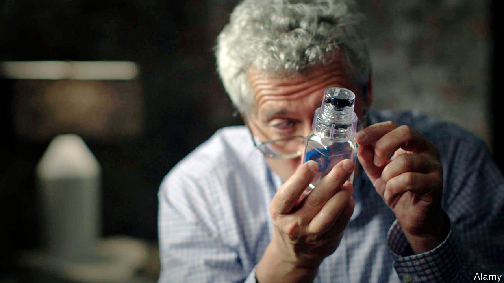

## Through the mousehole

# Memoirs of a champion Russian doper

> Now in hiding, Grigory Rodchenkov reflects on his country and career

> Aug 1st 2020

The Rodchenkov Affair: How I Brought Down Russia’s Secret Doping Empire. By Grigory Rodchenkov. WH Allen; 20 pages; £20.

AS A YOUNG man in the Brezhnev-era Soviet Union, Grigory Rodchenkov dreamed of becoming a champion long-distance runner. He wasn’t good enough. Instead, after training as a chemist, he made it to the top of another discipline: doping. His engaging memoir tells the story of how, as head of what was in theory Russia’s national anti-doping laboratory, he masterminded a huge, state-sponsored cheating operation, culminating in the biggest fraud in sporting history: the jaw-droppingly brazen sample-swapping shenanigans at the Winter Olympics of 2014 in the Russian city of Sochi, for which the host country was eventually fingered and banned from international competitions.

His book covers a lot of ground at speed: the history of drugs in sport; the half-hearted efforts of global authorities to crack down; the geopolitical rivalries driving cheating; the pettiness and vindictiveness of Russia bureaucracy; and the morality of doping. Despite his whistle-blowing, Mr Rodchenkov himself remains ambivalent about steroid use. Done judiciously, it can be less harmful than overtraining, he says.

Doping is in Russia’s sporting blood. It seemed quite normal to Mr Rodchenkov to inject Retabolil, a Hungarian steroid, in his early 20s, his mother administering it in their cramped flat in Moscow. Elite athletes took copious quantities. One coach boasted of injecting more than 50 race-walkers a day. In 1984, the author says, the Soviet Union had an abortive plan to send a ship with a secret lab to the port of Los Angeles, to assist with doping for the Olympics (which the Soviets ultimately boycotted).

The “medals over morals” policy, as Mr Rodchenkov calls it, was stepped up under Vladimir Putin, who saw Olympic success as a way to project power in the post-Soviet world. After the embarrassment of the Vancouver Winter Olympics of 2010, in which Russia won just three golds, and with Sochi next, officials were loth to leave anything to chance. Mr Rodchenkov and his team developed a highly effective cocktail of steroids, known as the Duchess, dissolved in Chivas Regal (or vermouth for those who liked it sweeter). During the games, Russian medal contenders’ urine samples were passed through a “mousehole” in the wall of his Sochi lab at night, taken by FSB (security-service) agents who had worked out how to open supposedly tamper-proof bottles without leaving marks, replaced with clean pee and passed back. A spook posing as a plumber oversaw the scam.

Mr Rodchenkov was very good at his job. Across five winter and summer Olympic games, not one elite athlete under his guidance was caught during competitions. The trick, he says, was to offer the odd sacrificial lamb lower down the pecking order so as not to look suspicious. In one case, when a well-known biathlete’s sample tested positive as inspectors from the World Anti-Doping Agency (WADA) looked on, he managed to switch the paperwork, leaving an unknown wrestler to take the fall.

Keeping one step ahead in the cat-and-mouse with WADA and global sports administrators was not hard; WADA was a “hot air machine”, hobbled by indecision. Olympic officials talked tough on doping control but worried that scandals would scare off sponsors and audiences. In the end, this impotent anti-doping regime was forced to get much tougher after a series of revelations in the international media.

The author has since attained celebrity as a snitch, starring in an Oscar-winning documentary, “Icarus” (see picture), and having an American anti-doping law named after him. But his status has come at a cost. Granted political asylum in America, he lives in protective custody in an undisclosed location. When he leaves home, flanked by at least one bodyguard, he sometimes wears a bulletproof vest. He has reason to worry, given Russia’s vengeful attitude to “traitors”. Two former doping officials who stayed in Russia died 11 days apart in mysterious circumstances.

His erstwhile paymasters have been forced to admit violations, but hardly appear chastened. Russia is appealing against a four-year Olympic ban. It continues to play games, submitting “a clumsily adulterated pack of lies” to WADA investigators, which, says Mr Rodchenkov, was “so artlessly counterfeited that it was almost as if they were begging to be caught”. Paraphrasing George Orwell, he concludes that the Russian state is as conscious as ever of the truth, but as wedded as ever to lies. ■

## URL

https://www.economist.com/books-and-arts/2020/08/01/memoirs-of-a-champion-russian-doper
